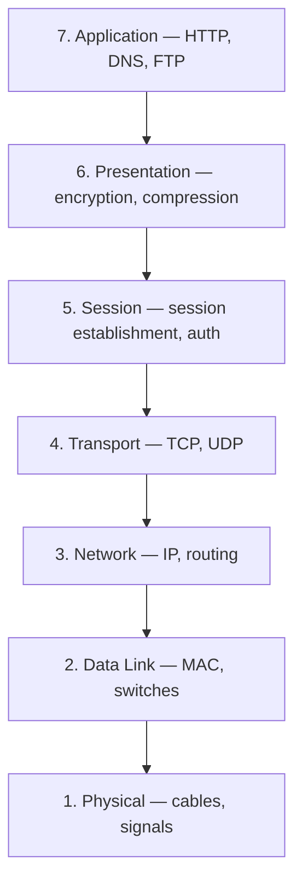
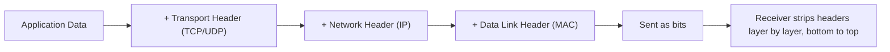

# Computer Networks
 
## OSI Model
 

 
For each layer, know one real protocol and one real security risk at that layer. For example: Application layer runs HTTP, and is where SQL injection or XSS-style attacks live. Network layer runs IP, and is where IP spoofing lives. Interviewers ask this to check you understand the model isn't just theory, it maps to real vulnerabilities.
 
## TCP vs UDP
 
| | TCP | UDP |
|---|---|---|
| Connection | Connection-oriented (handshake) | Connectionless |
| Reliability | Guaranteed delivery, ordered | No guarantee |
| Speed | Slower, more overhead | Faster, minimal overhead |
| Use case | File transfer, web requests | Video calls, live streaming, DNS |
 
## Encapsulation Across Layers
 

 
Know this happens in reverse on the receiving end, each layer strips its own header before passing data up. This is what "encapsulation and decapsulation" actually means, not just a term to recall.
 
---
*Back to [Core CS Fundamentals](./README.md)*