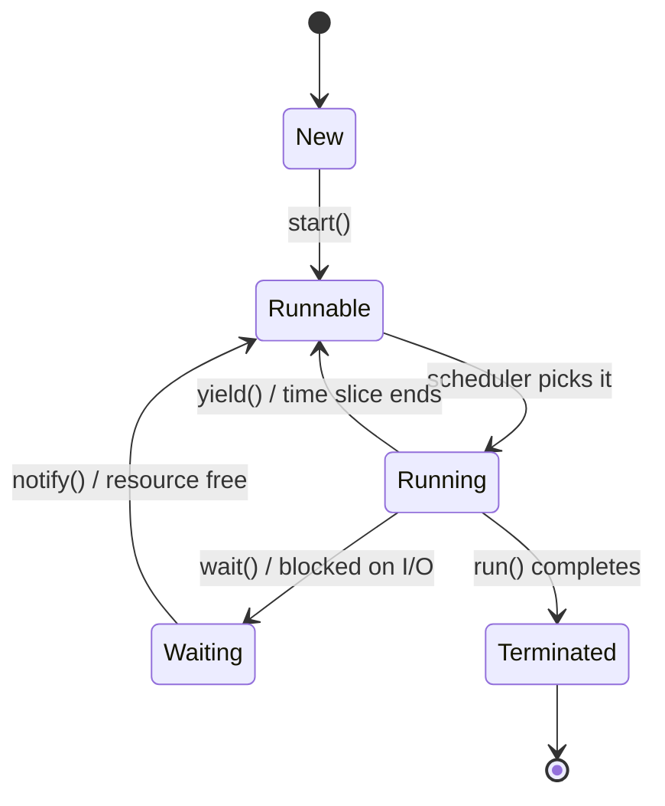
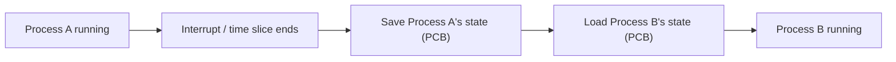
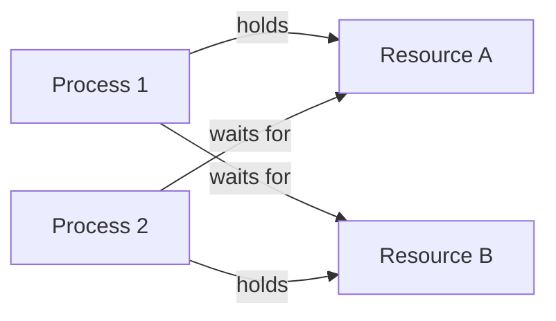

 # Operating Systems
 
> [!NOTE]
> Reference notes: [OS One-Shot Notes](../extras/notes/OS-ONE-SHOT.pdf) by [Codehelp by Babbar](https://www.youtube.com/channel/UCldyi11QYNXYXiLjVbyw5dA)
 
## Threads and Processes
 
Know the difference between an OS-level thread and a programming-level thread, and be able to walk through a thread's lifecycle in actual code, not just describe it in words.
 
> [!IMPORTANT]
> Pick Java or C# to explain thread lifecycle in an interview. Both have a clean, named lifecycle you can point to directly in code. Python's GIL and its threading model make this a messier example to reason about live.
 

 
Also cover single vs multi-threading (why concurrency helps, and where it doesn't) and how threading actually differs at the OS level vs the language runtime level.
 
## Context Switching
 

 
Know that Linux and Windows implement this differently under the hood (scheduler design, PCB structure). You don't need kernel-source depth, but you should be able to say what differs and why, not just that they're "different."
 
## Critical Section Problem
 
Understand what a race condition actually looks like in code, then how a mutex or semaphore fixes it.
 
```java
// Without protection: race condition on shared counter
counter++; // not atomic — read, increment, write can interleave across threads
 
// With a mutex
synchronized (lock) {
    counter++;
}
```
 
> [!IMPORTANT]
> Know the difference between a mutex (ownership, one thread at a time) and a semaphore (a counter, allows N threads). This distinction gets asked directly, often as a follow-up.


## Memory Management
 
| Concept | What it means |
|---|---|
| Contiguous allocation | A process gets one continuous memory block |
| Static vs dynamic partitioning | Fixed-size partitions vs partitions sized on demand |
| Non-contiguous allocation | A process's memory is split across scattered blocks |
| Paging | Memory split into fixed-size pages, avoids external fragmentation |
| Segmentation | Memory split by logical unit (code, stack, heap), can cause external fragmentation |
| Demand paging | Pages loaded into memory only when actually needed |
| Fragmentation | Wasted memory, either between blocks (external) or inside a block (internal) |
 
> [!WARNING]
> Paging vs segmentation is a favorite trick question. Know exactly which fragmentation problem each one causes and why.
 
## Deadlocks
 
This is a near-guaranteed interview topic, don't skip it.
 
Know the four necessary conditions (all four must hold for a deadlock to happen):
 
| Condition | Meaning |
|---|---|
| Mutual Exclusion | At least one resource is held in a non-shareable mode |
| Hold and Wait | A process holds a resource while waiting for another |
| No Preemption | A resource can't be forcibly taken from a process |
| Circular Wait | A closed chain of processes, each waiting on the next |
 

 
Then know the four ways to handle it, and be able to name a real technique for each:
 
- **Prevention**: break one of the four conditions by design (e.g. always acquire resources in a fixed global order to kill circular wait)
- **Avoidance**: Banker's Algorithm, only grant a request if the resulting state is still "safe"
- **Detection**: build a resource-allocation graph, periodically check for cycles
- **Recovery**: kill a process or preempt a resource once a deadlock is detected
> [!TIP]
> The classic example worth actually coding once is the Producer-Consumer problem or the Dining Philosophers problem. Both are standard ways interviewers test whether you can apply mutexes/semaphores to prevent deadlock and race conditions at the same time, not just define them.
 
## Virtual Memory and Thrashing
 
Virtual memory lets a process behave as if it has more memory than physically exists, using disk as overflow. Know what happens when this goes wrong: **thrashing**, where the CPU spends more time swapping pages in and out than executing anything.
 
Also know **Belady's Anomaly**: in FIFO page replacement specifically, adding more physical memory frames can sometimes *increase* the number of page faults instead of decreasing them. It's a common counter-intuitive follow-up after the page replacement algorithms below.
 
## Algorithms Worth Implementing
 
**Page replacement / caching:**
 
| Algorithm | Idea |
|---|---|
| LRU | Evict the page unused for the longest time |
| MRU | Evict the most recently used page |
| LFU | Evict the least frequently used page |
| MFU | Evict the most frequently used page |
 
**Process scheduling** (know preemptive vs non-preemptive for each):
 
| Algorithm | Preemptive? |
|---|---|
| FCFS | No |
| SJF | No |
| LJF | No |
| Round Robin | Yes |
| Priority Scheduling | Either, depends on implementation |
| SRTF | Yes |
| LRTF | Yes |
| MLQ / MLFQ | Yes |
 
**Free space management:**
 
| Strategy | Idea |
|---|---|
| First Fit | Allocate the first block big enough |
| Best Fit | Allocate the smallest block that still fits |
| Worst Fit | Allocate the largest available block |
| Next Fit | Like First Fit, but continues search from the last allocated position |
 
---
*Back to [Core CS Fundamentals](./README.md)*