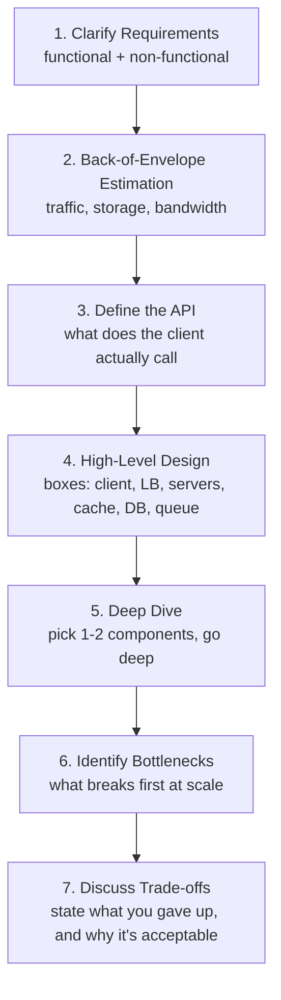
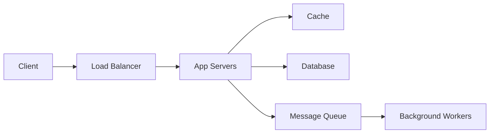

# High-Level Design (HLD)

HLD interviews don't have a single correct answer. Two candidates can design the same system completely differently and both pass, because what's actually being evaluated is whether you can map requirements to trade-offs out loud, not whether you land on some canonical diagram. This page is the thinking framework plus the roadmap, the same shape as the [DSA folder](../../ds-algo/README.md), mindset first, topics second.

## Why This Is Different From DSA Prep

There's no "optimal" HLD solution the way there's an optimal `Big-O` for a DSA problem. Every design decision here is a trade-off between **conflicting goals**, **consistency vs availability**, **latency vs cost**, **simplicity vs scalability**. An interviewer isn't checking if you know the **"right"** technology, they're checking if you can name the trade-off you're making and justify why it fits this system's actual requirements.

> [!IMPORTANT]
> The single biggest tell of a weak HLD answer: naming technologies (Redis, Kafka, Cassandra) without explaining what problem each one solves *for this specific system*. Anyone can memorize "use Redis for caching." Knowing why caching helps here, and what you're trading away by adding it (staleness, extra infrastructure, cache invalidation complexity), is the actual signal.

---

## Prerequisites

You've already covered the pieces this depends on, this section just tells you where:

- **CAP Theorem, replication, partitioning** from [DBMS](../../core-cs/dbms.md), this is the backbone of almost every database decision you'll make in an HLD interview
- **TCP vs UDP, OSI layers** from [Computer Networks](../../core-cs/computer-networks.md), needed to reason about how components actually talk to each other
- **Time & Space Complexity** from [Complexity Analysis](../../ds-algo/basic-foundations/complexity-analysis.md), needed for back-of-envelope estimation math below
- **Graph algorithms** (Dijkstra, Consistent Hashing shares its core idea with hashing) from [Graph Algorithms](../../ds-algo/algorithms/graph-algorithms.md) and [Hashing](../../ds-algo/data-structures/hashing.md)

---

## The Design Thinking Framework

This is the structured process to actually walk through in an interview, not a checklist to recite, a sequence to follow so you never freeze on "where do I even start."



### 1. Clarify Requirements

Split into two categories, and get both before designing anything:

- **Functional**: what the system actually does (users can post a tweet, users can follow other users)
- **Non-functional**: the qualities the system needs (how many users, read-heavy or write-heavy, how much latency is acceptable, does data need strong consistency or is eventual consistency fine)

> [!WARNING]
> Skipping non-functional requirements is the most common reason a technically sound design still reads as weak. "Design Twitter" without asking about scale (a college project vs a billion users) leads to answers that don't fit either case well.

### 2. Back-of-Envelope Estimation

Rough numbers, not precision, the goal is deciding whether you need a single database or a distributed one, not an exact server count.

```text
Daily Active Users: 100 million
Average requests per user per day: 10
Total requests/day: 1 billion
Requests/second (average): 1,000,000,000 / 86,400 ≈ 11,600 QPS
Peak QPS (assume 3x average): ≈ 35,000 QPS
```

> [!TIP]
> You don't need to memorize conversion constants. Round aggressively, 100,000 seconds in a day instead of 86,400 is a fine approximation for this purpose, the goal is order-of-magnitude reasoning, not a precise figure.

### 3. Define the API

A short list of endpoints, this forces you to nail down what the system actually needs to support before you start drawing boxes.

```text
POST /tweet {userId, content} -> tweetId
GET /timeline/{userId} -> list of tweets
POST /follow {followerId, followeeId} -> success
```

### 4. High-Level Design

The actual diagram, client through to storage. Keep it at the box level first, resist the urge to go deep on any one piece until the overall shape is agreed on.



### 5. Deep Dive

Pick the one or two components that are actually interesting for this problem, and only those. For a URL shortener, that's the ID generation scheme. For a chat system, that's message delivery and ordering. Going deep everywhere wastes time on the parts nobody's testing you on.

### 6. Identify Bottlenecks

Ask "what's the first thing that breaks as load increases?" out loud, and address it. A single database is almost always the first bottleneck named, which is exactly the cue to bring in replication, sharding, or caching, with a reason tied to the actual bottleneck, not just because those words exist.

### 7. Discuss Trade-offs

State clearly what you're giving up. "I chose eventual consistency here, which means a user might briefly see a stale follower count, but it lets us scale reads horizontally without the write bottleneck strong consistency would introduce." That sentence, trade-off named plus justification, is worth more than any diagram.

---

## Roadmap: Core Building Blocks

> [!TIP]
> Don't try to learn all of these before your first mock design. Learn 3 to 4, then try designing something (URL Shortener is the standard first problem), you'll notice exactly which building block you're missing, and that's a far stronger way to learn the rest than reading them all in sequence first.

| Building Block | What It Solves |
|---|---|
| Load Balancing | Distributing traffic across multiple servers so no single one is overwhelmed |
| Caching | Serving frequently-read data from fast memory instead of hitting the database every time |
| Database Replication | Copies of the same data across nodes, for availability and read scaling |
| Database Sharding/Partitioning | Splitting different data across nodes, for write scaling |
| CDN | Caching static content geographically close to users, cuts latency for content that doesn't change often |
| Message Queues (Kafka, SQS-style) | Decoupling producers from consumers, absorbing traffic spikes, enabling async processing |
| Consistent Hashing | Distributing data/load across nodes such that adding or removing a node reshuffles the minimum possible amount of data |
| Rate Limiting | Protecting a system from being overwhelmed by a single client or attacker |
| API Gateway | A single entry point handling auth, rate limiting, and routing before requests reach internal services |
| Microservices vs Monolith | Trade-off between independent scalability/deployment and operational complexity |
| Proxy vs Reverse Proxy | Forward proxy protects/represents the client, reverse proxy protects/represents the server |

---

## Reference Books

These aren't interchangeable, each teaches a different layer of this.

| Book | Author | What It Actually Gives You |
|---|---|---|
| *System Design Interview – An Insider's Guide, Volume 1* | Alex Xu | The interview framework itself, plus 15+ fully worked classic problems (URL Shortener, Rate Limiter, Chat System). Start here. |
| *System Design Interview – An Insider's Guide, Volume 2* | Alex Xu | More advanced, larger-scale problems (Google Drive, Nearby Friends, Ad Click Aggregation), assumes Volume 1's framework is already comfortable |
| *Designing Data-Intensive Applications* | Martin Kleppmann | The actual depth behind the buzzwords, why replication works the way it does, what consistency models really mean, how storage engines are built. Denser, not interview-format, but this is where genuine understanding (versus memorized talking points) comes from |
| *Grokking the System Design Interview* (Educative) | Design Gurus | Similar format to Alex Xu's books, useful as a second pass with different worked examples once the framework is solid |

> [!IMPORTANT]
> Read Alex Xu's Volume 1 first, in order, it directly teaches the framework above through worked examples. Kleppmann's book is not a first read, it's what you go to once you want to understand *why* the trade-offs in Alex Xu's examples actually hold, not to learn the interview format itself.

---

## Common Mistakes

1. **Jumping straight to a diagram** without clarifying requirements first, then having to backtrack when a requirement invalidates half the design
2. **Naming technologies without justifying them**, "I'll use Kafka" means nothing without "because we need to decouple ingestion from processing and survive consumer downtime"
3. **Designing for a scale nobody asked about**, over-engineering a college-project-scale system with sharding and multi-region replication reads as not understanding when complexity is actually warranted
4. **Never revisiting the initial design**, a strong candidate treats their own first draft as a starting point to critique, not a final answer to defend

---

## Where to Go Next

Start with the URL Shortener problem, it's small enough to fully complete in one session and touches most of the building blocks above (API design, database choice, ID generation, caching). Once that's comfortable, move to a read-heavy system (Twitter timeline) and then a write-heavy or real-time one (Chat System, Rate Limiter).

---
*Back to [Placement Prep](../../README.md)*
