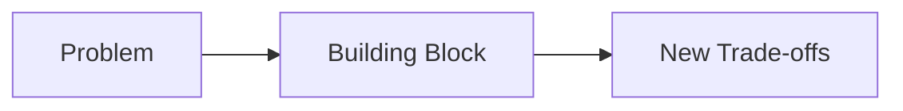

# High Level Design Building Blocks

The foundations told you **what starts breaking** as systems grow. This folder covers the components we introduce to deal with those problems.

Don't learn these as a list of technologies.

That's the pattern for every file here.

---

## Roadmap

```mermaid
flowchart TD
    A["More Application Traffic"] --> B["Load Balancing"]

    C["Repeated Expensive Reads"] --> D["Caching"]

    E["Need Read Scale / Availability"] --> F["Database Replication"]

    G["One Database Cannot Hold / Write Everything"] --> H["Partitioning / Sharding"]

    I["Work Does Not Need To Block"] --> J["Message Queues"]

    K["Users Far From Static Content"] --> L["CDN"]

    M["Need Stable Distribution Across Nodes"] --> N["Consistent Hashing"]

    O["Too Many Requests"] --> P["Rate Limiting"]

    Q["Many Backend Services"] --> R["API Gateway"]

    S["Need Intermediary Between Client and Server"] --> T["Proxy / Reverse Proxy"]

    U["Application Keeps Growing"] --> V["Monolith vs Microservices"]
```

---

## 1. Load Balancing

[Open Load Balancing →](./load-balancing.md)

You have more than one application server. Something now needs to decide where each request goes.

Focus on:

- Layer 4 vs Layer 7
- common balancing strategies
- health checks
- sticky sessions
- what happens when a server fails

---

## 2. Caching

[Open Caching →](./caching.md)

Repeatedly fetching or computing the same data is expensive.

Focus on:

- cache-aside
- read-through / write-through at a high level
- TTL
- eviction
- cache invalidation
- cache stampede
- when caching actually makes sense

---

## 3. Database Replication

[Open Database Replication →](./database-replication.md)

One copy of your database gives you one failure domain and limited read capacity.

Focus on:

- primary-replica
- synchronous vs asynchronous replication
- replication lag
- read replicas
- failover
- consistency trade-offs

---

## 4. Partitioning / Sharding

[Open Partitioning & Sharding →](./partitioning-sharding.md)

Eventually one database node may no longer be enough for the amount of data or writes.

Focus on:

- partition key
- range vs hash partitioning
- hotspots
- cross-shard queries
- rebalancing
- why choosing the shard key matters

---

## 5. Message Queues

[Open Message Queues →](./message-queues.md)

Some work doesn't need to block the request, and producers and consumers don't always operate at the same speed.

Focus on:

- producer / queue / consumer
- buffering traffic spikes
- retries
- duplicate delivery
- ordering
- idempotent consumers
- dead-letter queues

---

## 6. CDN

[Open CDN →](./cdn.md)

Serving static or cacheable content from one region to users across the world adds unnecessary latency and origin load.

Focus on:

- edge locations
- origin
- cache hit / miss
- TTL
- invalidation
- what belongs on a CDN and what doesn't

---

## 7. Consistent Hashing

[Open Consistent Hashing →](./consistent-hashing.md)

When data or requests are distributed across changing sets of nodes, normal hashing causes too much redistribution.

Focus on:

- why `hash(key) % N` breaks when `N` changes
- hash ring
- node addition / removal
- virtual nodes
- where this is useful

---

## 8. Rate Limiting

[Open Rate Limiting →](./rate-limiting.md)

A service has finite capacity. One client should not be allowed to consume all of it.

Focus on:

- fixed window
- sliding window
- token bucket
- leaky bucket
- where rate limiting sits
- per-user vs per-IP vs global limits

---

## 9. API Gateway

[Open API Gateway →](./api-gateway.md)

Once a backend has several services, clients should not need to understand every internal service boundary.

Focus on:

- routing
- authentication
- rate limiting
- request aggregation
- observability
- why gateways can become bottlenecks themselves

---

## 10. Proxy & Reverse Proxy

[Open Proxy & Reverse Proxy →](./proxy-reverse-proxy.md)

Both sit between two systems. The difference is **who they're representing**.

Focus on:

- forward proxy represents the client
- reverse proxy represents the server
- TLS termination
- routing
- caching
- how reverse proxies relate to load balancers

---

## 11. Monolith vs Microservices

[Open Monolith vs Microservices →](./monolith-vs-microservices.md)

This is not "old architecture vs modern architecture."

It's a trade-off between keeping a system simple and splitting parts of it so they can evolve independently.

Focus on:

- deployment boundaries
- independent scaling
- database ownership
- network calls
- operational complexity
- when a monolith is still the better choice

---

## How To Learn These

For every building block, be able to answer:

1. What problem does it solve?
2. Where does it sit in the architecture?
3. What happens without it?
4. What new problem does adding it create?
5. When would you deliberately not use it?

If you can answer those five, you understand the component well enough to use it in an HLD interview.

> [!WARNING]
> Don't memorize one giant architecture containing every component in this folder. Most systems do not need all of them.

---

*Back to [High-Level Design](../README.md)*