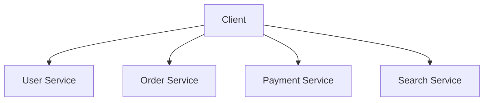
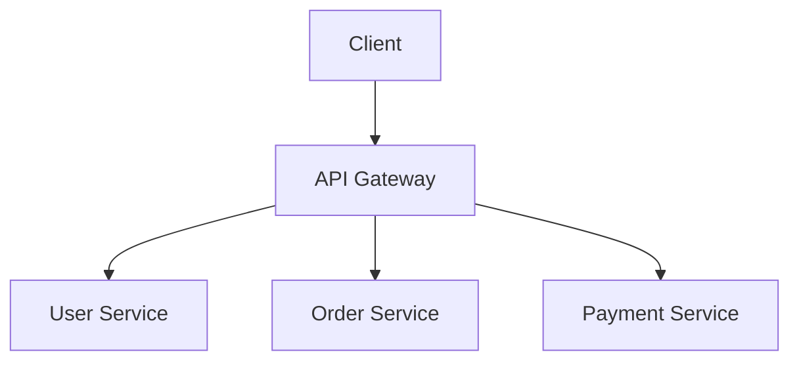
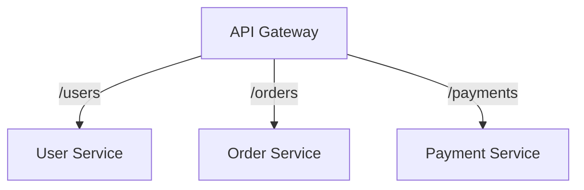
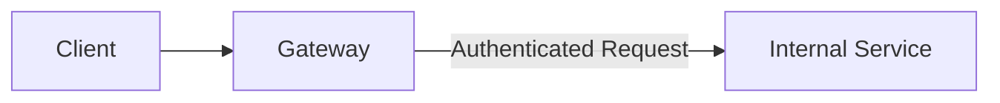
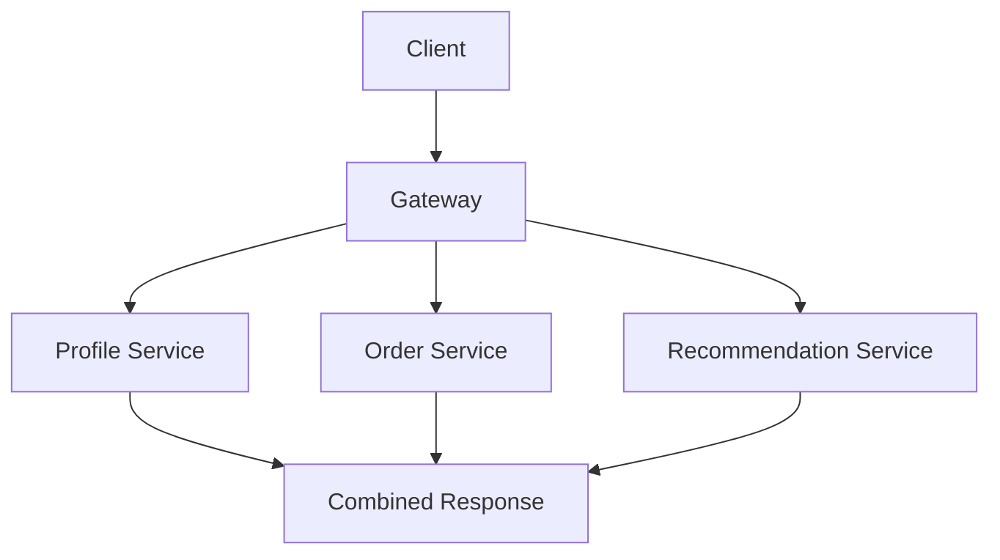
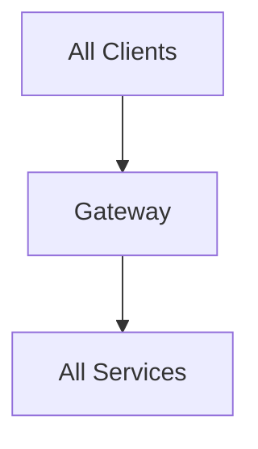

# API Gateway

Suppose your backend grows into several services.



You probably don't want every client to know every internal service address and responsibility.

An API gateway gives clients a single entry point.



---

## What Does the Gateway Do?

Common responsibilities include:

- routing
- authentication
- authorization
- rate limiting
- TLS termination
- request logging
- request transformation
- response aggregation

Not every gateway needs to do all of these.

---

## Routing

The gateway can route based on path.

```text
/users/*    -> User Service
/orders/*   -> Order Service
/payments/* -> Payment Service
```



The client sees one public API surface while internal architecture can change independently.

---

## Authentication

Instead of every backend service independently validating external credentials, some authentication work can happen at the gateway.



Internal services may still need authorization checks of their own.

Don't treat the gateway as a reason to stop thinking about service security.

---

## Request Aggregation

Suppose a mobile screen needs:

```text
profile
orders
recommendations
```

Instead of the mobile client making three separate backend calls, the gateway may aggregate them.



Useful when reducing client round trips matters.

But now the gateway owns more application behaviour and complexity.

---

## Gateway vs Load Balancer

They can overlap, but they're not the same concept.

Load balancer:

```text
Which instance of this service handles the request?
```

API gateway:

```text
Which backend service should receive the request?
What cross-cutting policies should apply?
```

A deployment may contain both.

---

## Gateway vs Reverse Proxy

An API gateway is usually a specialized reverse proxy with additional API-specific responsibilities.

A reverse proxy may simply handle:

- routing
- TLS
- caching
- load balancing

An API gateway often adds:

- authentication
- API quotas
- transformations
- service-level routing
- API observability

Don't get stuck on product labels. Focus on responsibilities.

---

## The Gateway Can Become a Bottleneck

If every request passes through one gateway:



the gateway becomes critical infrastructure.

It needs:

- enough capacity
- redundancy
- monitoring
- sensible timeouts

> [!WARNING]
> Centralizing common behaviour is useful. Centralizing too much business logic creates another giant service everyone depends on.

---

## What You Should Know

Be able to explain:

- why API gateways exist
- routing
- authentication
- rate limiting
- request aggregation
- gateway vs load balancer
- gateway vs reverse proxy
- why the gateway itself can become a bottleneck

That's enough.

---

## Next

The gateway is one kind of intermediary.

To make the terminology clear, continue with [Proxy & Reverse Proxy](./proxy-reverse-proxy.md).

---

*Back to [HLD Building Blocks](./README.md)*