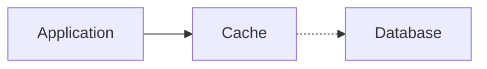
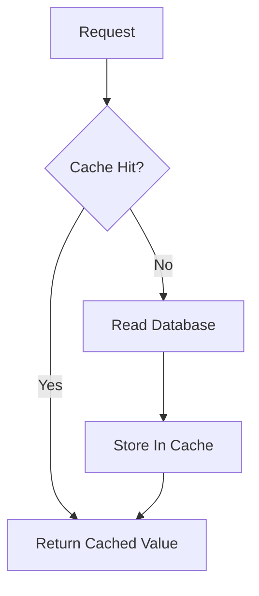
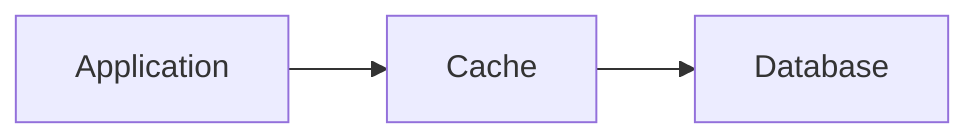
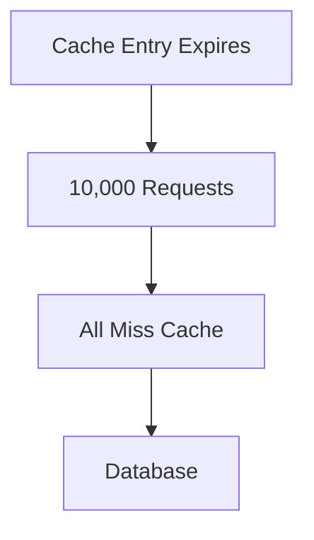
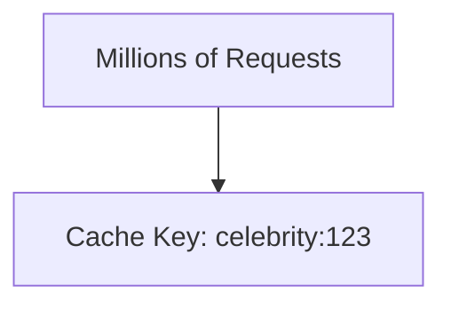
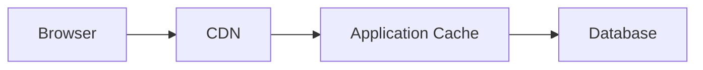

# Caching

A cache stores data somewhere faster so you don't repeatedly fetch or compute the same thing.



The point isn't "Redis is fast."

The point is avoiding expensive repeated work.

---

## Basic Read Flow



This is commonly called **cache-aside**.

The application checks the cache first and fills it when data is missing.

---

## Cache Hit vs Cache Miss

### Cache Hit

The requested value is already cached.

```text
Cache -> value found
```

Fast path.

### Cache Miss

The value is not cached.

```text
Cache -> miss
Database -> read
Cache -> populate
```

The database still needs to handle misses.

> [!IMPORTANT]
> A cache reduces backend load. It does not remove the backend.

---

## What Should You Cache?

Good candidates:

- frequently-read data
- expensive query results
- data that changes relatively infrequently
- computed responses that are expensive to regenerate

Poor candidates:

- data changing constantly
- highly sensitive data with strict freshness requirements
- values rarely requested more than once
- huge objects that consume more cache memory than they're worth

---

## TTL

Cached data should not necessarily live forever.

A **Time To Live (TTL)** tells the cache when an entry expires.

```text
profile:42 -> expires after 5 minutes
```

Shorter TTL:

- fresher data
- more backend reads

Longer TTL:

- fewer backend reads
- higher chance of stale data

That's the trade-off.

---

## Cache Invalidation

Suppose:

```text
Database -> username = Vijay
Cache    -> username = Vjiay
```

The database has been updated, but the cache still contains the old value.

Now you need a strategy for invalidating or updating cached data.

> [!IMPORTANT]
> Caching moves complexity from "reads are slow" to "how do I keep cached data acceptably fresh?"

That trade-off matters more than remembering Redis commands.

---

## Common Write Strategies

### Cache-Aside

Application writes to the database and removes or updates the cache.

Simple and common.

### Write-Through

Writes go through the cache and are also persisted to storage.



### Write-Back

Write reaches the cache first and is persisted later.

Can improve write performance, but now losing the cache can mean losing data unless carefully designed.

You usually don't need deep implementation details for interviews.

Know the trade-offs.

---

## Eviction

Cache memory is finite.

When it fills up, something has to leave.

Common policies include:

- LRU — Least Recently Used
- LFU — Least Frequently Used
- FIFO — First In First Out

For most HLD interviews, knowing why eviction exists matters more than memorizing every policy.

---

## Cache Stampede

Suppose one extremely popular key expires.



Instead of protecting the database, the cache suddenly sends thousands of identical requests to it.

That's a cache stampede.

Common mitigations include:

- request coalescing
- locking
- staggered expiration
- refreshing hot data before expiration

Know the problem first.

---

## Hot Keys

One cached value may receive far more traffic than everything else.



Even a distributed cache can struggle if all traffic lands on one node holding one extremely popular key.

This is a hotspot problem again.

---

## Cache Locations

Caching can happen at several layers.



Examples:

- browser cache
- CDN
- reverse proxy cache
- application cache
- database cache

Don't assume "cache" means one Redis cluster.

---

## What You Should Know

Be able to explain:

- why caching helps
- cache hit vs miss
- cache-aside
- TTL
- stale data
- invalidation
- eviction
- cache stampede
- why caching isn't automatically useful for every workload

That's enough.

---

## Next

Caching reduces reads, but the database is still one copy of your data.

Continue with [Database Replication](./database-replication.md).

---

*Back to [HLD Building Blocks](./README.md)*