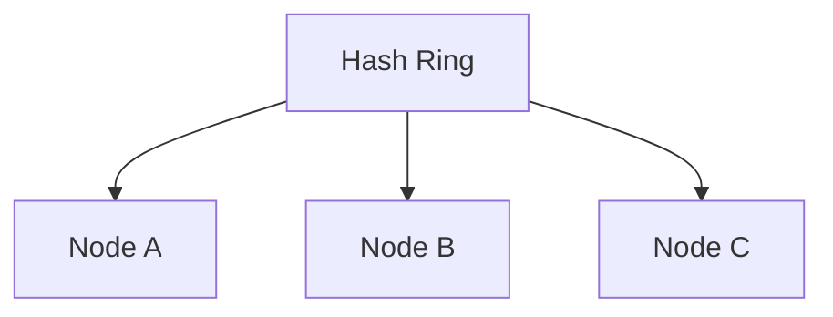

# Consistent Hashing

Suppose you have several cache or storage nodes and need to decide where each key belongs.

A naive approach is:

```text
node = hash(key) % numberOfNodes
```

It works until the number of nodes changes.

Consistent hashing exists to make that change much less painful.

---

## The Problem With Normal Modulo Hashing

Suppose you have three nodes:

```text
hash(key) % 3
```

Keys get distributed across:

```text
Node 0
Node 1
Node 2
```

Now add another node:

```text
hash(key) % 4
```

A huge percentage of keys suddenly map somewhere else.


For a large distributed cache, that can mean massive cache misses and data movement.

---

## The Hash Ring

Consistent hashing maps both:

- nodes
- keys

onto the same logical ring.



A key is assigned to the next node encountered around the ring.

The exact ring implementation isn't the important part.

The important property is what happens when membership changes.

---

## Adding a Node

With consistent hashing, adding a node only moves keys from a nearby section of the ring.


Most keys stay where they already were.

That's the benefit.

---

## Removing a Node

If a node disappears, only the keys owned by that node need to move.

They are reassigned to the next appropriate node.

Again, most of the system stays untouched.

---

## Virtual Nodes

One physical node can appear multiple times on the ring.

```text
Server A -> A1, A2, A3
Server B -> B1, B2, B3
Server C -> C1, C2, C3
```

These are virtual nodes.

They help:

- distribute keys more evenly
- reduce imbalance
- support servers with different capacities

You don't need to implement the ring from memory in most HLD interviews.

Understand why virtual nodes improve distribution.

---

## Where Is This Useful?

Common cases include:

- distributed caches
- distributed databases
- partitioned storage
- request routing

Anywhere you need stable key-to-node assignment while nodes may join or leave.

---

## What Consistent Hashing Does Not Solve

It doesn't automatically solve:

- replication
- consistency
- node failure detection
- hotspot keys
- data durability

It only solves one specific problem:

> distributing keys while minimizing how much needs to move when the node set changes.

> [!IMPORTANT]
> Don't treat consistent hashing as a generic scaling algorithm. Know the exact problem it fixes.

---

## Hot Keys Still Exist

Even with perfect key distribution:

```text
99% of requests -> key X
```

the node owning key X can still become overloaded.

Consistent hashing distributes **keys**, not necessarily **traffic**.

That's another example of workload distribution mattering more than raw node count.

---

## What You Should Know

Be able to explain:

- why `hash(key) % N` causes problems when `N` changes
- what the hash ring achieves
- what happens when nodes join or leave
- virtual nodes
- where consistent hashing is useful
- why it doesn't automatically solve hotspots

That's enough.

---

## Next

Distributing traffic is useful, but sometimes the correct answer is simply to refuse excess traffic.

Continue with [Rate Limiting](./rate-limiting.md).

---

*Back to [HLD Building Blocks](./README.md)*