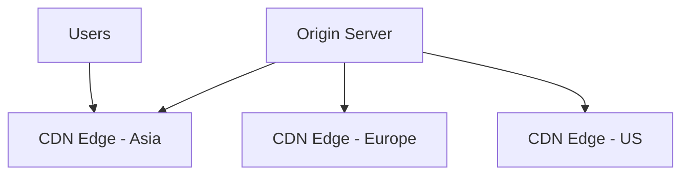
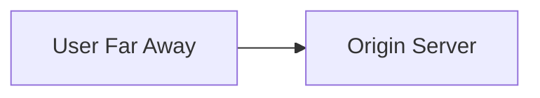
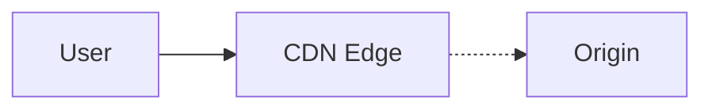
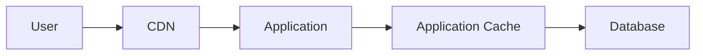

# Content Delivery Network (CDN)

A CDN stores cacheable content at locations geographically closer to users.



Instead of every user fetching content from your origin, many requests are served from nearby edge locations.

---

## Why You Need It

Suppose your origin runs in one region.



Every request travels all the way to that region.

For large static content, that's unnecessary latency and unnecessary origin traffic.

A CDN places cached copies closer to users.

---

## Origin and Edge

The **origin** is the original source of the content.

The **edge** is a CDN location closer to users.



If the edge already has the content:

```text
cache hit -> return immediately
```

If not:

```text
cache miss -> fetch from origin -> cache -> return
```

---

## Good CDN Content

Common examples:

- images
- videos
- CSS
- JavaScript bundles
- downloadable files
- static pages
- other cacheable responses

Large content benefits particularly well because it also reduces origin bandwidth.

---

## Dynamic Content

Not everything should be cached.

Examples like:

```text
GET /my-bank-balance
```

usually cannot simply be cached globally and served to everyone.

Some dynamic responses can still be cached depending on:

- user
- headers
- query parameters
- authorization
- TTL

But don't assume everything belongs on the CDN.

---

## TTL and Staleness

Like any cache, CDN content can become stale.

Suppose:

```text
/logo.png
```

changes at the origin.

Edge locations may still hold the old version until:

- TTL expires
- you invalidate the object
- you change the asset URL/version

Again, caching trades freshness for reduced latency and load.

---

## Cache Invalidation

You can explicitly tell the CDN to remove cached content.

Useful when something changes and waiting for TTL is unacceptable.

But invalidating huge amounts of globally distributed content repeatedly can be expensive or slow.

A common static-asset technique is versioned filenames:

```text
app.v1.js
app.v2.js
```

A new URL naturally creates a new cache entry.

---

## CDN vs Application Cache

They solve related but different problems.



CDN:

```text
reduce geographic latency
reduce origin traffic
serve cacheable content
```

Application cache:

```text
avoid expensive backend reads or computation
```

Both are caches, but they sit in different places.

---

## CDN Failure

If the CDN is unavailable, you may:

- route users directly to origin
- use another CDN
- temporarily lose access to cached content

The exact strategy depends on how critical that content is.

Don't over-design this unless the interview asks for global content delivery specifically.

---

## What You Should Know

Be able to explain:

- origin vs edge
- cache hit vs miss
- why CDNs reduce latency and origin load
- what content belongs on a CDN
- TTL
- invalidation
- CDN vs application caching

That's enough.

---

## Next

Some distributed systems need to map keys across nodes that are constantly being added and removed.

Continue with [Consistent Hashing](./consistent-hashing.md).

---

*Back to [HLD Building Blocks](./README.md)*