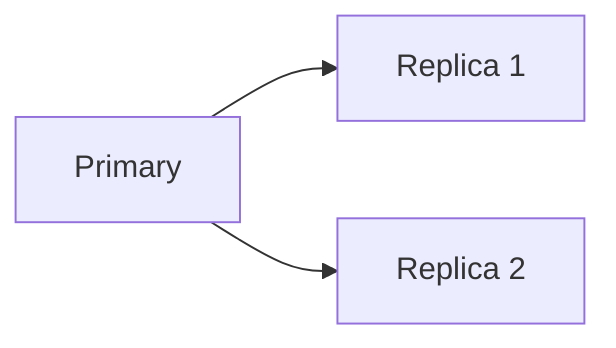
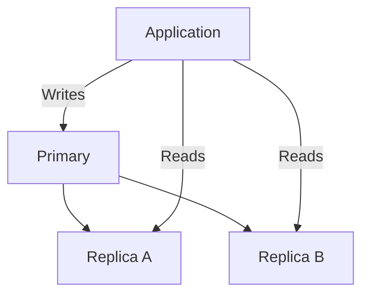
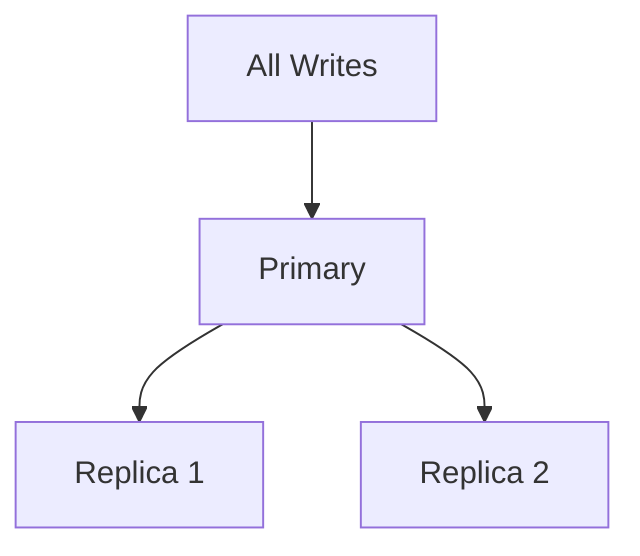
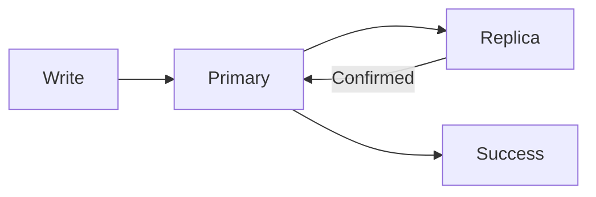
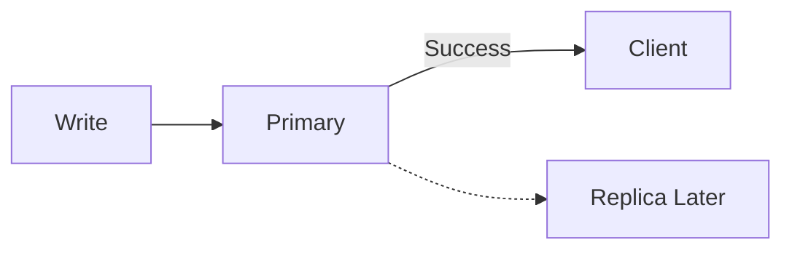
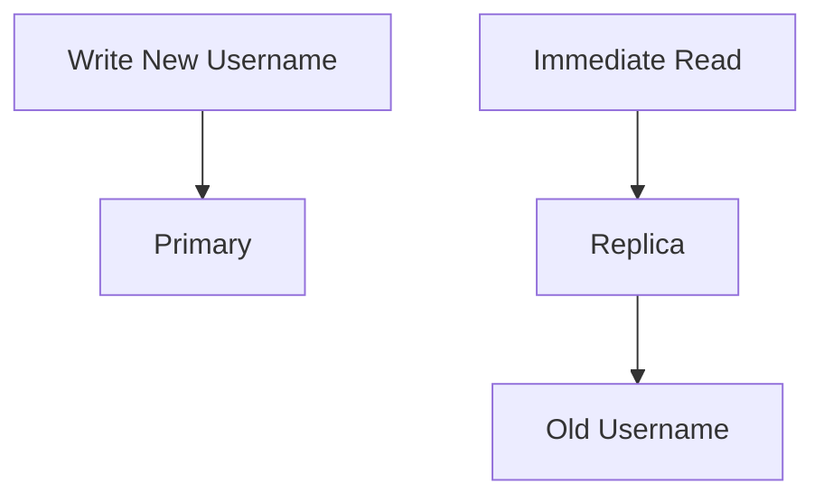
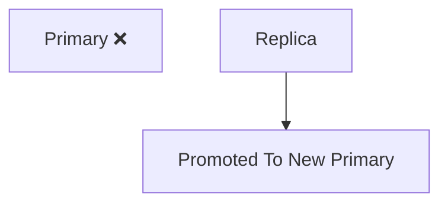
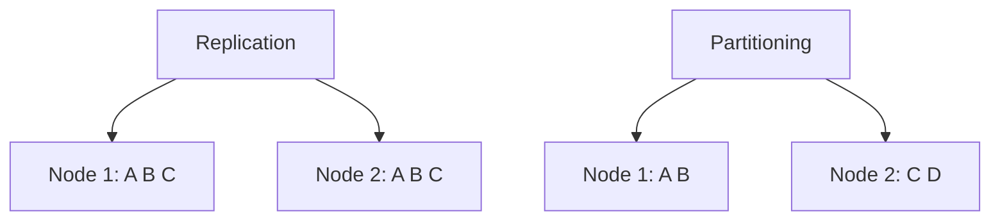

# Database Replication

Replication means keeping copies of the same data on multiple database nodes.



It is mainly used for:

- availability
- fault tolerance
- scaling reads

It is not the same thing as sharding.

---

## Primary-Replica Replication

A common setup is:



The primary accepts writes.

Replicas copy those changes and may serve reads.

This reduces read pressure on the primary.

---

## Replication Does Not Scale Writes Automatically



You may have ten replicas and still have every write going through the same primary.

So replication mainly helps:

- read throughput
- redundancy

If write throughput is the problem, partitioning may be the next step.

---

## Synchronous Replication

The primary waits for another node to confirm the write before acknowledging success.



Benefit:

- stronger durability / consistency guarantees

Cost:

- higher write latency
- unavailable or slow replicas can delay writes

---

## Asynchronous Replication

The primary acknowledges the write before replicas necessarily receive it.



Benefit:

- lower write latency

Cost:

- replicas may temporarily be stale

That delay is **replication lag**.

---

## Replication Lag

Suppose a user updates their profile:

```text
Primary  -> new value
Replica  -> old value
```

If the next read goes to the replica immediately, the user may see stale data.



This is one of the most common consistency issues introduced by asynchronous replication.

---

## Read-After-Write

Some operations need the user to immediately see their own update.

A common design is:

```text
User writes
↓
temporarily read that user's data from primary
↓
replicas catch up
```

You don't need to memorize one fixed implementation.

Understand the requirement:

> A user who just changed something often expects to immediately see that change.

---

## Failover

Replication also helps when the primary fails.



One replica can be promoted.

But failover isn't magically free.

You need to consider:

- detecting the failure
- choosing a new primary
- clients finding the new primary
- whether the newest writes reached the replica

Those details become deeper distributed-systems topics.

---

## Replication vs Backup

Do not confuse them.

Replication copies changes quickly.

If you accidentally delete all users:

```text
DELETE FROM users;
```

replication may happily copy that deletion everywhere.

A backup lets you recover older state.

```text
Replication -> availability / redundancy
Backup      -> recovery from data loss or corruption
```

Both matter for different reasons.

---

## Replication vs Partitioning

```text
Replication
-> same data on multiple nodes

Partitioning
-> different data on different nodes
```



This distinction should be automatic.

---

## What You Should Know

Be able to explain:

- why replication exists
- primary-replica architecture
- read scaling
- synchronous vs asynchronous replication
- replication lag
- stale reads
- failover
- replication vs backup
- replication vs partitioning

That's enough.

---

## Next

Replication copies the same data.

What happens when one node cannot hold or write all of the data anymore?

Continue with [Partitioning & Sharding](./partitioning-sharding.md).

---

*Back to [HLD Building Blocks](./README.md)*