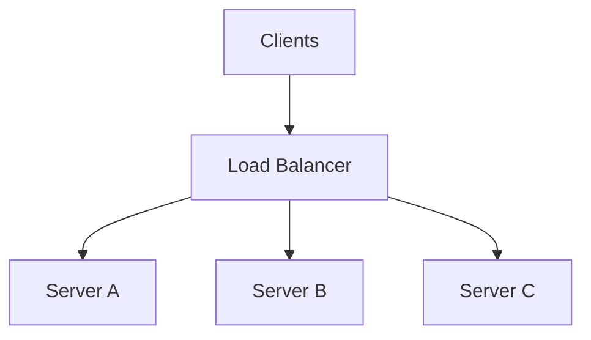
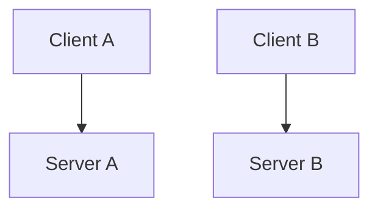
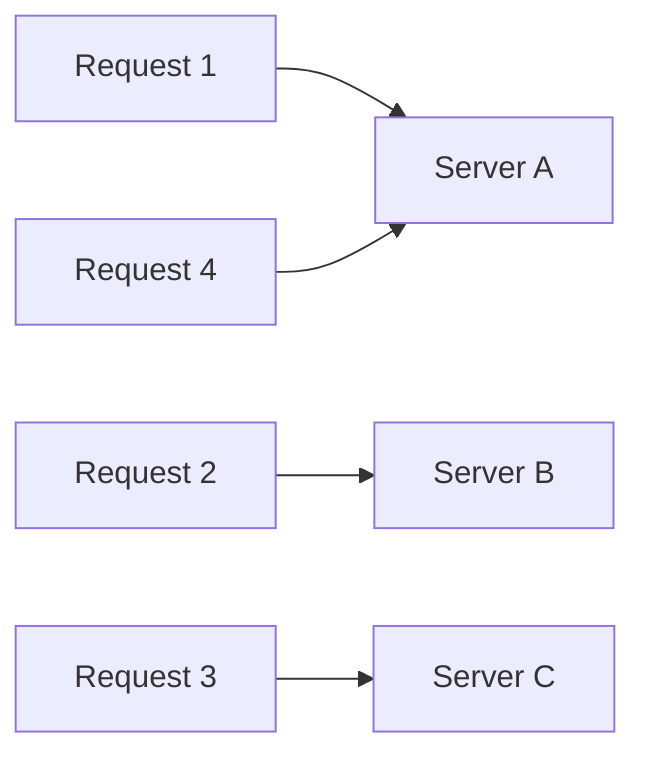
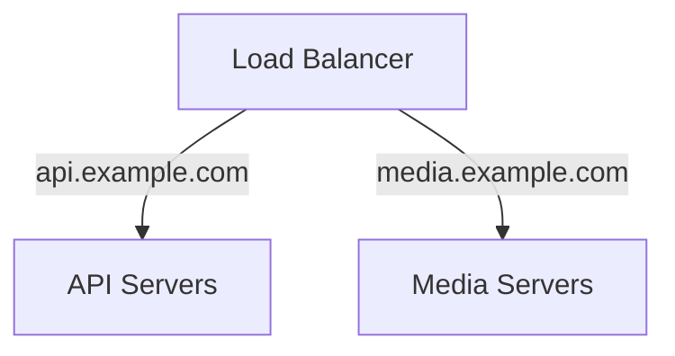
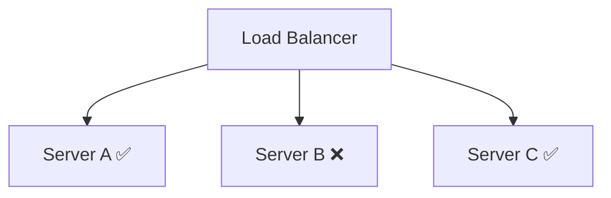
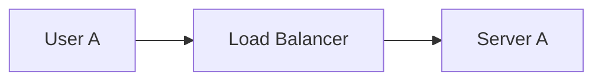
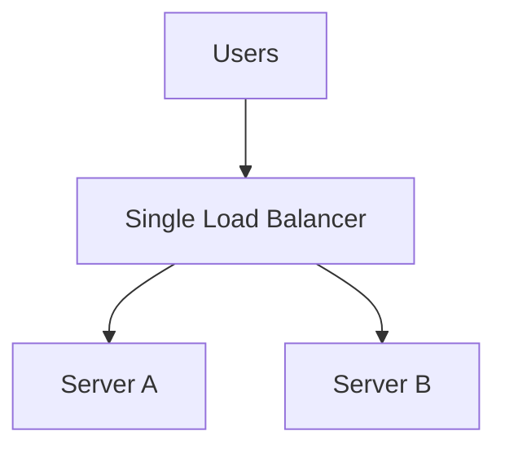
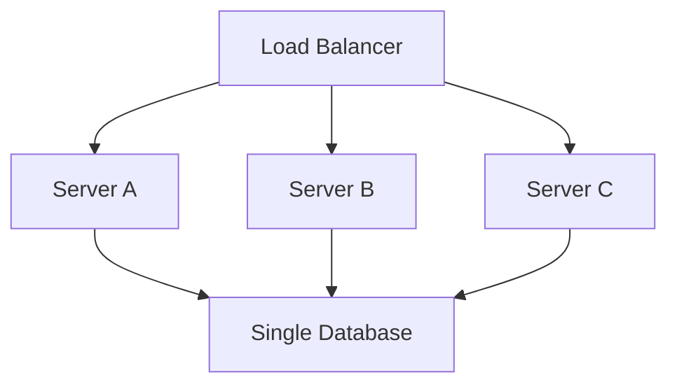

# Load Balancing

Once you run multiple application servers, users need a way to reach them without knowing which server should handle each request.

That's the load balancer's job.



---

## Why You Need It

Without a load balancer:



clients would somehow need to know which servers exist, whether they're healthy, and where to send traffic.

That's not a responsibility you want on the client.

A load balancer gives clients one entry point and distributes requests behind it.

---

## Common Strategies

### Round Robin

Send requests to servers in order.



Simple and useful when servers have roughly equal capacity and requests cost roughly the same.

### Least Connections

Send traffic to the server currently handling the fewest active connections.

Useful when requests can live for very different amounts of time.

### Weighted Balancing

Not every server needs to receive the same traffic.

```text
Server A -> weight 2
Server B -> weight 1
```

Server A can receive roughly twice as much traffic.

Useful when machines have different capacities.

---

## Layer 4 vs Layer 7

### Layer 4

Routes using transport-level information such as:

- IP
- TCP
- UDP
- port

It doesn't need to understand the HTTP request itself.

### Layer 7

Understands application-level data such as HTTP:

```text
/api/videos/*
/api/payments/*
```

and can route based on things like:

- path
- hostname
- headers
- cookies



> [!TIP]
> You don't need packet-level depth for HLD. Know why Layer 7 gives smarter routing while Layer 4 is simpler and lower-level.

---

## Health Checks

A load balancer should not keep sending requests to a server that is down.



Health checks let the load balancer temporarily remove unhealthy servers from rotation.

When the server recovers, it can be added back.

---

## Sticky Sessions

Sometimes requests from the same user need to keep reaching the same server.



Future requests from User A are routed to Server A again.

That's a sticky session.

Useful when local server state exists, but it also creates:

- uneven traffic
- harder failover
- harder scaling

Prefer stateless application servers where practical.

---

## The Load Balancer Can Fail Too

You may remove the application server as a single point of failure and accidentally create a new one:



If the load balancer disappears, neither server is reachable.

Real deployments usually provide redundancy at this layer too.

For interviews, simply recognize the failure point unless the problem specifically asks you to design the load-balancing infrastructure itself.

---

## Load Balancing Doesn't Fix Backend Bottlenecks



Application traffic is distributed.

Database traffic is not.

> [!IMPORTANT]
> Load balancing scales the layer behind the load balancer. It does not magically scale every dependency downstream.

---

## What You Should Know

Be able to explain:

- why load balancing is needed
- round robin vs least connections
- Layer 4 vs Layer 7
- health checks
- sticky sessions
- why the load balancer itself needs redundancy
- why adding app servers doesn't solve a database bottleneck

That's enough.

---

## Next

Once requests are distributed, the next common bottleneck is repeated reads.

Continue with [Caching](./caching.md).

---

*Back to [HLD Building Blocks](./README.md)*