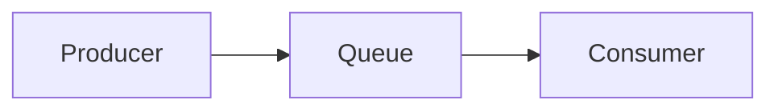
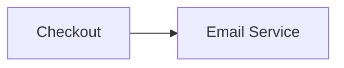
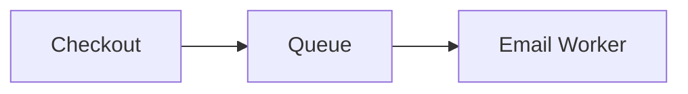
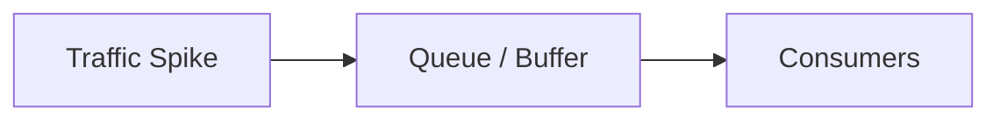
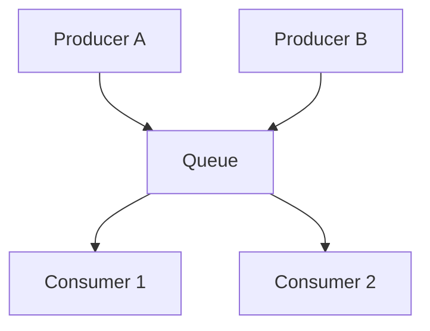
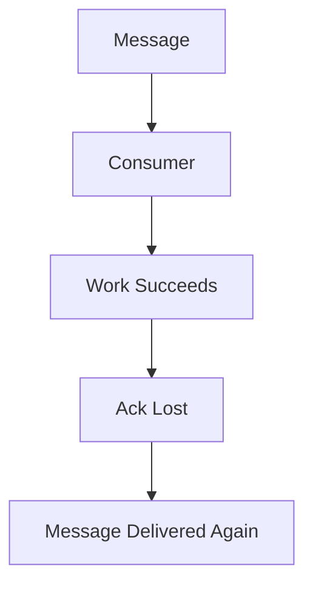
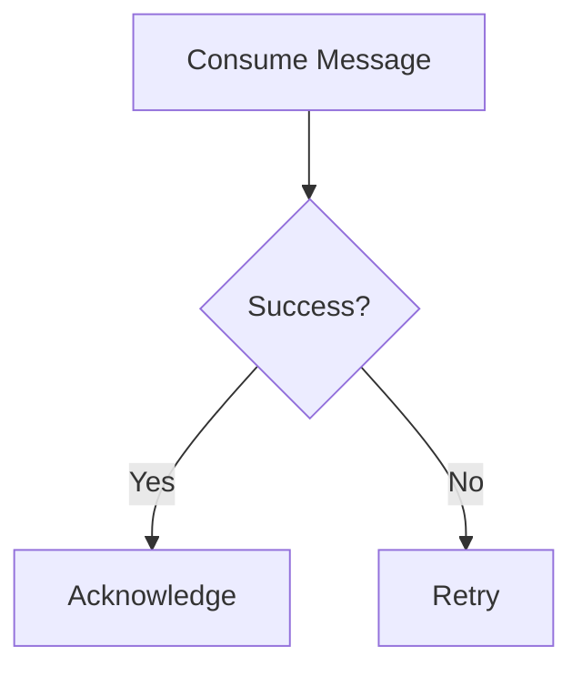
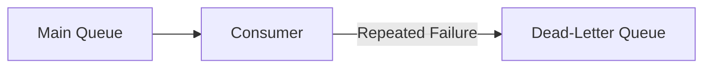

# Message Queues

A message queue sits between a producer creating work and a consumer processing it.



It lets the two sides operate independently instead of requiring both to be available and equally fast at the same time.

---

## Why Use a Queue?

Suppose checkout directly sends an email:



If the email service is slow, checkout is slow.

If the email service is down, checkout may fail.

Instead:



Checkout records the work and continues.

The email worker processes it separately.

That's decoupling.

---

## Absorbing Traffic Spikes

Suppose producers suddenly generate:

```text
50,000 jobs/sec
```

but consumers can process:

```text
10,000 jobs/sec
```

Without buffering, the consumers are immediately overwhelmed.

With a queue:



the queue temporarily stores excess work.

> [!IMPORTANT]
> A queue handles temporary imbalance. If producers permanently generate work faster than consumers can process it, the queue just grows forever.

Eventually you still need more consumer capacity or less incoming work.

---

## Producers and Consumers

A **producer** publishes work.

A **consumer** processes it.



Adding more consumers can increase processing throughput if jobs can safely run in parallel.

---

## Delivery Is Not Always Exactly Once

A consumer may process a message, finish the work, and crash before acknowledging it.

The queue may deliver the message again.



This is why consumers should often be **idempotent**.

Running the same operation twice should not incorrectly perform the business action twice.

---

## Idempotency

Suppose the message is:

```text
Charge customer ₹500
```

Processing it twice is obviously bad.

Instead, operations may carry an idempotency key:

```text
paymentId = 84f2...
```

Before processing, the consumer can determine whether that operation has already been completed.

The exact implementation depends on the system.

The important idea is:

> Duplicate delivery must not automatically mean duplicate business effects.

---

## Ordering

Some messages need to be processed in order.

```text
1. Create account
2. Update account
3. Delete account
```

Processing `3` before `1` makes no sense.

Other workloads don't care about global ordering.

Guaranteeing strict ordering usually limits how freely you can parallelize work.

That's a trade-off.

---

## Retries

Failed messages can often be retried.



But endless retries are dangerous.

A permanently broken message can keep failing forever.

---

## Dead-Letter Queue

After repeated failures, a message may be moved aside.



The dead-letter queue lets the rest of the workload continue while failed messages are inspected separately.

---

## Queue vs Stream

At HLD level, keep the distinction simple.

A traditional queue often behaves like work distribution:

```text
message -> processed by a consumer
```

An event stream often keeps an ordered log that multiple consumers can independently read.

```text
event 1
event 2
event 3
...
```

Kafka-style systems lean heavily toward the stream/log model.

SQS-style systems lean toward queue semantics.

You don't need broker internals unless the role specifically expects it.

---

## What Queues Cost You

Queues add:

- delayed processing
- operational infrastructure
- duplicate handling
- retries
- ordering concerns
- backlog monitoring
- eventual consistency

> [!IMPORTANT]
> Async architecture improves decoupling and request latency by accepting that some work completes later.

That's the trade-off.

---

## What You Should Know

Be able to explain:

- producer / queue / consumer
- why queues decouple systems
- traffic buffering
- backlog
- duplicate delivery
- idempotency
- ordering
- retries
- dead-letter queues

That's enough.

---

## Next

Queues help move work through the backend.

CDNs solve a different problem: moving content closer to users.

Continue with [CDN](./cdn.md).

---

*Back to [HLD Building Blocks](./README.md)*