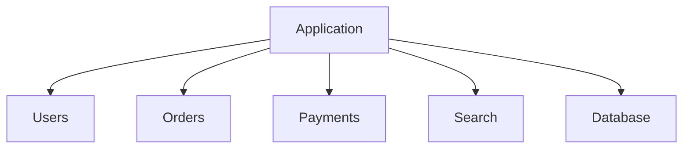
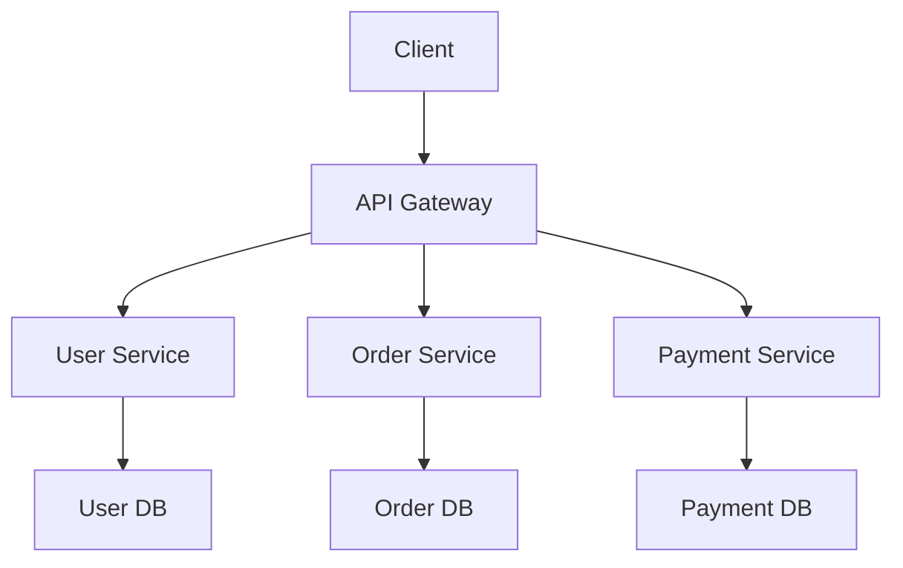
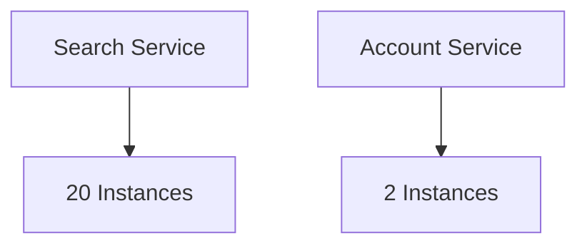
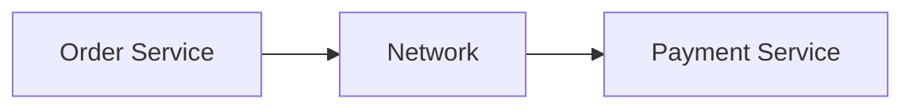
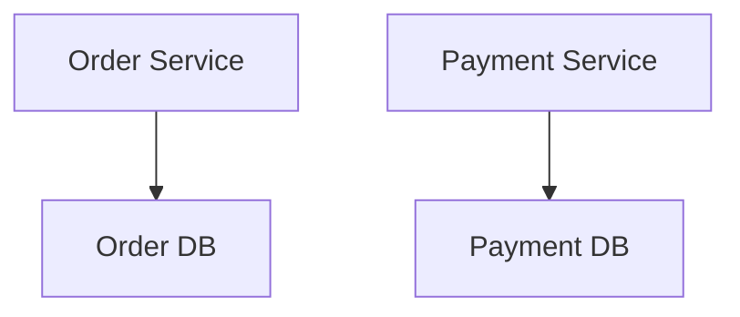
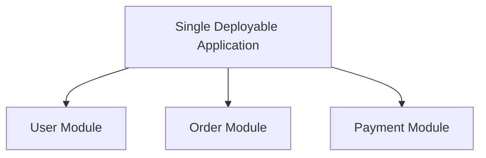
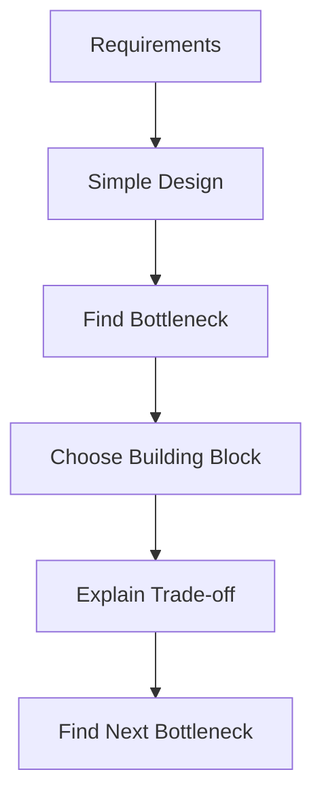

# Monolith vs Microservices

This gets presented badly all the time.

A monolith is not automatically outdated.

Microservices are not automatically scalable.

The real question is where you want your **deployment and ownership boundaries**.

---

## Monolith

A monolithic application keeps most application functionality inside one deployable system.



The code can still be cleanly separated into modules.

"Monolith" does not mean one giant file with no architecture.

---

## Why Start With a Monolith?

You get:

- simpler deployment
- easier local development
- fewer network calls
- simpler transactions
- easier debugging
- less infrastructure

For many products, especially early on, this is exactly what you want.

> [!IMPORTANT]
> If one application comfortably handles your scale and team size, splitting it into fifteen services is not an architectural upgrade.

---

## Microservices

Microservices split functionality into independently deployable services.



Each service may:

- deploy independently
- scale independently
- own its data
- be maintained by a separate team

That independence is the main benefit.

---

## Independent Scaling

Suppose search receives 20 times more traffic than account settings.

With a monolith, you may need to scale the whole application.

With separate services:



you can scale the hot service independently.

Useful when workloads differ significantly.

---

## Independent Deployment

Suppose the payments team needs to deploy without coordinating with five unrelated teams.

Separate service boundaries can help.

This becomes increasingly useful as:

- the codebase grows
- the organization grows
- different components evolve at different speeds

Architecture often follows team boundaries as much as traffic patterns.

---

## What Microservices Cost You

A function call inside one process becomes a network call.



Now you have:

- latency
- timeouts
- retries
- partial failures
- service discovery
- distributed tracing
- deployment coordination
- distributed transactions
- versioned APIs

You exchanged local complexity for distributed complexity.

---

## Data Ownership

A common microservice principle is that each service owns its data.



This reduces direct coupling between services.

But operations that previously used one database transaction may now span multiple services.

That makes consistency harder.

---

## Distributed Transactions

In a monolith with one database:

```text
BEGIN
create order
charge payment
update inventory
COMMIT
```

may be one transaction.

Across three independent services, that becomes much harder.

You now need to reason about:

- partial success
- retries
- compensation
- eventual consistency

This is one of the biggest costs people skip when casually suggesting microservices.

---

## Modular Monolith

There is a useful middle ground.



Keep strong internal boundaries without paying the distributed-system cost yet.

If one module later genuinely needs independent scaling or ownership, it can be extracted.

> [!TIP]
> Design clean boundaries first. Split processes only when you have a reason.

---

## When Microservices Make Sense

They start becoming reasonable when you have real needs such as:

- independent deployment
- independent scaling
- large teams owning separate domains
- very different reliability requirements
- strong domain boundaries
- technology requirements that genuinely differ

Not because:

```text
Netflix uses microservices
```

Your system is not Netflix by default.

---

## What You Should Know

Be able to explain:

- monolith
- microservices
- modular monolith
- independent scaling
- independent deployment
- data ownership
- network and operational cost
- distributed transactions
- why microservices are a trade-off, not an upgrade

That's enough.

---

## Building Blocks Done

You now have the common components needed to start putting real systems together:



The next stage should not be more isolated theory.

Start designing systems and pull these components in when the problem actually requires them.

---

*Back to [HLD Building Blocks](./README.md)*