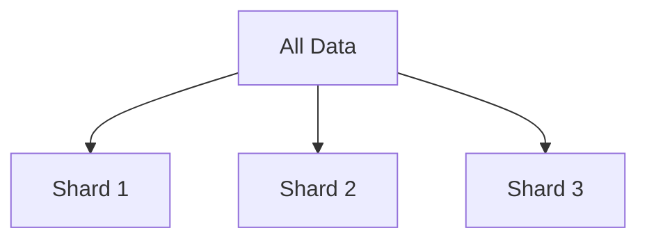
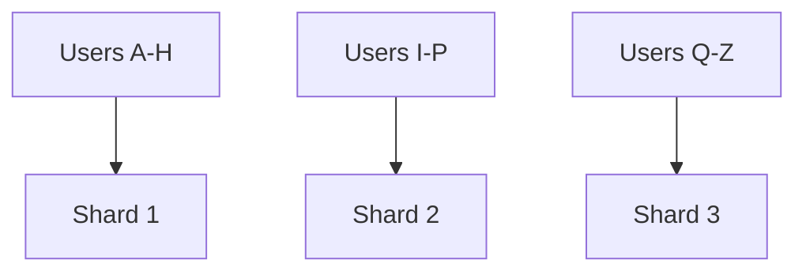
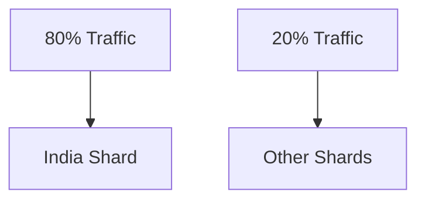
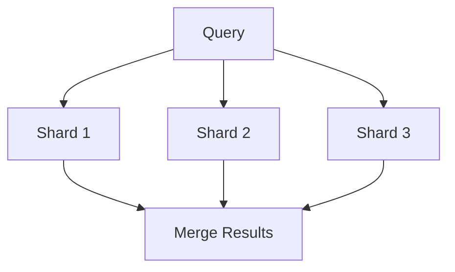
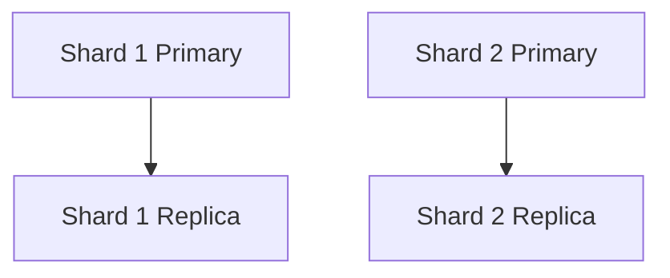

# Partitioning & Sharding

Partitioning splits a dataset into smaller pieces and stores different pieces on different nodes.



Unlike replication, the nodes do not necessarily contain the same data.

---

## Why Partition?

Eventually one database may struggle with:

- total data size
- write throughput
- read throughput
- index size
- storage capacity

Splitting data lets multiple nodes share the work.



---

## The Partition Key

The most important decision is usually:

**Which value decides where the data goes?**

Example:

```text
userId
```

You might route:

```text
userId 123 -> Shard 2
userId 456 -> Shard 1
```

That value is your partition or shard key.

> [!IMPORTANT]
> A bad shard key creates hotspots and expensive cross-shard queries. Sharding isn't hard because splitting data is difficult, it's hard because choosing the split correctly is difficult.

---

## Range-Based Partitioning

Split data by ranges.

```text
A - H -> Shard 1
I - P -> Shard 2
Q - Z -> Shard 3
```

Easy to understand and useful for range queries.

Problem: data may not be distributed evenly.

If most users have names starting with A-H, Shard 1 gets overloaded.

---

## Hash-Based Partitioning

Hash the key and use the result to decide the shard.

```text
hash(userId) % numberOfShards
```


This usually distributes data more evenly.

But range queries become harder because nearby keys may live on completely different shards.

---

## Hotspots

Suppose you shard by:

```text
country
```

and 80% of your users are from one country.



One shard gets destroyed while the others sit mostly idle.

That's why partition-key selection matters.

---

## Cross-Shard Queries

Suppose users are partitioned by `userId`.

Now someone asks:

```text
Find the 100 newest users globally.
```

There is no single shard containing that answer.

You may need to:



Cross-shard joins, aggregations, and transactions are harder and more expensive.

> [!WARNING]
> Sharding buys scale by giving up the simplicity of having all data in one place.

---

## Rebalancing

Suppose you start with three shards and later add a fourth.

With naive hashing:

```text
hash(key) % 3
```

becomes:

```text
hash(key) % 4
```

A huge amount of data may now map to different nodes.

Moving all of that data is expensive.

This is one of the problems [Consistent Hashing](./consistent-hashing.md) helps with.

---

## Replication and Sharding Are Often Combined

Real systems commonly do both.



Partitioning:

```text
splits the dataset
```

Replication:

```text
creates copies of each partition
```

They solve different problems and work together.

---

## When Not To Shard

If one database comfortably handles:

- your data
- your writes
- your reads

don't shard it.

You are adding:

- routing
- rebalancing
- cross-shard queries
- distributed transactions
- operational complexity

for no benefit.

> [!IMPORTANT]
> Sharding should solve a real capacity problem, not make the architecture look large-scale.

---

## What You Should Know

Be able to explain:

- why partitioning exists
- partition key
- range vs hash partitioning
- hotspots
- cross-shard queries
- rebalancing
- replication vs sharding
- why shard-key choice matters

That's enough.

---

## Next

Storage isn't the only place we distribute work.

Some operations should happen outside the request path entirely.

Continue with [Message Queues](./message-queues.md).

---

*Back to [HLD Building Blocks](./README.md)*