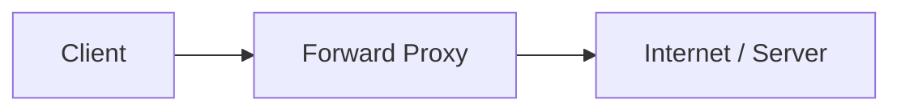
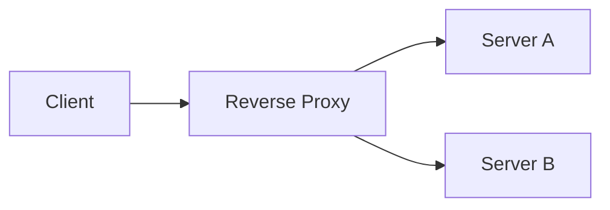
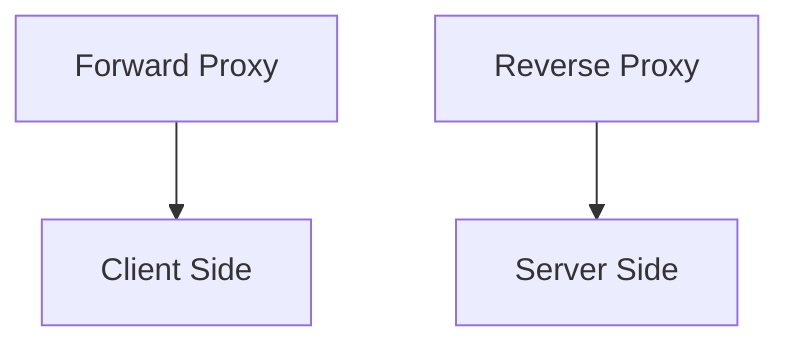
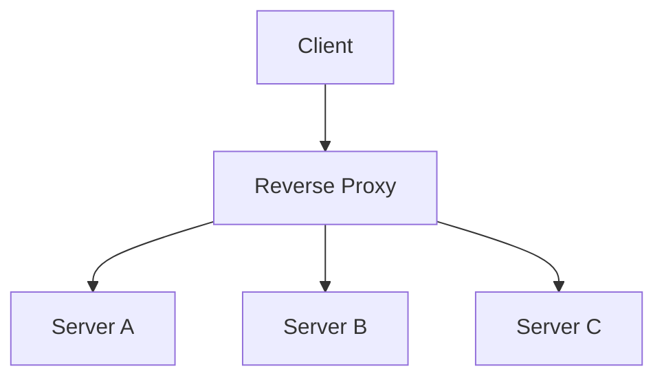
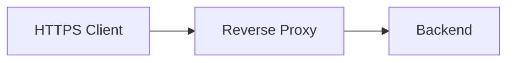

# Proxy vs Reverse Proxy

Both sit between two systems.

The easiest way to remember the difference is:

```text
Forward Proxy -> represents the client
Reverse Proxy -> represents the server
```

---

## Forward Proxy

A forward proxy sits between clients and the internet or destination server.



The destination server sees the proxy rather than directly dealing with the original client.

Common uses:

- corporate internet access
- access control
- content filtering
- hiding client IPs
- outbound traffic control

---

## Reverse Proxy

A reverse proxy sits in front of backend servers.



The client sees one public endpoint and does not need to know which backend server handled the request.

Common responsibilities:

- routing
- TLS termination
- load balancing
- caching
- compression
- hiding internal server topology

---

## The Difference



Forward proxy:

```text
Client -> Proxy -> Server
```

Reverse proxy:

```text
Client -> Proxy -> Backend Servers
```

The network diagram can look similar.

The difference is who the proxy is acting on behalf of.

---

## Reverse Proxy and Load Balancing

A reverse proxy may also load balance.



This is why tools like NGINX can be described as both reverse proxies and load balancers.

They're responsibilities, not mutually exclusive product categories.

---

## TLS Termination

Instead of every backend server independently handling HTTPS:



the reverse proxy can handle the TLS connection and forward traffic internally.

This centralizes certificate management.

Whether internal traffic is also encrypted depends on the system's security requirements.

---

## Routing

A reverse proxy can route:

```text
/api/*    -> API servers
/images/* -> media servers
/admin/*  -> admin service
```

This overlaps with Layer 7 load balancing and API gateway behaviour.

Again, focus on what the component is doing, not what vendor name is attached to it.

---

## What You Should Know

Be able to explain:

- forward proxy
- reverse proxy
- who each represents
- reverse proxy use cases
- TLS termination
- how reverse proxies overlap with load balancers and API gateways

That's enough.

---

## Next

At this point you've covered most common infrastructure building blocks.

The remaining architecture-level decision is how much of the application should live together.

Continue with [Monolith vs Microservices](./monolith-vs-microservices.md).

---

*Back to [HLD Building Blocks](./README.md)*