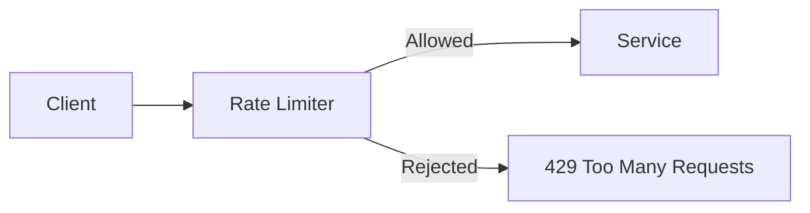
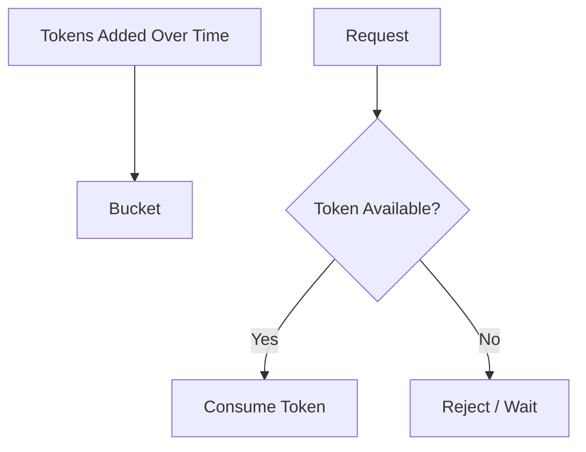
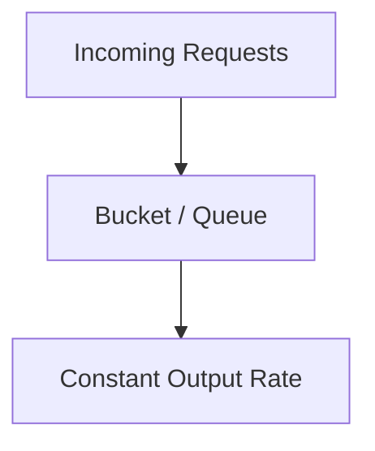
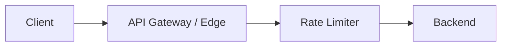

# Rate Limiting

Every system has finite capacity.

Rate limiting controls how much traffic a client is allowed to send within some period.



---

## Why You Need It

Without rate limiting, one client can accidentally or deliberately overwhelm the service.

Common reasons:

- abusive clients
- buggy retry loops
- bots
- scraping
- denial-of-service attempts
- fair usage between customers
- expensive APIs

Rate limiting protects capacity before the expensive work happens.

---

## What Can You Limit By?

Examples:

```text
100 requests/minute per user
1000 requests/minute per API key
20 requests/second per IP
1 million requests/minute globally
```

The right key depends on the product.

Per-IP limits alone can be weak because:

- many users may share one IP
- one attacker may use many IPs

Again, requirements matter.

---

## Fixed Window

Example:

```text
100 requests between 10:00 and 10:01
```

Simple counter.

Problem:

A client can send:

```text
100 requests at 10:00:59
100 requests at 10:01:01
```

That's 200 requests in two seconds while still staying within each fixed window.

Simple, but bursty at boundaries.

---

## Sliding Window

Instead of fixed clock boundaries, count requests over the most recent interval.

```text
last 60 seconds
```

More accurate, but more expensive to track depending on implementation.

You usually don't need implementation-level detail in HLD.

---

## Token Bucket

Imagine a bucket holding tokens.



Tokens refill at a fixed rate.

Requests consume tokens.

The bucket allows short bursts while still controlling the long-term rate.

This is one of the most common algorithms to understand.

---

## Leaky Bucket

Think of requests entering a bucket and leaving at a controlled rate.



Useful when you want smoother outgoing traffic rather than allowing bursts.

---

## Where Should Rate Limiting Happen?

Ideally before expensive application work.



For distributed systems, multiple rate limiter instances may need shared counters or some distributed coordination.

That becomes more complicated, but the basic goal stays the same.

---

## Rate Limiting vs Load Balancing

Load balancing:

```text
distributes accepted traffic
```

Rate limiting:

```text
decides how much traffic should be accepted
```

They're complementary.

A load balancer can spread 1 million requests perfectly across servers and still overwhelm every server.

---

## What Happens When Limited?

HTTP APIs commonly return:

```text
429 Too Many Requests
```

The response may include information about:

- retry timing
- remaining quota

Clients should respect the limit instead of retrying immediately and making the problem worse.

---

## What You Should Know

Be able to explain:

- why rate limiting exists
- per-user / per-IP / global limits
- fixed window
- sliding window
- token bucket
- leaky bucket
- where rate limiting should sit
- rate limiting vs load balancing

That's enough.

---

## Next

As systems split into more backend services, clients need a cleaner way to reach them.

Continue with [API Gateway](./api-gateway.md).

---

*Back to [HLD Building Blocks](./README.md)*