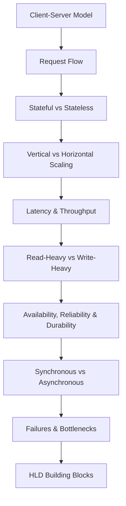
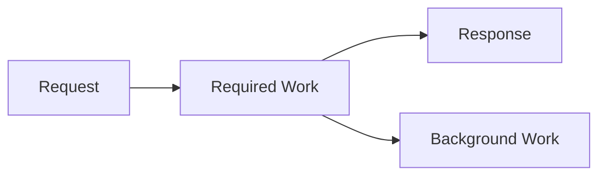
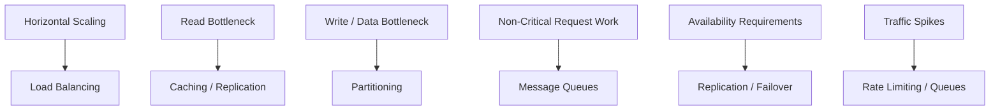

# High Level Design Foundations

Before getting into load balancers, caches, queues, sharding, and the rest, get these basics right first. Most of HLD is just taking a simple system, finding what stops working as the requirements change, and introducing the right component to fix it.

> [!IMPORTANT]
> Don't start HLD by memorizing architectures. Start with one server and one database, then learn what forces that design to change.

---

## Learning Order

---

## Client-Server Model

[Open Client-Server notes →](./client-server.md)

This is where every design starts. Understand what the client, application server, and database are doing, and how a request moves between them.

Focus on:

- request-response flow
- where application logic runs
- where persistent data lives
- how one service talks to another

You already know HTTP and networking from [Computer Networks](../../../core-cs/computer-networks.md). Don't relearn them here, just understand how they fit into an actual application.

---

## Stateful vs Stateless

[Open Stateful vs Stateless notes →](./stateful-stateless.md)

Why it matters: adding more application servers is easy only when any server can handle the next request.

Focus on:

- what application state actually is
- server-side sessions
- shared state
- why stateless application servers are easier to scale horizontally

> [!IMPORTANT]
> Stateless does not mean the system has no state. It means the application server does not need its own local state to handle the next request.

---

## Vertical vs Horizontal Scaling

[Open Scalability notes →](./scalability.md)

One machine eventually stops being enough.

Know the difference:

- **Vertical scaling**: make the same machine bigger
- **Horizontal scaling**: add more machines

Horizontal scaling is where most of the interesting HLD problems begin, because now traffic, state, data, and failures are spread across multiple machines.

This is what eventually leads into load balancing, replication, partitioning, and distributed coordination.

---

## Latency & Throughput

[Open Latency & Throughput notes →](./latency-throughput.md)

Don't use "performance" as a catch-all word.

- **Latency**: how long one operation takes
- **Throughput**: how much work the system can process over time

A design change can improve one without necessarily improving the other.

Know which one your requirement is actually asking you to optimize.

---

## Read-Heavy vs Write-Heavy Systems

[Open Workload notes →](./workloads.md)

Architecture depends heavily on how the system is used.

A system doing millions of reads and very few writes has different problems from one ingesting millions of writes continuously.

Focus on:

- reads per second
- writes per second
- read/write ratio
- peak traffic
- uneven traffic and hotspots

> [!TIP]
> Workload first, component second. "Use a cache" means nothing until you've established that repeated reads are actually a problem.

---

## Availability, Reliability & Durability

[Open Availability notes →](./availability-reliability-durability.md)

These three get mixed together constantly.

- **Availability**: can the system serve requests?
- **Reliability**: does it keep behaving correctly?
- **Durability**: does acknowledged data survive failures?

Don't memorize just the definitions. Be able to explain what failure would violate each one.

This feeds directly into replication, redundancy, failover, and consistency decisions later.

---

## Synchronous vs Asynchronous Processing

[Open Sync vs Async notes →](./sync-async.md)

The question is simple:

**Does this work need to finish before I respond to the user?**

If yes, keep it in the request path.

If no, it can usually happen asynchronously.

This is the foundation for understanding queues and background workers. Learn the reason first, Kafka and SQS come later.

---

## Failures & Bottlenecks

[Open Failures & Bottlenecks notes →](./failures-and-bottlenecks.md)

A system working normally is the easy case.

For every important component, get used to asking:

- What happens if this goes down?
- What happens if this becomes slow?
- What happens if traffic doubles?
- What happens if one part receives much more traffic than the others?

> [!IMPORTANT]
> This is one of the habits that separates an architecture diagram from an actual system design. Don't just draw the happy path, look for what breaks.

You don't need retries, circuit breakers, failover strategies, and every distributed-systems failure mode yet. Those come when the corresponding building blocks need them.

---

## How Deep Should You Go?

For each topic above, you should be able to:

1. explain the idea without a textbook definition
2. give one simple example
3. explain what problem it creates or solves in a design
4. recognize when it becomes relevant

That's enough.

> [!WARNING]
> Don't spend weeks here. These concepts become much clearer while designing actual systems. The point of foundations is to stop the later building blocks from becoming vocabulary you memorize without understanding.

---

## Where This Feeds Into

Once these relationships make sense, move to the actual HLD building blocks.

---

*Back to [High-Level Design](../README.md)*