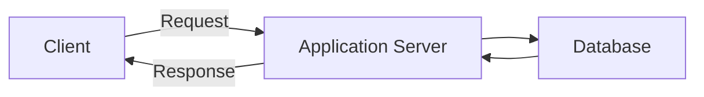
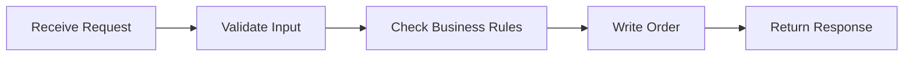
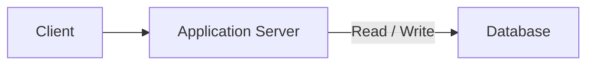
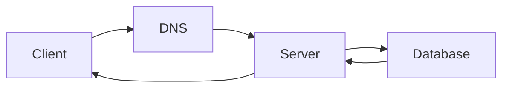
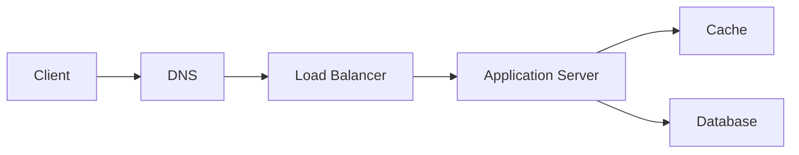
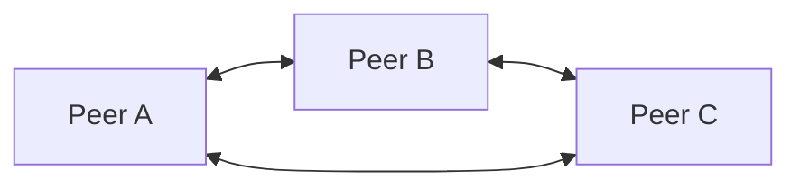
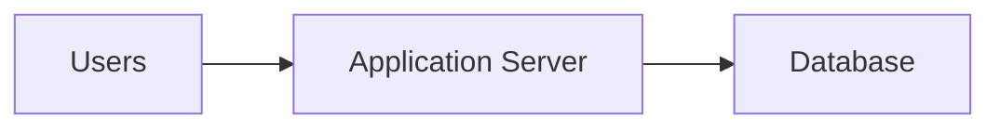
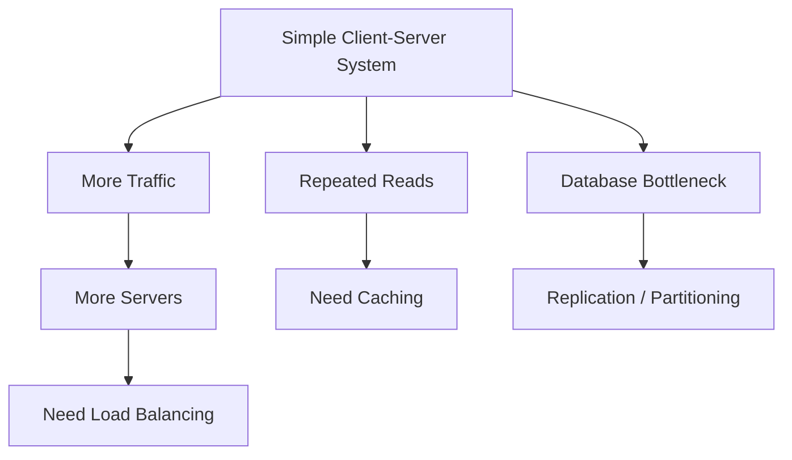

# Client-Server Model

Almost every system you design starts with the same basic shape: a client sends a request, some backend processes it, data is read or written somewhere, and a response comes back.



The diagram is simple, but get this flow clear before adding load balancers, caches, queues, or replicas.

---

## What Is the Client?

The client is whoever is asking the system to do something.

That could be:

- a browser
- a mobile application
- another backend service
- a CLI
- an IoT device

From the server's point of view, it doesn't matter much whether the request came from a React app or another microservice. What matters is the contract between them.

Usually that contract is an API.

```text
GET /users/42
POST /orders
DELETE /sessions/123
```

---

## What Is the Server?

The server receives the request and runs the application logic.

For something like:

```text
POST /orders
```

the server might:



The application server is where most of your business logic normally lives.

> [!IMPORTANT]
> Don't treat "server" as one physical machine. In a real system, the same server application may be running on tens, hundreds, or thousands of machines.

That distinction becomes important once we get to horizontal scaling.

---

## Where Does the Database Fit?

Application servers should not be the permanent source of truth for your data.

If the server restarts, your users, orders, payments, or messages should not disappear with it.

Persistent data usually lives in a database or another storage system.



The application server decides **what should happen**.

The database is responsible for **persisting the data needed later**.

Exactly which database to choose comes much later. Don't start with SQL vs NoSQL before you've even understood the workload.

---

## The Request Path

A real request usually has more than three boxes.

A simplified web request may look like:



As the system grows, more components can appear:



Don't memorize that diagram.

Every extra component should answer a specific problem.

- Load balancer: one server is no longer enough
- Cache: repeated reads are expensive
- Database replica: reads or availability need to scale
- Queue: some work doesn't need to block the request

That's the pattern you'll keep using throughout HLD.

---

## Client-Server vs Peer-to-Peer

Most systems you design in interviews are client-server systems.

In a peer-to-peer system, nodes can act as both clients and servers.



Examples include some file-sharing and decentralized systems.

Know that the model exists. You don't need to go deep unless the problem specifically calls for it.

---

## One Server Is Fine Until It Isn't

For a small application, this may genuinely be enough:



Do not over-engineer this immediately.

Problems start appearing when:

- traffic increases
- one server cannot handle all requests
- the server becomes a single point of failure
- the database becomes slow
- users are spread across regions
- background work starts delaying requests

Those problems are what push the design forward.



> [!IMPORTANT]
> HLD is mostly this evolution. Start simple, find the bottleneck, then introduce the smallest change that solves it.

---

## What You Should Know

Before moving on, you should be able to explain:

- what the client does
- what the application server does
- where persistent data lives
- how a basic request moves through the system
- why one server is enough initially
- what eventually forces that architecture to change

That's enough.

Don't turn this into a networking revision session. HTTP, DNS, TCP, and the underlying network details already belong in [Computer Networks](../../../core-cs/computer-networks.md).

---

## Next

Once the basic request flow is clear, the next question is:

> If I add more application servers, can any of them handle any request?

That depends on where your application state lives.

Continue with [Stateful vs Stateless](./stateful-stateless.md).

---

*Back to [HLD Foundations](./README.md)*