# Failures & Bottlenecks

A diagram where every component is healthy is the easy part.

The useful part of HLD starts when you ask:

**What breaks first?**

That can mean something becomes slow, runs out of capacity, or disappears completely.

---

## Start With the Simplest System

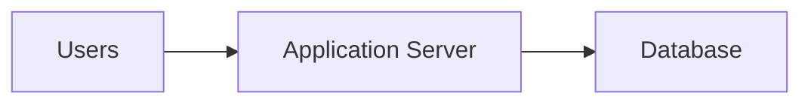

There are already two obvious failure points.

If the application server goes down:

```text
No requests can be served.
```

If the database goes down:

```text
Most useful requests cannot complete.
```

Both are single points of failure.

---

## Single Point of Failure

A **single point of failure** is a component whose failure can take down the entire critical path.

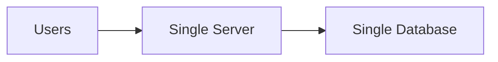

Adding redundancy can remove some of these:

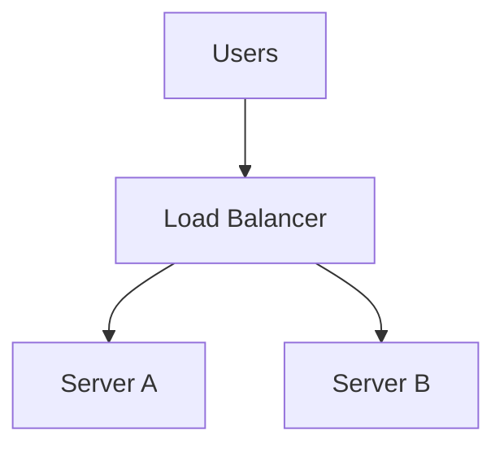

Now losing one application server does not necessarily take down the service.

But you've introduced another question:

```text
What if the load balancer fails?
```

There is always another layer.

The goal isn't "nothing can ever fail." The goal is to remove unacceptable failure points based on the requirements.

---

## Failure Is Not Always a Crash

Distributed systems fail in less obvious ways too.

A dependency may be:

- completely down
- extremely slow
- reachable from some machines but not others
- returning errors
- returning stale data

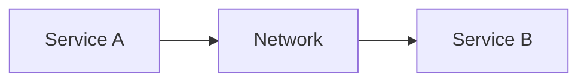

Service B may still be running while Service A cannot reach it.

That's why distributed failures are harder than a local function throwing an exception.

---

## Timeouts Matter

If Service A calls Service B and Service B never responds:

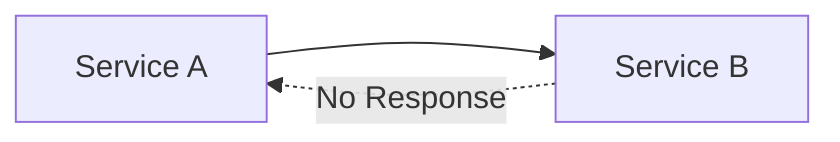

Service A cannot wait forever.

Eventually the request needs to fail or take another path.

That's what timeouts are for.

You don't need to tune timeout values here.

Just understand that every remote call can fail or hang.

---

## Retries Aren't Free

A natural response to failure is:

```text
Request failed
↓
Retry
```

Sometimes that's correct.

But imagine an overloaded database.

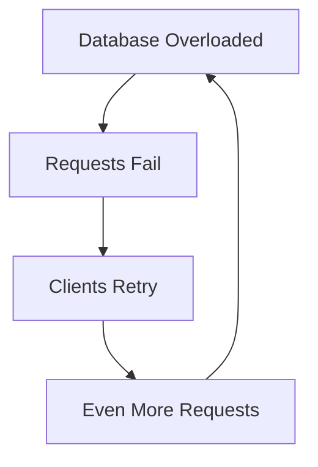

Retries can make an overloaded system even worse.

They also create another problem:

**What happens if the first request actually succeeded, but its response was lost?**

The retry may perform the operation twice.

That leads into idempotency later.

> [!IMPORTANT]
> "Just retry" is not a complete failure strategy.

---

## Bottlenecks

A bottleneck is the component currently limiting the system's capacity.

Suppose:

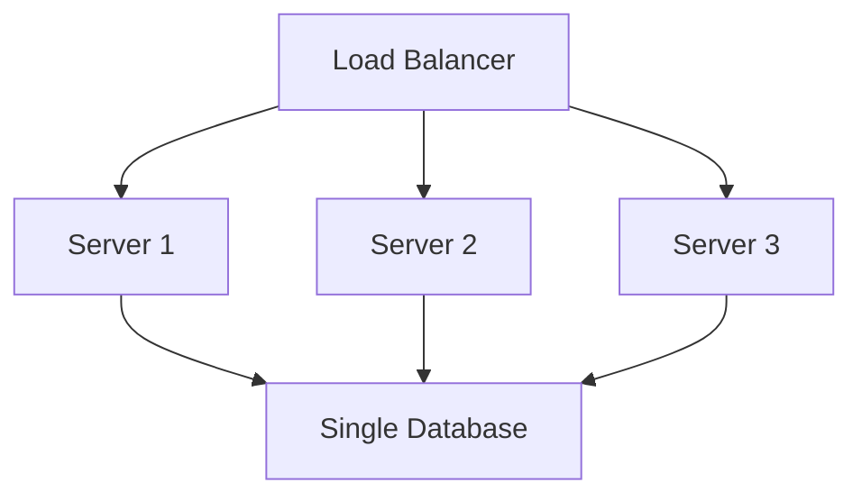

You can keep adding application servers.

Eventually it stops helping because every request still depends on the same database.

The database is now the bottleneck.

---

## Bottlenecks Move

This is one of the most useful ideas in HLD.

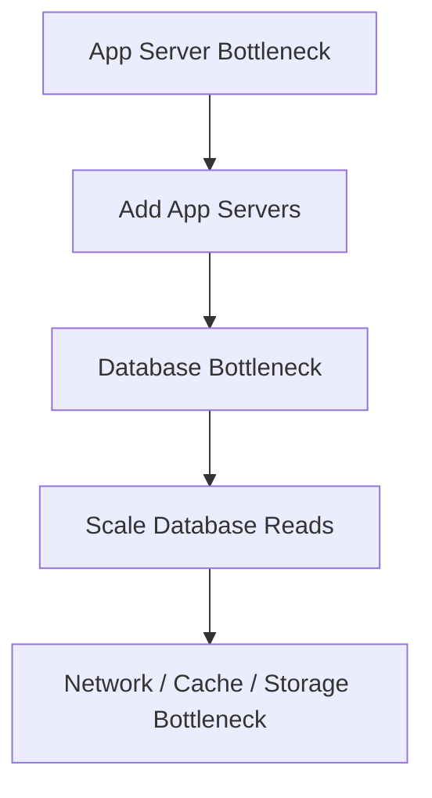

You fix one constraint and expose the next one.

There is no architecture where every component has infinite capacity.

> [!TIP]
> When someone asks how you'd scale a system, don't start listing technologies. Find the current bottleneck first.

---

## Common Bottlenecks

Depending on the system, the limit may be:

- CPU
- memory
- database reads
- database writes
- disk throughput
- network bandwidth
- storage capacity
- connection count
- a downstream service
- one hot partition or cache key

This is why "add more servers" is often an incomplete answer.

You need to know **which servers and why**.

---

## Hotspots

A system may have enough total capacity while one part receives most of the traffic.

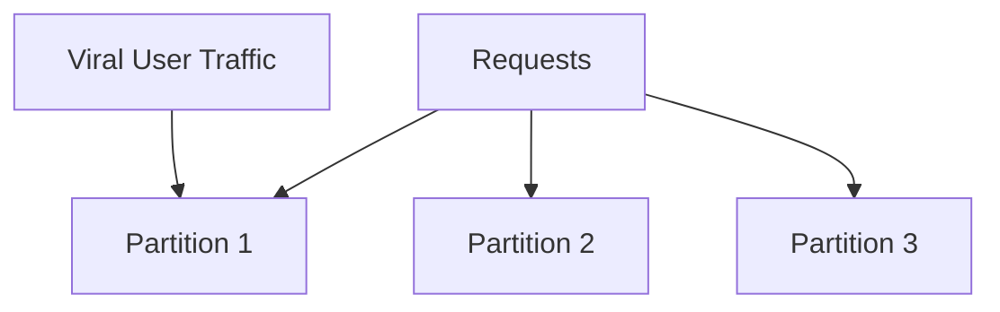

Partition 1 can become overloaded while the others sit mostly idle.

This is a hotspot.

You'll see this problem again in:

- caching
- sharding
- consistent hashing
- databases
- queues

---

## Graceful Degradation

Not every dependency needs to take the whole product down with it.

Suppose:

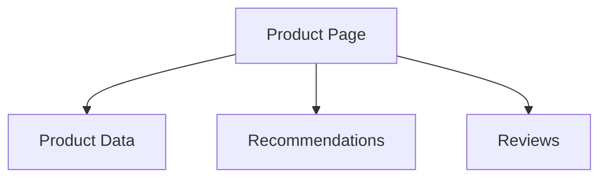

If recommendations fail, the product page may still be useful.

Instead of returning an error for everything, return the important parts and temporarily omit recommendations.

That's graceful degradation.

Critical and optional dependencies should not always have the same failure behaviour.

---

## Build This Habit

For every important box in a design, ask:

```text
What if this goes down?

What if this becomes slow?

What if traffic doubles?

What if requests are unevenly distributed?

What if the operation runs twice?
```

You won't always need to solve every case.

But noticing them is part of the interview.

> [!IMPORTANT]
> A strong design is not one with the most boxes. It's one where you know which boxes matter, what happens when they fail, and what you're willing to tolerate.

---

## What You Should Know

You should be able to explain:

- single points of failure
- bottlenecks
- why bottlenecks move
- why remote calls need timeouts
- why retries can make failures worse
- what hotspots are
- what graceful degradation means

That's enough.

---

## Where to Go Next

At this point you have the foundation needed to understand why the standard HLD building blocks exist.

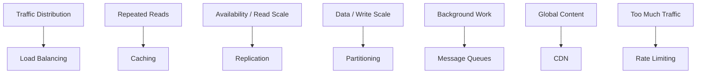

Move back to the [HLD Roadmap](../README.md) and start with the core building blocks.

---

*Back to [HLD Foundations](./README.md)*