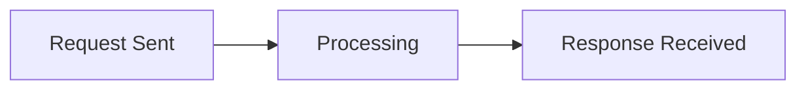
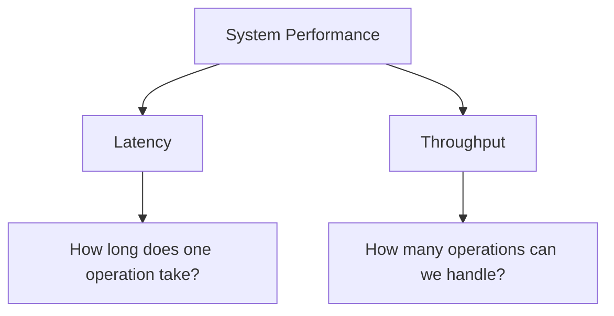
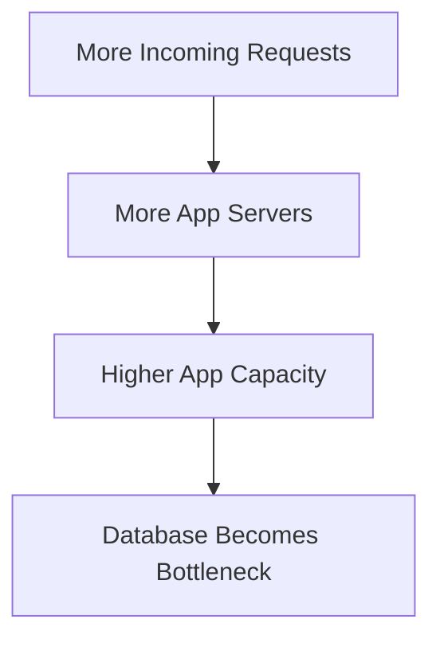
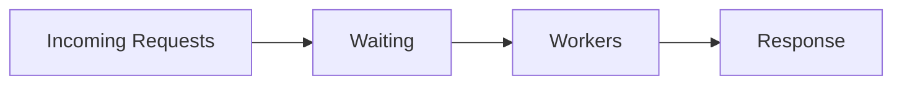
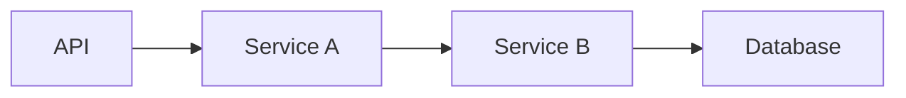

# Latency & Throughput

Once a system starts receiving more traffic, saying "it needs to be faster" isn't specific enough.

Two numbers matter constantly in HLD:

- **Latency** — how long one operation takes
- **Throughput** — how much work the system can handle over time

They describe different problems, and improving one does not automatically improve the other.

---

## Latency

Latency is the time between starting an operation and getting the result back.



If the whole trip takes 120 ms:

```text
Request latency = 120 ms
```

Latency can come from several places:

- network travel
- application processing
- database queries
- calls to other services
- queueing while the system is busy

The user only sees the total.

---

## Average Latency Can Hide Problems

Suppose these five requests take:

```text
40 ms
45 ms
50 ms
55 ms
900 ms
```

The average doesn't tell the full story. Most users are fast, but one user waited almost a second.

This is why production systems commonly look at percentiles:

```text
p50 -> 50% of requests are faster than this
p95 -> 95% are faster than this
p99 -> 99% are faster than this
```

> [!TIP]
> You don't need deep statistics for interviews. Just understand why p95 or p99 is often more useful than saying "average latency is 100 ms."

A system can have a perfectly reasonable average while a small but important percentage of requests are painfully slow.

---

## Throughput

Throughput measures how much work the system completes in a given amount of time.

For web services this is often:

```text
Requests per second (RPS / QPS)
```

For other systems it might be:

```text
messages/sec
transactions/sec
MB/sec
jobs/sec
```

Example:

```text
20,000 requests/second
```

means the system can process roughly 20,000 requests every second under that workload.

---

## Low Latency Does Not Mean High Throughput

Suppose one server handles a request in 10 ms.

That sounds fast.

But if it can only process 100 requests concurrently, it may still fall over under enough traffic.

Likewise, a batch-processing system may process millions of records per second while individual jobs take several seconds.



Keep these questions separate.

---

## What Usually Improves Latency?

Depends on where the time is being spent.

Examples:

- caching frequently-read data
- placing content closer to users with a CDN
- optimizing a slow database query
- removing unnecessary network calls
- doing non-critical work asynchronously
- reducing the number of services in the request path


Every synchronous hop adds some latency and another place where the request can slow down or fail.

> [!WARNING]
> Splitting an application into more services does not automatically make it faster. Network calls are more expensive and less reliable than function calls inside the same process.

---

## What Usually Improves Throughput?

When the current system cannot process enough work, you may:

- add more application servers
- increase concurrency
- batch operations
- partition work across machines
- move non-critical work to queues
- remove a shared bottleneck



Again, the bottleneck moves.

Adding application servers does nothing if every request is waiting on the same overloaded database.

---

## Queueing Makes Latency Worse Before Failure

A system does not necessarily crash the moment it reaches capacity.

Requests often start waiting.



As traffic approaches or exceeds what the workers can process, the waiting line grows.

Throughput may stay almost the same while latency shoots up.

This is why a system under heavy load can become extremely slow before it becomes completely unavailable.

---

## Latency Budgets

Suppose the requirement says:

```text
p95 response time < 200 ms
```

and your request calls three services sequentially.



You cannot let every component independently take 200 ms.

The entire request still has a 200 ms budget.

This becomes important later when reasoning about distributed services, caching, timeouts, and asynchronous work.

---

## What You Should Know

You should be able to explain:

- latency vs throughput
- why average latency can be misleading
- what p95 and p99 roughly mean
- why adding servers may increase throughput without reducing latency
- why slow dependencies increase end-to-end latency
- why systems often become slow before they become unavailable

That's enough.

> [!IMPORTANT]
> In an interview, replace vague statements like "this improves performance" with the actual thing you're improving: **latency, throughput, availability, or cost**.

---

## Next

Knowing how much traffic you have is only half the story.

You also need to know **what kind of traffic it is**.

Continue with [Read-Heavy vs Write-Heavy Systems](./workloads.md).

---

*Back to [HLD Foundations](./README.md)*