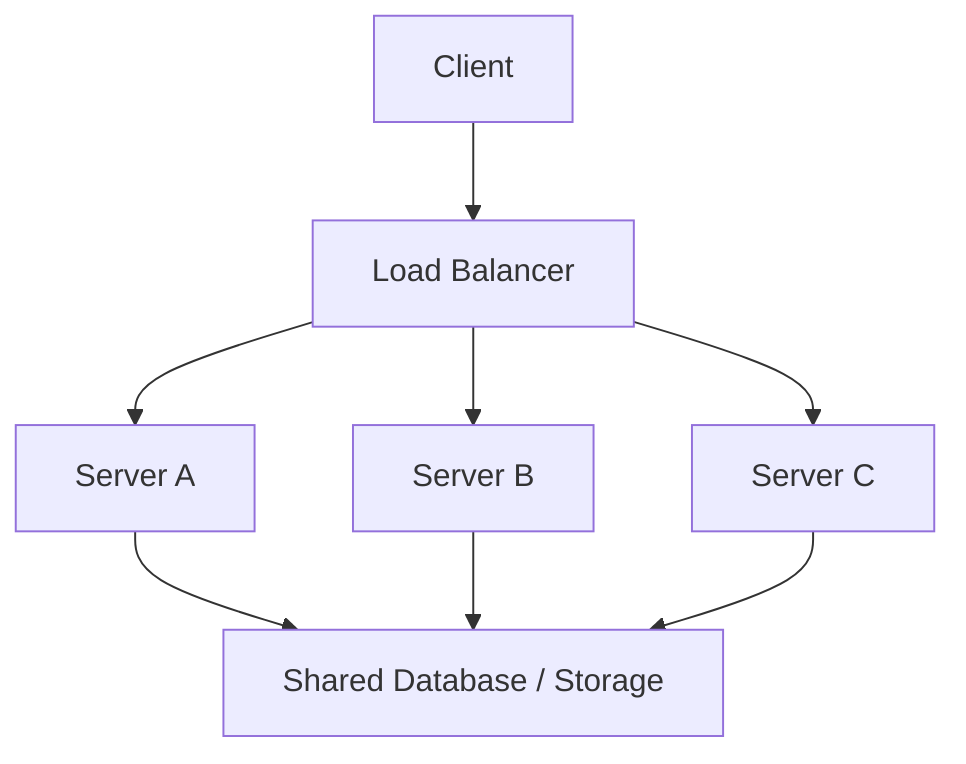
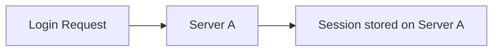
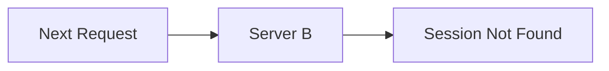
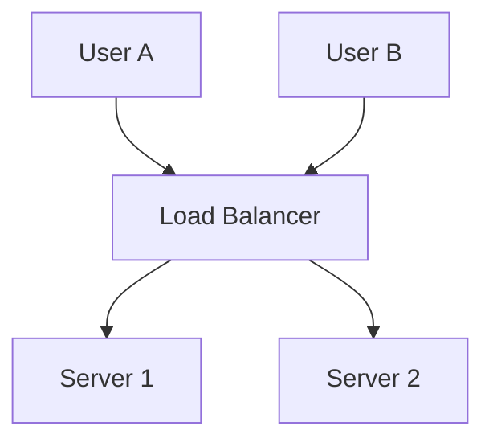
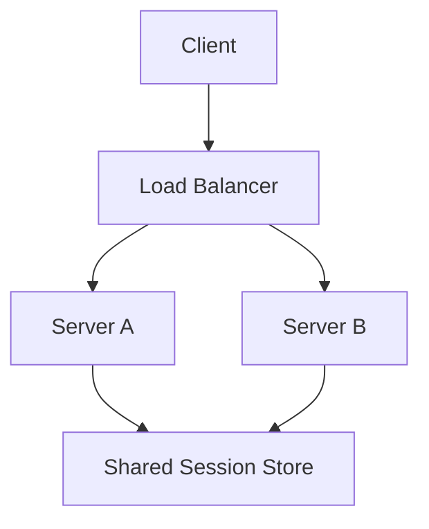
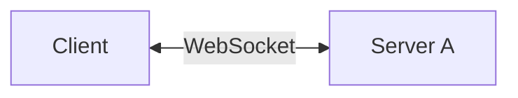
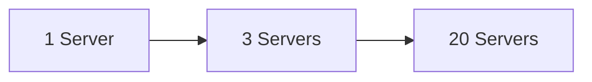
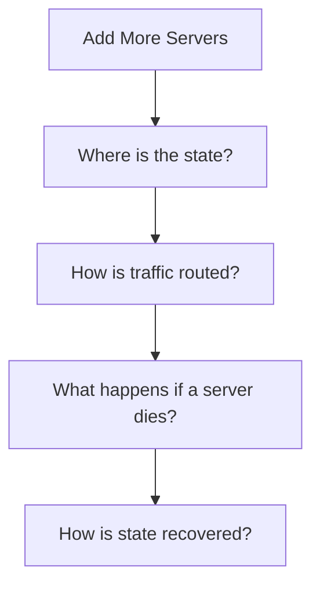

# Stateful vs Stateless

Once you add more application servers, one question matters immediately:

**Can any server handle the next request, or does the request need to return to a specific server?**

That's the difference between stateless and stateful application servers.

---

## Stateless Servers

A stateless server does not rely on local information from previous requests to handle the next one.

Request 1 can go to Server A, request 2 to Server C, and nothing breaks.

Anything the servers need across requests lives somewhere shared.

Examples:

- user data in a database
- files in object storage
- shared session data in a distributed store
- authentication information carried in the request

This is why stateless application servers are much easier to scale horizontally.

Add another server, put it behind the load balancer, and it can start serving traffic.

---

## Stateful Servers

A stateful server keeps information locally that later requests depend on.

Suppose Server A stores a user's session in its own memory.

The next request goes somewhere else:

Server B knows nothing about the session stored inside Server A.

Now your load balancer either has to keep sending that user back to Server A, or the session needs to move somewhere shared.

---

## Sticky Sessions

One way to deal with stateful application servers is **sticky sessions**.

Once a user lands on a server, future requests are routed to the same one.

This works, but introduces problems:

- traffic may become uneven
- losing that server may lose the session
- scaling servers up and down becomes harder
- deployments and failover become more complicated

> [!TIP]
> Sticky sessions are useful sometimes, but don't use them as the default fix for application state. If the state can live outside the server cleanly, that usually scales better.

---

## Moving State Out of the Server

Instead of storing session state inside each application server:

Now either server can handle the request.

The application servers become stateless even though the **system itself still has state**.

> [!IMPORTANT]
> Stateless does not mean "no state exists."
>
> Your users, orders, sessions, files, and messages are obviously state. The question is whether an individual application server needs to own that state locally between requests.

---

## What Counts as State?

Anything a future operation depends on.

Examples:

- logged-in user session
- shopping cart
- uploaded file
- order status
- current game state
- active WebSocket connection
- partially completed workflow

Some of this belongs naturally in persistent storage.

Some of it is temporary.

Some state cannot easily be moved away from the server at all.

The goal isn't "make everything stateless." The goal is to know **where state lives and what that choice does to scaling and failure handling**.

---

## Stateful Systems Aren't Wrong

There are systems where maintaining a connection or local state is part of the problem.

Examples include:

- WebSocket connections
- multiplayer game servers
- streaming sessions
- long-running computations
- some database systems

If a user has an active WebSocket connected to Server A, you cannot pretend Server B already owns that connection.

You now need to reason about connection routing, reconnects, server failure, and possibly moving shared state elsewhere.

Stateful systems are not bad. They are simply harder to scale and replace blindly.

---

## Persistent vs In-Memory State

Do not mix these either.

### In-Memory State

Lives inside a running process.

Fast, but normally disappears if that process crashes or restarts.

Examples:

- temporary counters
- local caches
- session objects
- currently connected clients

### Persistent State

Needs to survive process or machine failure.

Examples:

- users
- orders
- payments
- messages
- documents

That belongs in durable storage.

> [!WARNING]
> If losing an application server means permanently losing important user data, the design is probably wrong. Application instances should generally be replaceable.

---

## Why This Matters in HLD

Stateless application servers make this:

relatively straightforward.

Stateful servers turn the same scaling problem into:

That is why you'll repeatedly see stateless application layers in scalable system designs.

---

## What You Should Know

You should be able to explain:

- what makes a server stateful or stateless
- why stateless application servers scale more easily
- why the system can still contain state
- what sticky sessions solve and what they make worse
- when shared session storage helps
- why some workloads are naturally stateful

That's enough.

---

## Next

Once multiple servers can handle requests independently, the next question is how to increase capacity:

**make one machine bigger, or add more machines?**

Continue with [Vertical vs Horizontal Scaling](./scalability.md).

---

*Back to [HLD Foundations](./README.md)*