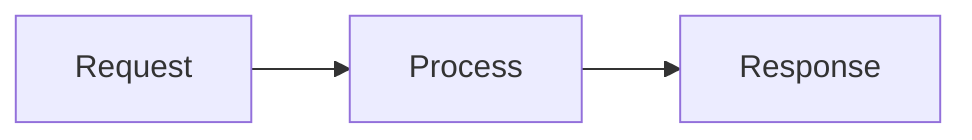
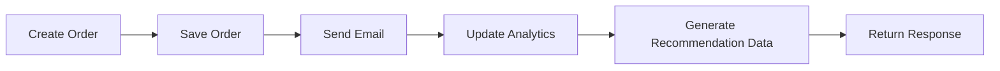
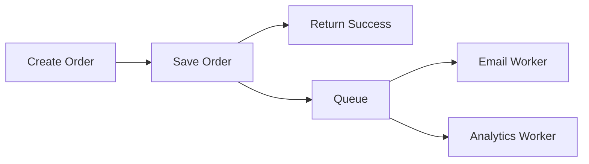
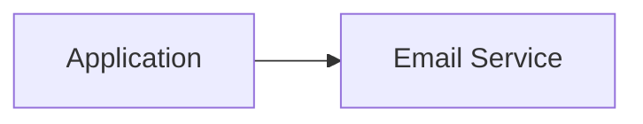
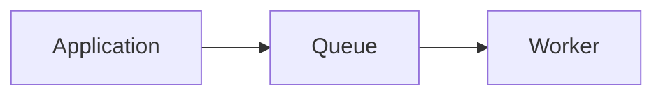
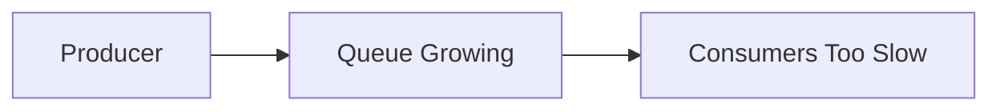
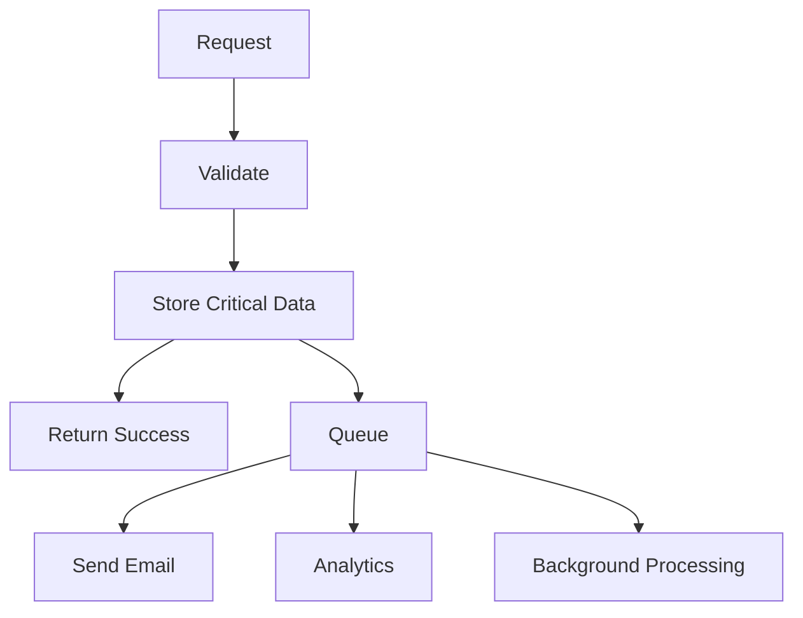

# Synchronous vs Asynchronous Processing

Not every piece of work needs to finish before the user gets a response.

Knowing what belongs in the request path and what can happen later is one of the simplest ways to improve both latency and scalability.

The question is:

> **Does the caller need this work to finish before I can return a meaningful response?**

---

## Synchronous Processing

In synchronous processing, the caller waits for the work to finish.



Example: creating an order.

Before returning success, you may need to:

- validate the request
- confirm the item exists
- reserve inventory
- store the order

The user needs to know whether the operation actually succeeded.

That work belongs in the synchronous path.

---

## The Problem With Doing Everything Synchronously

Suppose checkout does this:



The user is waiting for work that has nothing to do with whether their order was successfully created.

If the email service takes three seconds, checkout takes three extra seconds.

If analytics is down, checkout may fail for no good reason.

That's unnecessary coupling.

---

## Asynchronous Processing

Move work that doesn't need to finish immediately outside the request path.



The important operation completes first.

Other work happens afterward.

Common examples:

- emails
- notifications
- analytics
- image processing
- video transcoding
- search indexing
- background reports

---

## Why Queues Show Up

Suppose the application directly calls the email worker:



If the email service is temporarily unavailable, the application now needs to decide what to do.

A queue gives you a buffer:



The producer can submit work even if the consumer is slower or temporarily unavailable.

This is one of the main reasons message queues exist.

Kafka, SQS, RabbitMQ, and the rest come later.

Learn the problem first.

---

## Async Does Not Mean Instant

This matters.

If you return success before background work completes:

```text
API returns success
↓
Background job runs later
```

there is now a period where the operation is only partially complete.

Example:

```text
User uploads video
↓
Upload completes
↓
API returns success
↓
Transcoding starts
↓
Video becomes playable later
```

The product needs to handle that intermediate state.

Maybe:

```text
Processing...
```

This is a product decision as much as an infrastructure one.

---

## Async Introduces New Problems

Moving work to the background improves the request path, but it doesn't make complexity disappear.

Now you have to think about:

- what happens if a worker crashes
- whether failed work should retry
- whether the same job can run twice
- how long work can sit in the queue
- what happens when producers are faster than consumers



This is called **backlog** or queue buildup.

We'll deal with these problems properly when learning message queues.

---

## Don't Make Important Work Async Just for Speed

Suppose a money transfer requires:

```text
Debit Account A
Credit Account B
```

Returning success before the critical transaction is safely recorded would be dangerous.

Async is not "better."

Use it when the work genuinely does not need to complete before responding.

> [!IMPORTANT]
> Ask whether the user can safely receive success before that operation finishes. If the answer is no, keep it synchronous.

---

## Sync vs Async Is Often Mixed

Most real request flows contain both.



That's usually the useful mental model.

Critical path synchronous.

Everything else async where appropriate.

---

## What You Should Know

You should be able to explain:

- synchronous vs asynchronous work
- why unnecessary synchronous work increases latency
- why queues decouple producers and consumers
- why async processing introduces intermediate states
- why background work still needs failure handling
- why not every operation should be asynchronous

That's enough.

---

## Next

Moving work across more machines gives us more capacity, but it also gives us more things that can fail.

Continue with [Failures & Bottlenecks](./failures-and-bottlenecks.md).

---

*Back to [HLD Foundations](./README.md)*