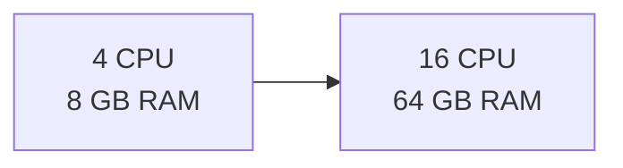
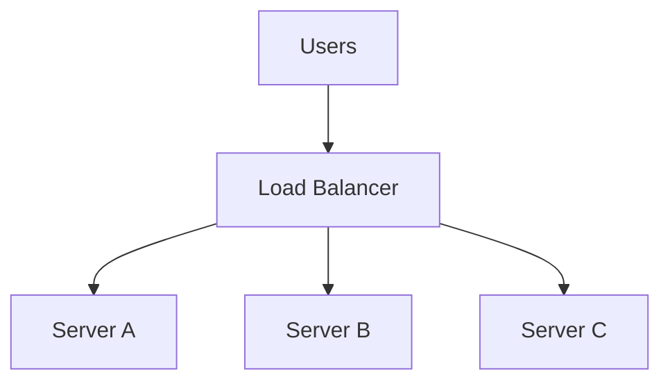
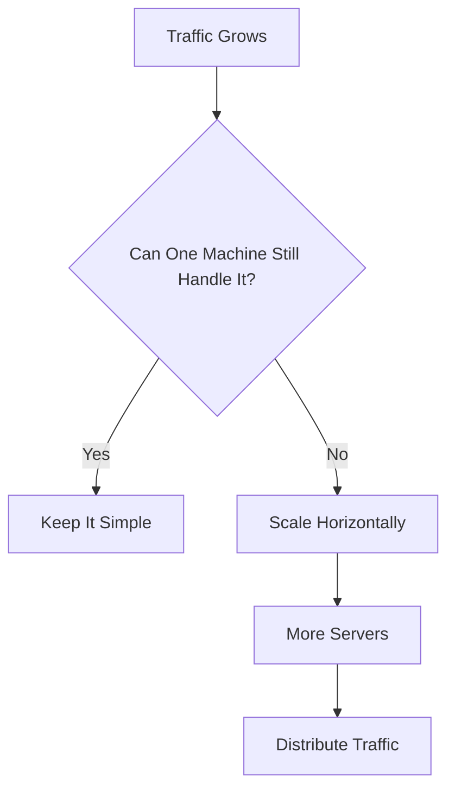
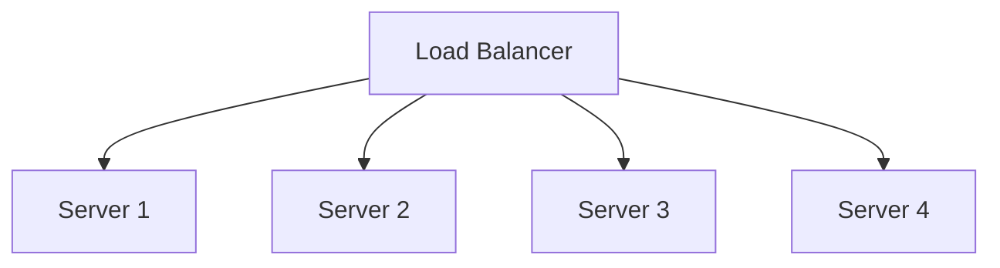
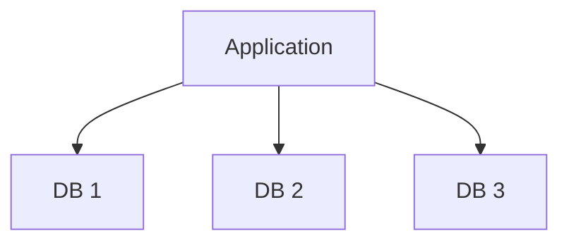
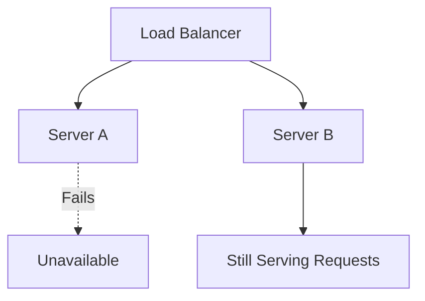

# Vertical vs Horizontal Scaling

A system eventually reaches a point where the current machine cannot comfortably handle the load anymore.

At that point you have two choices:

- make the machine stronger
- add more machines

That's vertical vs horizontal scaling.

---

## Vertical Scaling

Vertical scaling means increasing the resources of the same machine.



You might add:

- more CPU
- more memory
- faster disks
- better network capacity

The advantage is simplicity. Your architecture barely changes.

The problem is that one machine has a limit.

> [!IMPORTANT]
> Vertical scaling is not bad. For many systems, upgrading one machine is cheaper and simpler than introducing distributed-system complexity.

Don't build a distributed system just because horizontal scaling sounds more impressive.

---

## Horizontal Scaling

Horizontal scaling means adding more machines and distributing the work between them.



Instead of one large server handling everything, multiple servers share the traffic.

This gives you a much higher scaling ceiling, but now you've introduced new problems:

- how requests are distributed
- where application state lives
- how machines discover each other
- what happens when one machine fails
- how data stays consistent across nodes

This is where system design starts becoming distributed systems.

---

## Scale Up vs Scale Out

You'll hear these terms interchangeably with vertical and horizontal scaling.

```text
Scale Up  -> Vertical Scaling
Scale Out -> Horizontal Scaling
```

That's all they mean.

---

## When Vertical Scaling Is Enough

Suppose your application currently handles:

```text
500 requests/sec
```

and one stronger machine can comfortably handle:

```text
5,000 requests/sec
```

You probably don't need twenty servers and a complicated distributed architecture.

Scale vertically first if it gives you:

- enough capacity
- acceptable availability
- manageable cost
- simpler operations

> [!WARNING]
> Over-engineering is still bad engineering. If one database machine comfortably handles the workload, sharding it into ten nodes only gives you ten new problems.

---

## When Horizontal Scaling Becomes Necessary

Horizontal scaling starts making sense when:

- one machine cannot provide enough capacity
- traffic keeps growing
- you need better availability
- workloads need to run across regions
- one machine becoming unavailable cannot take the entire service down



Notice the order.

You don't start with multiple servers. You reach them because the requirements force you there.

---

## Application Servers Are Usually Easy to Scale

If your application servers are stateless, adding more instances is relatively straightforward.



Add capacity, register the new server, start sending traffic to it.

This is exactly why [Stateless Servers](./stateful-stateless.md) matter.

---

## Databases Are Harder

Application servers mostly execute logic.

Databases own state.

You cannot blindly turn:


into:



because now you have questions like:

- which database contains which data?
- do all databases contain the same data?
- where does a write go?
- what if replicas disagree?
- what happens when a node fails?

Those questions lead into:

- replication
- partitioning
- consistency
- leader/follower setups

This is why scaling the application layer and scaling the storage layer are very different problems.

---

## Horizontal Scaling Doesn't Automatically Mean Linear Scaling

Adding twice as many servers does not guarantee twice the capacity.


You can scale the application layer to 100 servers and still have every request hitting one database.

At that point, the application servers aren't your problem anymore.

The bottleneck moved.

> [!IMPORTANT]
> Scaling is not "add more servers." It's finding the current bottleneck, fixing it, then repeating when the bottleneck moves somewhere else.

---

## Scaling and Availability Are Different

Multiple servers can also improve availability:



But don't confuse the two goals.

- **Scalability** asks whether the system can handle more load.
- **Availability** asks whether the system can keep serving when something fails.

Horizontal scaling can help both, but they are not the same requirement.

---

## What You Should Know

You should be able to explain:

- vertical vs horizontal scaling
- scale up vs scale out
- why vertical scaling is often the simpler first step
- why horizontal scaling introduces distributed-system problems
- why stateless application servers are easier to scale
- why databases are harder to scale horizontally
- why adding servers doesn't automatically fix every bottleneck

That's enough.

> [!TIP]
> Whenever someone says "this system needs to scale," ask: **what exactly is running out of capacity?**
>
> Application servers, database reads, database writes, storage, bandwidth, or something else?
>
> Scale the bottleneck, not the diagram.

---

## Next

Once the system starts handling more traffic, you need a way to describe what "faster" or "more capacity" actually means.

Continue with [Latency & Throughput](./latency-throughput.md).

---

*Back to [HLD Foundations](./README.md)*