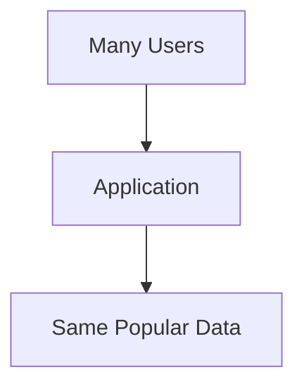
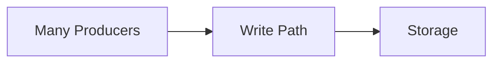
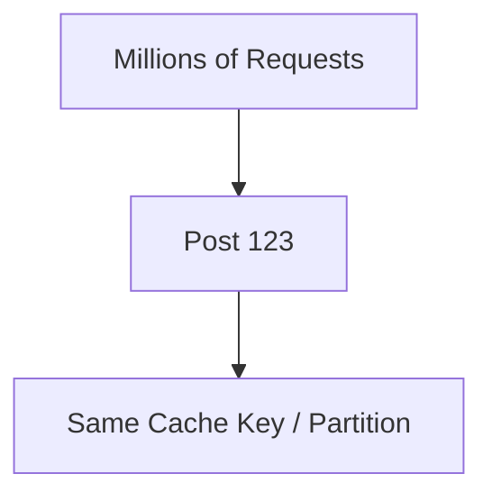
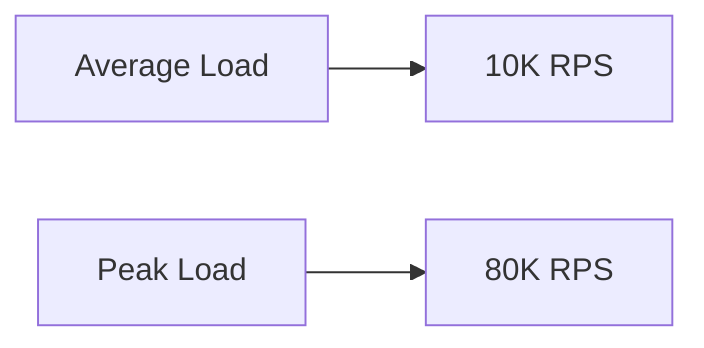

# Read-Heavy vs Write-Heavy Systems

Two systems receiving the same number of requests can need completely different architectures depending on what those requests actually do.

Before choosing caches, replicas, shards, or databases, understand the workload.

---

## Start With Reads and Writes

Suppose a system receives:

```text
100,000 reads/sec
1,000 writes/sec
```

That's read-heavy.

Now flip it:

```text
5,000 reads/sec
100,000 writes/sec
```

That's write-heavy.

The total traffic is similar, but the bottlenecks are completely different.

---

## Read-Heavy Systems

Common examples:

- news feeds
- product catalogs
- public profiles
- video metadata
- popular posts

The same data may be requested repeatedly.



If every read reaches the primary database, that database eventually becomes the bottleneck.

This is where concepts like:

- caching
- read replicas
- CDNs

start becoming useful.

> [!IMPORTANT]
> Don't add a cache because "high-scale systems use Redis." Add one when repeated reads are expensive enough that avoiding them actually solves a problem.

---

## Write-Heavy Systems

Common examples:

- telemetry ingestion
- logging
- analytics events
- financial transactions
- large event streams



Here, caching reads may barely matter.

Instead you may care about:

- write throughput
- batching
- partitioning
- queues
- storage characteristics
- durability

The architecture follows the workload.

---

## Read/Write Ratio

Don't stop at "read-heavy."

Get a rough ratio.

```text
Reads  = 100,000/sec
Writes = 1,000/sec

Read : Write = 100 : 1
```

That tells you much more than simply saying the system has high traffic.

A social feed and a telemetry pipeline can both operate at huge scale while needing almost opposite designs.

---

## Access Pattern Matters Too

Even inside a read-heavy system, reads may not be evenly distributed.

Suppose one post goes viral.



The system may have plenty of overall capacity while one specific piece of data becomes overloaded.

This is a **hotspot**.

Hotspots can appear in:

- databases
- partitions
- caches
- queues
- storage
- individual API endpoints

> [!TIP]
> Average traffic is useful for sizing. Traffic distribution is useful for finding what actually breaks.

---

## Read and Write Sizes Matter

Not all requests cost the same.

Compare:

```text
1,000 writes/sec × 500 bytes
```

with:

```text
1,000 writes/sec × 50 MB
```

Same number of writes. Completely different storage and bandwidth requirements.

Similarly:

```text
GET /user/42
```

is not comparable to:

```text
GET /video/4k-file
```

When estimating load, care about both:

- operation count
- data size per operation

---

## Peaks Matter More Than Daily Average

Suppose:

```text
Average traffic = 10,000 requests/sec
```

but every evening:

```text
Peak traffic = 80,000 requests/sec
```

Designing only for the average means the system fails exactly when everyone uses it.



For interview estimates, rough assumptions are fine.

What's important is that you recognize peak traffic exists.

---

## Different Operations Can Have Different Workloads

A system isn't always globally "read-heavy" or "write-heavy."

Take a video platform:

```text
Watching videos   -> extremely read-heavy
Uploading videos  -> write-heavy
Comments          -> mixed
View counters     -> frequent writes
Search            -> read-heavy
```

Each path may need a different design.

> [!IMPORTANT]
> Break the system into important access patterns instead of trying to label the entire product with one word.

This becomes especially useful during HLD deep dives.

---

## Workload Before Database Choice

Don't start with:

```text
SQL or NoSQL?
```

Start with:

```text
What are we storing?
How is it accessed?
How often is it read?
How often is it written?
How large does it get?
What consistency does it need?
```

Then choose storage.

Database technology is a consequence of requirements, not the starting point.

---

## What You Should Know

You should be able to reason about:

- read-heavy vs write-heavy workloads
- read/write ratios
- operation size
- average vs peak traffic
- hotspots
- why different API paths can have different workloads
- why workload should come before component or database choice

That's enough.

---

## Next

Traffic isn't the only requirement.

You also need to know what happens when pieces of the system stop working.

Continue with [Availability, Reliability & Durability](./availability-reliability-durability.md).

---

*Back to [HLD Foundations](./README.md)*