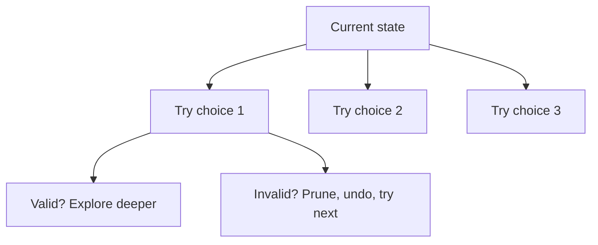

# Backtracking

## Short Notes

### What It Actually Is

Recursion (from [basic foundations](../basic-foundation/recursion.md)) that explores every possible choice at each step, and undoes a choice the moment it's known to be invalid or fully explored, instead of finishing the exploration and checking validity at the end. That "undo and try the next option" step is the entire word "backtracking."

> [!NOTE]
> No dedicated Coddy visualizer for this, it's tree recursion applied to a decision space, not its own data structure. The recursion-tree diagram from [Recursion](../basic-foundation/recursion.md) is the right mental picture, just imagine branches getting cut off early.

### The Template Every Backtracking Problem Follows

```java
void backtrack(State state, List<State> choices, List<Result> results) {
    if (isComplete(state)) {
        results.add(new Result(state)); // save a copy, not a reference
        return;
    }
    for (Choice choice : getChoices(state)) {
        if (!isValid(state, choice)) continue; // pruning: skip invalid branches immediately
        makeChoice(state, choice);              // choose
        backtrack(state, choices, results);      // explore
        undoChoice(state, choice);               // un-choose, this is the "back" in backtracking
    }
}
```

The three steps inside the loop, choose, explore, un-choose, are the whole pattern. Every backtracking problem you'll see is this shape wearing different clothes.



### Pruning Is the Entire Optimization

Without pruning, backtracking degenerates into brute force, generate every possibility, then filter. With pruning, invalid branches get cut the moment they're known to be invalid, not after being fully built out. This is the exact "waste" named in the [DSA README's Optimization Ladder](../README.md): exploring a branch fully before realizing it was invalid, fixed by cutting it early.

```java
// N-Queens: prune the moment a placement conflicts, don't wait to place all N queens first
boolean isValid(int[] board, int row, int col) {
    for (int prevRow = 0; prevRow < row; prevRow++) {
        int prevCol = board[prevRow];
        if (prevCol == col) return false;                        // same column
        if (Math.abs(prevCol - col) == Math.abs(prevRow - row)) return false; // same diagonal
    }
    return true;
}
```

> [!TIP]
> Where to prune is the actual design decision in a backtracking solution, not whether to use recursion. Ask: "what's the earliest point where I can tell this path can never work?" Move the validity check to exactly that point, not later.

### Why This Is Exponential, and Why That's Sometimes Fine

Backtracking problems are typically O(2ⁿ) or worse, tree recursion exploring branching choices, tying directly back to the tree-recursion shape from [Recursion](../basic-foundation/recursion.md) and the exponential row of the complexity table in [Complexity Analysis](../basic-foundation/complexity-analysis.md). That's expected and fine, not a red flag, whenever the constraint is small (`n ≤ 20` is the classic signal from the DSA README's constraint table).

---

## Problems

- Subsets, generate every subset, the clearest possible tree recursion with no pruning needed yet
- Permutations, same shape, with a "used" check to avoid reusing an element
- Combination Sum, pruning kicks in for real here, cut a branch the moment the running sum exceeds the target
- N-Queens, the classic pruning example above
- Word Search, backtracking on a grid, checking valid moves and un-marking visited cells on the way back out

---

## Resources

- [GeeksforGeeks - Backtracking Algorithm](https://www.geeksforgeeks.org/dsa/backtracking-algorithms/)

---
*Back to [Roadmap & Prerequisites](../roadmap.md)*
