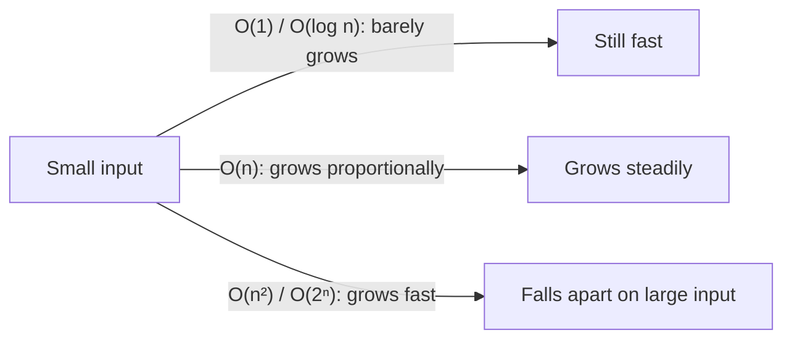
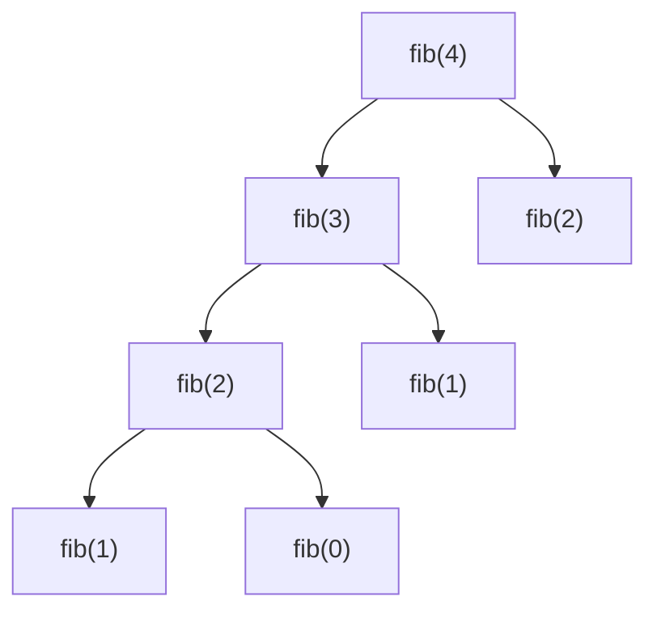

# Complexity Analysis

## Short Notes

### What Big-O Actually Measures

Big-O describes how the amount of work grows as input size grows, not literal speed. A program that takes 2 seconds isn't automatically "better" than one that takes 5 seconds, if the 5-second one scales as O(n) and the 2-second one scales as O(n²), the 5-second one wins the moment input gets large enough.



### The Common Complexities, Fastest to Slowest

| Complexity | Name | Typical source |
|---|---|---|
| O(1) | Constant | Array index access, hashmap lookup |
| O(log n) | Logarithmic | Binary search, balanced tree operations |
| O(n) | Linear | Single pass through an array |
| O(n log n) | Linearithmic | Efficient sorting (merge sort, heap sort) |
| O(n²) | Quadratic | Nested loop over the same input |
| O(2ⁿ) | Exponential | Trying every subset, unoptimized recursion (Fibonacci) |
| O(n!) | Factorial | Trying every permutation |

> [!IMPORTANT]
> Memorizing this table doesn't help you. Being able to look at code you haven't seen before and derive its complexity does. That's the actual skill, use the table only to sanity-check yourself.

### Reading Complexity From Code

**Loops**: a single loop over `n` elements is O(n). A loop nested inside another loop, both running over the same input, is O(n²). The rule is: multiply the iteration counts of nested loops, add the iteration counts of sequential loops.

```text
for i in range(n):        # O(n)
    for j in range(n):    # O(n) nested inside
        ...                # O(n * n) = O(n²)

for i in range(n):        # O(n)
    ...
for j in range(n):        # O(n), but sequential, not nested
    ...
# total: O(n) + O(n) = O(n)
```

**Halving patterns**: if a loop or recursive call cuts the problem size in half each time (binary search, balanced BST traversal), that's O(log n). The question to ask: "does this input shrink by a fraction each step, or by a fixed amount?" Fraction means log, fixed amount means linear.

**Recursion**: draw the recursion tree. Each node is one call, the depth of the tree times the work done per call gives you the total. For naive Fibonacci, each call branches into two more calls, giving a tree with roughly 2ⁿ nodes, hence O(2ⁿ).



Notice `fib(2)` gets computed twice here, from two different branches. That repeated work is exactly the "waste" that memoization eliminates, which is why memoized Fibonacci drops to O(n).

### Average Case vs Worst Case

Interviewers almost always want worst case unless they explicitly say otherwise. A hashmap lookup is O(1) on average, but O(n) worst case if every key collides into the same bucket. Say both when it's relevant, and default to worst case when asked for "the" complexity.

### Space Complexity

Same growth-rate idea, applied to memory instead of time. Count extra space your solution uses beyond the input itself.

- A few variables, regardless of input size: O(1) space
- An array or hashmap that grows with input size: O(n) space
- A recursive call stack counts too. Recursion that goes `n` levels deep uses O(n) space on the call stack, even if you never explicitly declare an array

> [!WARNING]
> People forget the call stack constantly. "My recursive solution doesn't use any extra data structures" doesn't mean O(1) space, if the recursion goes `n` levels deep, that's O(n) space whether you like it or not.

### Complexity Notation for Graphs

This trips people up specifically because graphs introduce two separate quantities: `V` (number of vertices/nodes) and `E` (number of edges). Complexity gets expressed in terms of both, not just one `n`.

| Algorithm | Time Complexity | Why |
|---|---|---|
| BFS / DFS | O(V + E) | Every vertex is visited once, every edge is checked once |
| Dijkstra (with a min-heap) | O((V + E) log V) | Each edge relaxation can trigger a heap operation, which costs log V |
| Bellman-Ford | O(V × E) | Every edge gets relaxed, up to V-1 times |
| Floyd-Warshall | O(V³) | Three nested loops over all vertices, for every intermediate node |
| Union-Find (with path compression) | Effectively O(1) per operation | Amortized, technically O(α(n)), the inverse Ackermann function, which is so slow-growing it's constant for any realistic input |

> [!TIP]
> `O(V + E)` isn't "two separate complexities added for no reason." In a sparse graph (few edges), `E` is small and this is close to O(V). In a dense graph (nearly every pair of nodes connected), `E` can be as large as O(V²), and the complexity is dominated by that instead. Knowing which case you're in matters when an interviewer asks you to reason about it.

### Amortized Complexity, Briefly

Some operations are expensive occasionally but cheap on average over many calls. A dynamic array's `append` is O(1) most of the time, but O(n) on the rare occasion it needs to resize and copy everything. Averaged over many appends, it still comes out to O(1) amortized. You don't need to derive this from scratch in an interview, just recognize the term if it comes up and know it means "expensive operations are rare enough that the average stays cheap."

---

## Problems

The exercise here isn't solving problems, it's correctly stating the complexity of code you didn't write. Take any 5 to 6 short solutions from topics you've already covered (or from a friend's code) and, without running anything, write down:

1. Time complexity, and *why*, in one sentence
2. Space complexity, and *why*, in one sentence

Then verify against the actual behavior (does performance degrade the way your stated complexity predicts as input grows). If your answer keeps being wrong, that's a stronger signal to revisit this page than any number of problems solved elsewhere.

> [!TIP]
> A good self-test: take a recursive solution you've already written for another topic, draw its recursion tree by hand, and derive the complexity from the tree instead of guessing.

---

## Resources

- [GeeksforGeeks - Analysis of Algorithms](https://www.geeksforgeeks.org/dsa/analysis-of-algorithms/), solid reference for the formal side (best/average/worst case, asymptotic notations)
- [Big-O Cheat Sheet](https://www.bigocheatsheet.com/), quick lookup for common data structure and algorithm complexities once you already understand how to derive them yourself

---
*Back to [Roadmap & Prerequisites](../roadmap.md)*
