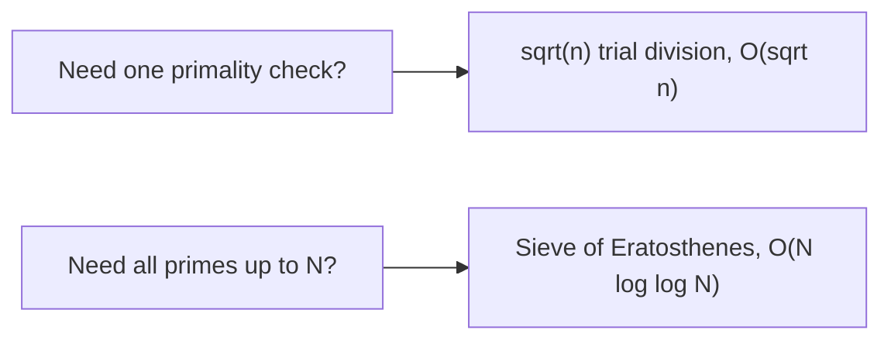

# Number Theory

Distinct from [Math](./math.md), which covers combinatorics, series, and geometry. This file is specifically about integers, how they divide, how they behave under modulo, and how they look in binary. This is the prerequisite that quietly shows up inside DP, backtracking, and array problems without ever announcing itself as "number theory."

## Short Notes

### GCD and LCM

GCD (Greatest Common Divisor) and LCM (Least Common Multiple) show up whenever a problem involves reducing fractions, finding a common cycle length, or simplifying ratios.

```java
// Euclidean algorithm, O(log(min(a, b)))
int gcd(int a, int b) {
    return b == 0 ? a : gcd(b, a % b);
}

int lcm(int a, int b) {
    return (a / gcd(a, b)) * b; // divide first to avoid overflow
}
```

> [!TIP]
> The Euclidean algorithm's core idea: `gcd(a, b) == gcd(b, a % b)`. Repeatedly replacing the larger number with the remainder shrinks the problem fast, logarithmically fast, which is why it's O(log(min(a, b))) instead of the O(min(a, b)) a naive loop would give you.

### Prime Numbers

**Checking if a single number is prime**: only check divisors up to `sqrt(n)`, not all the way to `n`. If `n` has a factor larger than its square root, it must also have a corresponding factor smaller than the square root, so checking beyond that point is redundant.

```java
boolean isPrime(int n) {
    if (n < 2) return false;
    for (int i = 2; (long) i * i <= n; i++) {
        if (n % i == 0) return false;
    }
    return true;
}
```

**Generating all primes up to N**: use the Sieve of Eratosthenes instead of checking each number individually, O(N log log N) instead of O(N × sqrt(N)).

```java
boolean[] sieve(int n) {
    boolean[] isComposite = new boolean[n + 1];
    for (int i = 2; (long) i * i <= n; i++) {
        if (!isComposite[i]) {
            for (int j = i * i; j <= n; j += i) {
                isComposite[j] = true;
            }
        }
    }
    return isComposite; // isComposite[i] == false means i is prime
}
```



> [!WARNING]
> Using trial division inside a loop that runs for every number up to N is a common performance trap, it works on small inputs and silently times out on large ones. If the problem says "up to N," that's the signal to sieve once, not check N times individually.

### Modular Arithmetic

Shows up constantly in problems that ask for an answer "modulo 10^9 + 7," which is a signal, not a random detail, it's telling you the actual answer is too large to fit in a standard integer type, so you're expected to carry the modulo through every intermediate step, not just apply it once at the end.

```text
(a + b) % m = ((a % m) + (b % m)) % m
(a - b) % m = ((a % m) - (b % m) + m) % m   # the +m guards against negative results
(a * b) % m = ((a % m) * (b % m)) % m
```

> [!IMPORTANT]
> That `+ m` in the subtraction rule matters more than it looks. In languages where `%` can return a negative result for negative operands (C++, Java, C#, unlike Python), skipping it produces a silently wrong negative answer instead of a clean error, which is worse.

**Modular exponentiation**: computing `(base^exp) % mod` efficiently, without ever materializing the full (potentially enormous) power.

```java
long modPow(long base, long exp, long mod) {
    long result = 1;
    base %= mod;
    while (exp > 0) {
        if ((exp & 1) == 1) result = (result * base) % mod;
        exp >>= 1;
        base = (base * base) % mod;
    }
    return result;
}
```

This runs in O(log exp) by squaring the base and halving the exponent each step, the same halving idea behind binary search, applied to multiplication instead of searching.

### Bit Manipulation

The operators themselves are simple, the useful part is the small set of tricks that come up repeatedly.

| Operation | What it does |
|---|---|
| `n & 1` | Checks if `n` is odd (last bit is 1) |
| `n >> 1` | Divides `n` by 2 (integer division), shifting bits right |
| `n << 1` | Multiplies `n` by 2, shifting bits left |
| `n & (n - 1)` | Clears the lowest set bit, used to count set bits efficiently |
| `n & (-n)` | Isolates the lowest set bit |
| `n ^ n` | Always 0, XOR-ing a number with itself cancels it out |
| `n > 0 && (n & (n - 1)) == 0` | Checks if `n` is a power of 2, a power of 2 has exactly one set bit |

```java
// Count set bits using n & (n - 1), O(number of set bits) instead of O(bit width)
int countSetBits(int n) {
    int count = 0;
    while (n != 0) {
        n = n & (n - 1); // clears the lowest set bit each iteration
        count++;
    }
    return count;
}
```

> [!TIP]
> XOR's self-canceling property (`n ^ n = 0`, `n ^ 0 = n`) is the entire trick behind "find the single number that doesn't repeat, when every other number appears exactly twice." XOR every element together, the pairs cancel out, and the single leftover number is your answer, in O(n) time and O(1) space, no hashmap required.

---

## Problems

- Compute GCD/LCM directly, then use it inside a problem that requires reducing a fraction
- Sieve of Eratosthenes, generate all primes up to N directly
- A DP problem that requires the answer modulo 10^9 + 7, to practice carrying the modulo through intermediate steps correctly
- Count set bits in a number, or in every number from 0 to N (Counting Bits style problem)
- "Single Number" (XOR trick) and its variant where every other element appears three times instead of twice

---

## Resources

- [GeeksforGeeks - Euclidean Algorithm](https://www.geeksforgeeks.org/dsa/euclidean-algorithms-basic-and-extended/), covers both the basic and extended versions
- [GeeksforGeeks - Sieve of Eratosthenes](https://www.geeksforgeeks.org/dsa/sieve-of-eratosthenes/)
- [GeeksforGeeks - Modular Exponentiation](https://www.geeksforgeeks.org/dsa/modular-exponentiation-power-in-modular-arithmetic/)
- [GeeksforGeeks - Bit Manipulation](https://www.geeksforgeeks.org/dsa/bits-manipulation-important-tactics/), a good index of the common bit tricks beyond the table above

---
*Back to [Roadmap & Prerequisites](../roadmap.md)*
