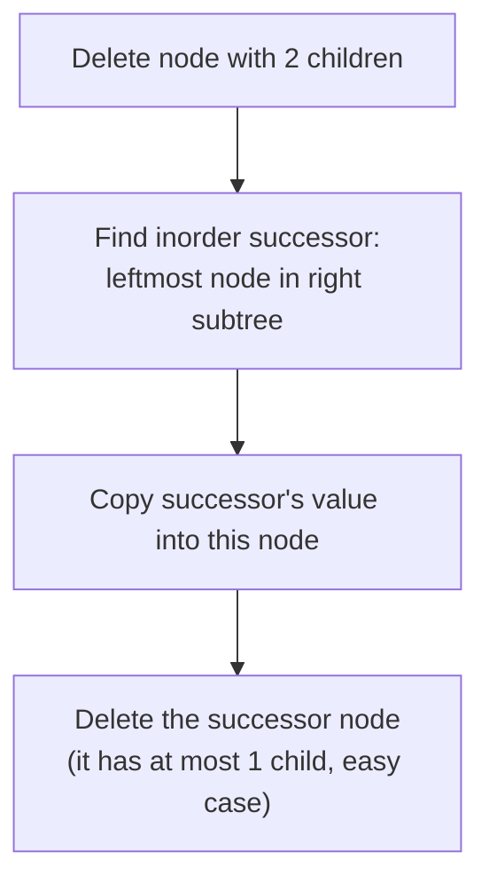

# Binary Search Trees

## Short Notes

### The One Rule That Defines a BST

For every node: everything in its left subtree is smaller, everything in its right subtree is larger. That single invariant is what makes search, insert, and delete all O(log n) on a balanced BST, at each node you know exactly which side to go, no need to check both.

> [!TIP]
> Watch a BST place values and search by comparison: [Coddy - Binary Search Tree](https://coddy.tech/visualize/data-structures/binary-search-tree)

```java
TreeNode search(TreeNode node, int target) {
    if (node == null || node.val == target) return node;
    return target < node.val ? search(node.left, target) : search(node.right, target);
}

TreeNode insert(TreeNode node, int val) {
    if (node == null) return new TreeNode(val);
    if (val < node.val) node.left = insert(node.left, val);
    else node.right = insert(node.right, val);
    return node;
}
```

### Why Inorder Traversal Matters Specifically Here

Inorder traversal (left, node, right) on a BST visits every value in sorted order, for free, no separate sort step needed. This is the single most useful fact about BSTs beyond the search speed, "give me the values in order" and "is this a valid BST" both reduce directly to an inorder traversal.

```java
// Validate BST using the inorder property: values must come out strictly increasing
TreeNode prev = null;
boolean isValidBST(TreeNode node) {
    if (node == null) return true;
    if (!isValidBST(node.left)) return false;
    if (prev != null && node.val <= prev.val) return false;
    prev = node;
    return isValidBST(node.right);
}
```

### Deletion, the One Genuinely Tricky Operation

Three cases, and only the third one requires real thought:

1. Node has no children, just remove it
2. Node has one child, replace it with that child
3. Node has two children, replace its value with its **inorder successor** (the smallest value in its right subtree), then delete that successor node instead



### When a BST Stops Being Fast: The Balance Problem

Insert values in already-sorted order into a plain BST, and it degrades into a straight line, every operation becomes O(n), you've accidentally built a linked list with extra steps. This is the exact failure mode Height/Balance from [Trees](./trees.md) warned about.

**AVL Trees** solve this by rebalancing automatically. After every insert or delete, it checks the balance factor (height of left subtree minus height of right subtree) at each affected node, and if it exceeds 1, it performs a rotation to restore balance.

> [!TIP]
> Watch the rotations happen live as the tree grows: [Coddy - AVL Tree](https://coddy.tech/visualize/data-structures/avl-tree)

> [!IMPORTANT]
> You're extremely unlikely to be asked to implement AVL rotations from scratch in a PBC interview. What you're expected to know: *why* balance matters (worst-case complexity guarantee), and that self-balancing trees (AVL, Red-Black) are what real language libraries use under the hood, Java's `TreeMap` and `TreeSet` are Red-Black trees specifically so you never hit the degraded-to-a-linked-list case by accident.

---

## Problems

- Validate Binary Search Tree, the inorder property applied directly
- Insert into a Binary Search Tree
- Delete Node in a BST, the three-case logic above
- Kth Smallest Element in a BST, inorder traversal, stop at the Kth value
- Lowest Common Ancestor of a BST, use the ordering property to decide which subtree to descend into, without needing to search both sides

---

## Resources

- [Coddy - Binary Search Tree](https://coddy.tech/visualize/data-structures/binary-search-tree)
- [Coddy - AVL Tree](https://coddy.tech/visualize/data-structures/avl-tree)
- [GeeksforGeeks - Binary Search Tree](https://www.geeksforgeeks.org/dsa/binary-search-tree-data-structure/)

---
*Back to [Roadmap & Prerequisites](../roadmap.md)*
