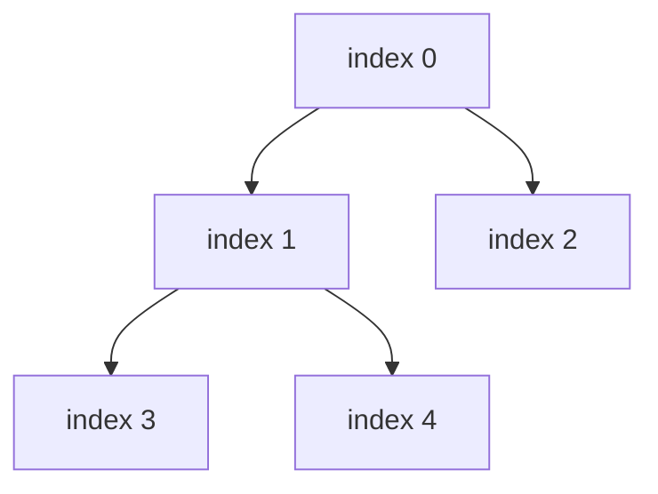

# Heaps (Priority Queues)

## Short Notes

### The One Guarantee a Heap Gives You

O(1) access to the smallest (min-heap) or largest (max-heap) element, always. Not sorted overall, just guaranteed to have the extreme value sitting at the top. That narrower guarantee is exactly why it's cheaper to maintain than a fully sorted structure, O(log n) insert and remove instead of the O(n) an array would need to stay sorted.

> [!TIP]
> Watch a min-heap sift a new value up to keep the smallest on top: [Coddy - Heap (Priority Queue)](https://coddy.tech/visualize/data-structures/heap)

### The Structure Underneath

A heap is a binary tree, but stored as a plain array, using index math instead of actual pointers. For a node at index `i`: its children live at `2i + 1` and `2i + 2`, its parent lives at `(i - 1) / 2`. That's the entire trick, no `TreeNode` objects, no pointers, just an array with a rule about relative ordering between parent and child.



```java
// Java's PriorityQueue is a min-heap by default
PriorityQueue<Integer> minHeap = new PriorityQueue<>();
minHeap.offer(5);
minHeap.peek();  // smallest, O(1)
minHeap.poll();  // remove smallest, O(log n)

// Max-heap: reverse the ordering
PriorityQueue<Integer> maxHeap = new PriorityQueue<>(Collections.reverseOrder());

// Custom ordering, e.g. by a specific field on an object
PriorityQueue<int[]> pq = new PriorityQueue<>((a, b) -> a[1] - b[1]); // order by second value
```

> [!WARNING]
> Don't hand-roll heap sift-up/sift-down logic in an interview unless specifically asked to implement a heap from scratch. Every mainstream language ships a built-in priority queue, use it, and spend your interview time on the actual problem, not reimplementing infrastructure.

### The Signal That Points Here

"Top K," "Kth largest/smallest," "K most frequent," anything where you need the extreme value repeatedly as the data changes, that's a heap. The general trick: keep a heap of size K, and every time a new element beats the current worst element in the heap, swap it in.

```java
// Kth largest element: keep a MIN-heap of size K
// the smallest thing in this heap is always the Kth largest overall
PriorityQueue<Integer> minHeap = new PriorityQueue<>();
for (int num : nums) {
    minHeap.offer(num);
    if (minHeap.size() > k) minHeap.poll();
}
return minHeap.peek();
```

> [!TIP]
> That inversion trips people up at first: finding the **K largest** values uses a **min-heap**, not a max-heap. The min-heap's smallest element is the weakest of your current top K, exactly the one you want to evict when a bigger number shows up.

### Heap Sort, Briefly

Build a max-heap from the array, then repeatedly extract the max and place it at the end. O(n log n), O(1) extra space, this is the mechanism behind Heap Sort covered in [Sorting](../algorithms/sorting.md).

---

## Problems

- Kth Largest Element in an Array (or Stream), the min-heap-of-size-K pattern above
- Top K Frequent Elements, combine with a hashmap for frequency counting first
- Merge K Sorted Lists, a heap holding the current front of each list
- Find Median from Data Stream, two heaps, a max-heap for the lower half and a min-heap for the upper half, balanced against each other
- Task Scheduler, a max-heap driving a greedy scheduling decision, a preview of how Heaps and [Greedy](../algorithms/greedy.md) combine

---

## Resources

- [Coddy - Heap (Priority Queue)](https://coddy.tech/visualize/data-structures/heap)
- [GeeksforGeeks - Heap Data Structure](https://www.geeksforgeeks.org/dsa/heap-data-structure/)

---
*Back to [Roadmap & Prerequisites](../roadmap.md)*
