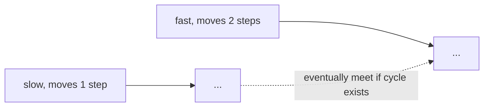

# Linked List

## Short Notes

### What It Actually Is

A sequence of nodes, each holding a value and a pointer to the next node, instead of sitting in one contiguous memory block like an array. That one structural difference is the source of every trade-off below.

> [!TIP]
> Watch nodes link and pointers rewire before writing any code: [Coddy - Linked List](https://coddy.tech/visualize/data-structures/linked-list)

```java
class ListNode {
    int val;
    ListNode next;
    ListNode(int val) { this.val = val; }
}
```

### Why Use It Over an Array

| | Array | Linked List |
|---|---|---|
| Access by index | O(1) | O(n), must walk from the head |
| Insert/delete at a known position | O(n), shifts elements | O(1), just rewire pointers |
| Memory layout | Contiguous | Scattered, extra memory per node for the pointer |

The trade is direct: arrays are fast to read, slow to insert/delete in the middle. Linked lists are the opposite. Pick based on which operation your problem actually does more of.

### Singly vs Doubly Linked List

A singly linked list only points forward. A doubly linked list also keeps a `prev` pointer, letting you traverse backward and delete a node in O(1) *if you already have a reference to it*, without needing to walk from the head to find its predecessor.

> [!TIP]
> Doubly linked lists in motion: [Coddy - Doubly Linked List](https://coddy.tech/visualize/data-structures/doubly-linked-list)

```java
class DoublyListNode {
    int val;
    DoublyListNode next, prev;
    DoublyListNode(int val) { this.val = val; }
}
```

> [!IMPORTANT]
> Doubly linked lists show up constantly as the backbone of **LRU Cache** implementations, paired with a hashmap for O(1) lookup. The hashmap tells you *where* a node is, the doubly linked list lets you move or remove it in O(1) once you're there. Neither piece alone solves it.

### The Techniques That Actually Get Tested

**Fast and Slow Pointers**: two pointers moving through the list at different speeds, one step at a time vs two steps at a time. If the list has a cycle, the fast pointer eventually laps the slow one and they meet. If it doesn't, the fast pointer reaches the end first.



```java
boolean hasCycle(ListNode head) {
    ListNode slow = head, fast = head;
    while (fast != null && fast.next != null) {
        slow = slow.next;
        fast = fast.next.next;
        if (slow == fast) return true;
    }
    return false;
}
```

This same fast/slow idea, with small variations, also finds the middle of a list in one pass and detects where a cycle begins (Floyd's Cycle Detection).

**Reversal**: rewiring `next` pointers one at a time while walking the list, keeping track of the previous node.

```java
ListNode reverse(ListNode head) {
    ListNode prev = null;
    while (head != null) {
        ListNode nextTemp = head.next;
        head.next = prev;
        prev = head;
        head = nextTemp;
    }
    return prev;
}
```

**Dummy Head Node**: when a problem might delete or modify the actual head of the list, create a placeholder node pointing to the real head first. It removes the need to special-case "what if the head itself needs to change," every operation becomes uniform.

```java
ListNode dummy = new ListNode(0);
dummy.next = head;
// operate using dummy.next instead of head directly
// return dummy.next at the end
```

> [!WARNING]
> Forgetting the dummy head is the most common reason "remove Nth node from list" or "merge two sorted lists" solutions break specifically when the head node itself needs to be removed or replaced. If your solution has a separate `if` branch just for handling the head, that's usually a sign you needed a dummy node instead.

---

## Problems

- Reverse a Linked List, both iteratively (above) and recursively
- Detect a Cycle in a Linked List (Floyd's), then find where the cycle begins
- Merge Two Sorted Lists, using a dummy head to avoid special-casing the first node
- Remove Nth Node From End of List, using two pointers offset by N and a dummy head
- LRU Cache, hashmap plus doubly linked list, the clearest real test of whether both pieces above actually clicked

---

## Resources

- [Coddy - Linked List](https://coddy.tech/visualize/data-structures/linked-list)
- [Coddy - Doubly Linked List](https://coddy.tech/visualize/data-structures/doubly-linked-list)
- [GeeksforGeeks - Linked List Data Structure](https://www.geeksforgeeks.org/dsa/linked-list-data-structure/)

---
*Back to [Roadmap & Prerequisites](../roadmap.md)*
