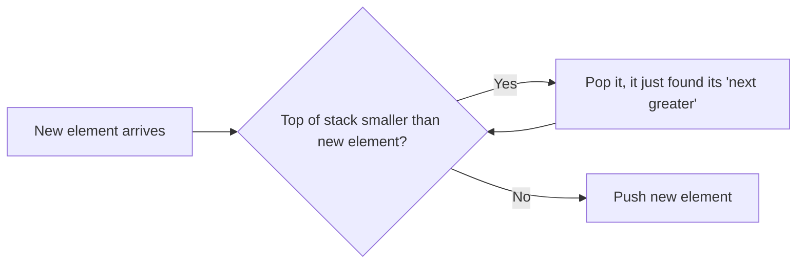

# Stacks & Queues

## Short Notes

### Stack: Last In, First Out

Only two operations that matter: `push` (add to the top) and `pop` (remove from the top). Everything a stack is used for in interviews comes down to one idea, needing to look back at the most recently seen unresolved thing.

```java
Deque<Integer> stack = new ArrayDeque<>();
stack.push(5);
stack.pop();  // removes 5
```

### Queue: First In, First Out

Add at the back (`offer`/`enqueue`), remove from the front (`poll`/`dequeue`). Used whenever order of arrival needs to be preserved, most commonly for BFS traversal.

```java
Queue<Integer> queue = new LinkedList<>();
queue.offer(5);
queue.poll(); // removes 5
```

> [!NOTE]
> No dedicated Coddy visualizer for stacks/queues specifically (they're used as the underlying mechanism inside the Coddy DFS and BFS graph visualizations instead), but Coddy does have short free courses on both: [Stack](https://coddy.tech/landing/courses/stack__data_structures_series_1) · [Queue](https://coddy.tech/landing/courses/queue__data_structures_series_2)

### The Pattern That Actually Gets Tested: Monotonic Stack

A stack that's kept either increasing or decreasing from bottom to top, by popping elements that violate that order before pushing a new one. This is the mechanism behind "next greater element" style problems, and it's easy to miss entirely if you only know stacks as "undo functionality."



```java
// Next Greater Element: monotonic decreasing stack
int[] nextGreaterElement(int[] nums) {
    int[] result = new int[nums.length];
    Arrays.fill(result, -1);
    Deque<Integer> stack = new ArrayDeque<>(); // stores indices
    for (int i = 0; i < nums.length; i++) {
        while (!stack.isEmpty() && nums[stack.peek()] < nums[i]) {
            result[stack.pop()] = nums[i];
        }
        stack.push(i);
    }
    return result;
}
```

> [!TIP]
> Recognize this pattern from the wording: "next greater," "next smaller," "previous greater," "span of days until a warmer temperature," anything about looking back at unresolved elements until one gets resolved by a new arrival, is a monotonic stack in disguise.

### Other Recurring Uses

- **Balanced parentheses / bracket matching**: push opening brackets, pop and match on closing ones
- **Expression evaluation**: converting and evaluating infix/postfix expressions
- **Two stacks implementing a queue, or two queues implementing a stack**: a common "can you build X using only Y" interview question, testing whether you understand the mechanics, not just the API
- **BFS uses a queue, DFS (iterative) uses a stack**: this is why the two traversal orders differ, covered fully in [Graphs](../algorithms/graph-algorithms.md)

---

## Problems

- Valid Parentheses, the standard bracket-matching stack problem
- Min Stack, a stack that also returns its minimum in O(1), track the running minimum alongside each push
- Next Greater Element, and its circular-array variant
- Daily Temperatures, monotonic stack applied to "days until warmer"
- Implement Queue using Stacks (or the reverse), to actually internalize the mechanical difference between the two

---

## Resources

- [Coddy - Stack (free course)](https://coddy.tech/landing/courses/stack__data_structures_series_1)
- [Coddy - Queue (free course)](https://coddy.tech/landing/courses/queue__data_structures_series_2)
- [GeeksforGeeks - Monotonic Stack](https://www.geeksforgeeks.org/dsa/introduction-to-monotonic-stack/), worth reading once the concept above still feels fuzzy

---
*Back to [Roadmap & Prerequisites](../roadmap.md)*
