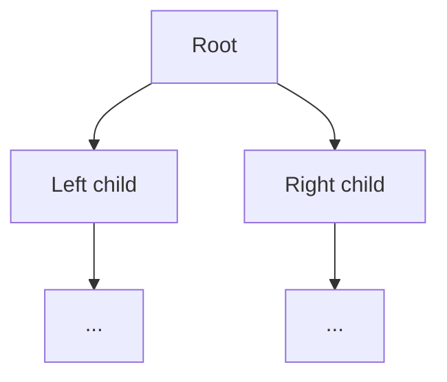

# Trees

## Short Notes

### The Shape

A node holding a value, plus pointers to child nodes, most commonly two (`left`, `right`) for a binary tree. No cycles, one path from the root to any node. Every tree operation you'll write is recursion applied to this shape, which is exactly why [Recursion](../basic-foundation/recursion.md) is a hard prerequisite here, not a suggestion.

> [!TIP]
> Watch a tree get built level by level, then traversed: [Coddy - Binary Tree](https://coddy.tech/visualize/data-structures/binary-tree)

```java
class TreeNode {
    int val;
    TreeNode left, right;
    TreeNode(int val) { this.val = val; }
}
```

### The Three Depth-First Traversals

Same recursive shape, different point in the recursion where you actually process the node.

```java
void inorder(TreeNode node) {     // left, node, right, gives sorted order on a BST
    if (node == null) return;
    inorder(node.left);
    process(node);
    inorder(node.right);
}

void preorder(TreeNode node) {    // node, left, right, gives you the root first
    if (node == null) return;
    process(node);
    preorder(node.left);
    preorder(node.right);
}

void postorder(TreeNode node) {   // left, right, node, children fully resolved before the parent
    if (node == null) return;
    postorder(node.left);
    postorder(node.right);
    process(node);
}
```

> [!TIP]
> Postorder is the one to reach for whenever a node's answer depends on its children's answers first, computing height, checking balance, deleting a tree bottom-up. If you find yourself needing "the children's result before I can compute the parent's," that's postorder, even if the problem doesn't say the word.

### Breadth-First: Level Order

Uses a queue, not recursion, this is where [Stacks & Queues](./stacks-and-queues.md) comes back directly. Process one full level before moving to the next.



```java
void levelOrder(TreeNode root) {
    if (root == null) return;
    Queue<TreeNode> queue = new LinkedList<>();
    queue.offer(root);
    while (!queue.isEmpty()) {
        int levelSize = queue.size();
        for (int i = 0; i < levelSize; i++) {
            TreeNode node = queue.poll();
            process(node);
            if (node.left != null) queue.offer(node.left);
            if (node.right != null) queue.offer(node.right);
        }
    }
}
```

> [!IMPORTANT]
> Capturing `levelSize` before the inner loop is what actually separates level-by-level processing from just "BFS with no level awareness." Skip it, and you can still visit nodes in the right order, but you lose the ability to answer anything level-specific (max width, level averages, zigzag order).

### Height, Depth, and Balance

- **Height** of a node: the number of edges on the longest path down to a leaf
- **Depth** of a node: the number of edges from the root down to that node
- **Balanced tree**: for every node, the height difference between its left and right subtrees is at most 1

Balance matters because it's what keeps [Binary Search Trees](./binary-search-trees.md) fast, an unbalanced BST degrades toward a linked list, O(n) instead of O(log n).

---

## Problems

- Maximum Depth of Binary Tree, the simplest postorder application
- Invert Binary Tree, small but famously reveals whether recursion actually clicked
- Level Order Traversal, direct application of the BFS pattern above
- Diameter of Binary Tree, longest path between any two nodes, doesn't have to pass through the root, this is the postorder pattern combined with tracking a running answer
- Validate Binary Search Tree, bridges directly into the next file, [Binary Search Trees](./binary-search-trees.md)

---

## Resources

- [Coddy - Binary Tree](https://coddy.tech/visualize/data-structures/binary-tree)
- [GeeksforGeeks - Binary Tree Data Structure](https://www.geeksforgeeks.org/dsa/binary-tree-data-structure/)

---
*Back to [Roadmap & Prerequisites](../roadmap.md)*
