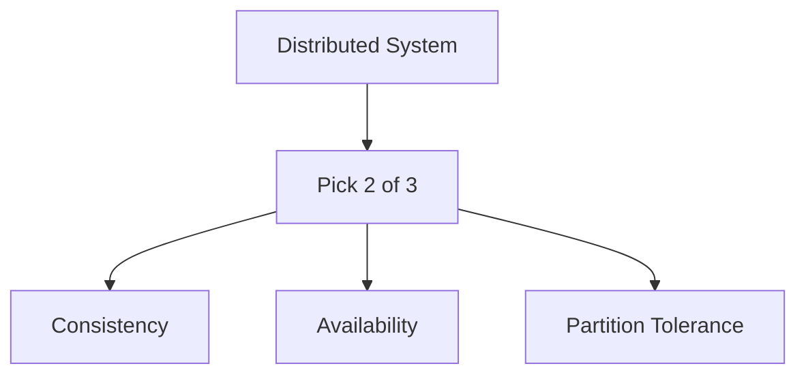

# DBMS
 
> [!NOTE]
> Reference notes: [DBMS One-Shot Notes](https://drive.google.com/file/d/1y3KKghRhQjKfbWhvLipMOCCemKd_XdTm/view?usp=sharing)
 
Most PBCs won't ask you to write SQL queries live. But database-heavy companies will go deep here, expect SQL-heavy rounds at places like Oracle, and NoSQL/distributed-systems-heavy rounds at places like Databricks or Snowflake.
 
## SQL vs NoSQL
 
Know when each is the right call, not just that both exist. SQL for strong consistency and relational integrity, NoSQL for horizontal scale and flexible schema.
 
## CAP Theorem
 
A distributed system can only guarantee two of Consistency, Availability, Partition tolerance at the same time.
 

 
> [!IMPORTANT]
> Partition tolerance isn't optional in a real distributed system, network partitions will happen. So in practice you're really choosing between consistency and availability during a partition. That's the framing interviewers actually want to hear.
 
## Replication and Partitioning
 
Replication copies the same data across nodes (for availability). Partitioning (sharding) splits different data across nodes (for scale). Know both and why they solve different problems.
 
## Backups
 
Full vs incremental, and what recovery time each implies.
 
## Efficient Querying
 
Indexing (and its trade-off, faster reads, slower writes), and being able to reason about why a query is slow, not just memorize `EXPLAIN` syntax.
 
---
*Back to [Core CS Fundamentals](./README.md)*