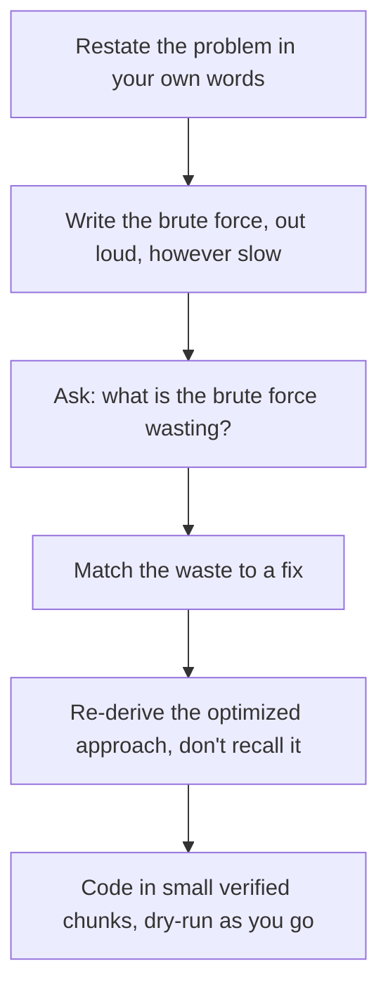

# 04. Data Structures & Algorithms

This page is the thinking behind how this folder is built, why most people prepare DSA the wrong way, and what to actually do differently. It won't teach you a data structure or an algorithm, every topic has its own file for that, and the practical order to follow lives in [Roadmap & Prerequisites](./roadmap.md).

> [!IMPORTANT]
> **If you're a beginner just starting out**: stop here and jump straight to [Roadmap & Prerequisites](./roadmap.md), start with the first topic, and come back to this page once you've got a few topics under your belt. It'll mean more once you have something to measure it against.
>
> **If you're already reasonably prepared, revising, or prepping for a job switch**: keep reading. This page is written for exactly this stage, when you already know the syntax and the theory but want to fix *how* you think through a problem, which is usually the actual gap.

---

## Why Most People Get This Wrong

The usual approach: open LeetCode, solve problems roughly in order of difficulty, repeat for months, walk into an interview.

Here's what actually happens with that approach. You solve "Two Sum" using a hashmap. You solve it again next week, same solution. Three weeks later you're in an interview and you get a problem that's structurally identical to Two Sum but phrased differently, maybe it's about finding a pair of shipping containers that fit a weight limit. You don't recognize it. You've memorized a solution to a sentence, not a shape.

> [!IMPORTANT]
> An interviewer isn't testing whether you've seen a problem before. They're testing whether you can look at a new problem and correctly identify what it actually is underneath the wording. That skill is called pattern recognition, and it's learnable, but not by memorizing solutions.

Roughly 3000+ problems exist on LeetCode. They collapse into about 15 to 20 real patterns. Learn the patterns, and you can solve problems you've never seen. Learn 3000 individual solutions, and you can solve exactly the problems you've already seen, which is useless the moment the interviewer changes one constraint.

---

## The Actual Skill Is Reading Constraints, Not Just the Question

Every problem gives you signals about which pattern applies, usually in the constraints and the shape of the input, not the story wrapped around it. Train yourself to read these first, before you think about a solution.

> [!WARNING]
> This table is a compass, not a shortcut. Don't memorize it and start pattern-matching keywords in the problem statement, that's the exact same mugging trap wearing a different costume. Real pattern recognition is built by solving enough problems that you start *noticing* these signals yourself, on your own, before you ever check a table like this. Use it to check your instinct after you've formed one, not to replace forming one.

The table below lists patterns in their bare, textbook form. **A real interview problem will never say "sliding window" or "two pointers."** It'll be a story, a warehouse packing scenario, a stock price sequence, a delivery route problem, and it's on you to strip the story away and see the shape underneath. That translation step is the actual skill being tested. The table gives you the shapes to recognize, not the words to expect.

| Signal in the problem | Likely pattern |
| --- | --- |
| Sorted array, looking for a pair or triplet | Two Pointers |
| Subarray or substring with a condition ("longest," "contains at most K") | Sliding Window |
| Need the top K, or the Kth largest/smallest | Heap |
| Repeated lookups, "have I seen this before," counting frequency | Hashing |
| Tree or graph, need shortest path with equal weights | BFS |
| Tree or graph, need to explore all paths / all combinations | DFS or Backtracking |
| "Number of ways to..." or "minimum/maximum cost to..." with overlapping subproblems | Dynamic Programming |
| Next greater/smaller element, or needing to look back at recent elements | Stack |
| Merging intervals, scheduling, overlapping ranges | Intervals / Greedy |
| Connecting components, checking if things are grouped together | Union-Find |
| Fixed-size or shrinking/growing window over an array | Sliding Window |
| Input size ≤ ~20 and asks for all subsets/permutations | Backtracking (exponential is expected and fine) |
| Input size ~10^5 to 10^6 and needs better than O(n²) | Hashing, Two Pointers, Sliding Window, Binary Search, or Heap, in that rough order of likelihood |

> [!TIP]
> Constraints tell you the expected time complexity before you've even thought of an approach. `n ≤ 20` means exponential is fine, they want backtracking. `n ≤ 10^6` rules out anything worse than O(n log n). Read constraints before you read the problem twice.

---

## Why People Actually Fail

Not because they didn't solve enough problems. Because of *how* they solved them.

1. **They memorize the solution's code, not the reason it works.** The moment the wrapper story changes, the memorized code doesn't transfer, and they have nothing left to fall back on.
2. **They skip the brute force.** They jump straight to trying to recall a "trick." When nothing comes to mind, they freeze, because they never built the habit of starting from something they can always derive.
3. **They don't actually read the constraints.** The exact clue that tells you which pattern applies is sitting right there in the input size and properties, and it gets skipped in the rush to start coding.
4. **They don't dry-run before typing.** Thirty lines go down, something's wrong, and now they're debugging logic errors live, under time pressure, with an interviewer watching.
5. **They practice in topic-locked batches.** Fifty DP problems back to back builds your ability to recall DP. It does nothing for your ability to *recognize* that a brand new problem is DP when it isn't labeled as one.
6. **They stop the moment the example output matches.** No edge case check, no empty input, no single element, no all-duplicates case. Works on the one example given, ships it, and it breaks on the interviewer's follow-up input.

---

## The Optimization Ladder: How to Actually Arrive at a Solution

This is the structured way to think through a problem instead of hoping a pattern jumps out at you.

Step 3 is the entire skill. Every optimized solution exists because the brute force was wasting something specific. Learn to name the waste, and the fix follows.

| What the brute force is wasting | The fix | What this becomes |
| --- | --- | --- |
| Recomputing the same subproblem over and over | Store the result the first time | Dynamic Programming |
| Scanning the full array again for every element to check existence | Precompute a lookup | Hashing |
| Re-scanning the whole window from scratch every time it shifts | Maintain running state, add what enters, remove what leaves | Sliding Window |
| Checking every pair in a sorted array with nested loops | Converge from both ends using the sorted property | Two Pointers |
| Exploring a branch fully before realizing it was invalid | Cut the branch the moment it's known to be invalid | Backtracking with pruning |
| Recomputing shortest distance from scratch for every query | Relax edges once, reuse the result | BFS / Dijkstra |

### Worked Example 1: Recursion → DP → Space-Optimized DP

Climbing stairs, n steps, 1 or 2 steps at a time, count the ways.

- **Brute force**: plain recursion, `ways(n) = ways(n-1) + ways(n-2)`. Wasteful because `ways(n-2)` gets recomputed from scratch inside both `ways(n-1)` and directly, exponential blowup.
- **Waste identified**: the same subproblem is solved repeatedly.
- **Fix**: store each `ways(i)` the first time it's computed. That's memoization, top-down DP.
- **Further optimization**: since `ways(i)` only ever needs the previous two values, you don't need the whole array, two variables are enough. That's space-optimized DP.

### Worked Example 2: Two Pointers → Fixed Window → Variable Window

- **Brute force**: max sum of any subarray of size `k`. Nested loop, recompute the sum for every starting index, O(nk).
- **Waste identified**: re-summing overlapping elements every time the window shifts by one.
- **Fix**: subtract the element leaving the window, add the element entering it. Fixed-size Sliding Window, O(n).
- **Next evolution**: "longest substring with at most K distinct characters", the window size isn't fixed anymore, it grows and shrinks based on a condition (distinct character count via a hashmap). Same core idea, one level more general: Variable Sliding Window.

### Worked Example 3: Graph Traversal → BFS → Dijkstra → Bellman-Ford → Floyd-Warshall

- **Brute force**: try every possible path between two nodes, compare total costs. Exponential.
- **Unweighted shortest path**: every edge costs the same, so the first time BFS reaches a node is guaranteed to be the shortest path. No need to compare paths at all.
- **Add positive edge weights**: BFS's "first visit is shortest" guarantee breaks. Fix: always expand the currently-closest unvisited node next, using a priority queue. That's Dijkstra.
- **Add negative edge weights**: Dijkstra's greedy assumption breaks, a negative edge encountered later can invalidate an earlier "shortest" decision. Fix: relax every edge repeatedly, `V-1` times, and check for further improvement, that's Bellman-Ford, and it also lets you detect negative cycles.
- **Need shortest paths between every pair of nodes, not just one source**: running Dijkstra or Bellman-Ford from every node works but is expensive. Fix: Floyd-Warshall, a DP over "can I improve the path from i to j by routing through k," solves all pairs at once.

Notice the shape across all three examples: brute force, name the waste, apply a fix that matches the waste, and the "next" algorithm exists purely because the constraints changed enough to break the previous fix's assumption. That's the actual skill. Nobody needs to memorize Bellman-Ford's formula if they understand it exists specifically to fix what breaks in Dijkstra under negative weights.

---

## Next Step

Ready to actually get moving, or need the ordered list of topics: [Roadmap & Prerequisites](./roadmap.md).

> [!IMPORTANT]
> Set a reminder, literally, to reread this page twice more: once when you're roughly halfway through the roadmap, and once in your last two weeks before interviews begin. Same words, different meaning each time, because you'll have actual failed attempts and real pattern recognition to measure it against by then.
