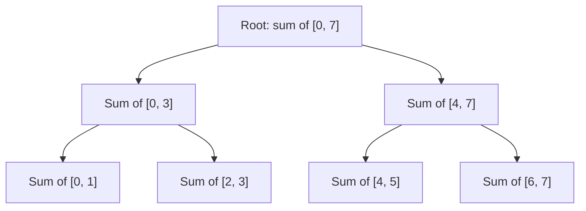

# Advanced Topics

These sit at the end of the roadmap for a reason, each one only makes sense once its prerequisite is solid. Don't start here.

## Short Notes

### Union-Find (Disjoint Set Union)

Answers one question fast, repeatedly: "are these two elements in the same group?" and "merge these two groups into one." Both operations run in effectively O(1) (technically O(α(n)), the inverse Ackermann function, so slow-growing it's constant for any input size you'll ever encounter), which is exactly the complexity note flagged back in [Complexity Analysis](../basic-foundations/complexity-analysis.md).

```java
class UnionFind {
    int[] parent, rank;

    UnionFind(int n) {
        parent = new int[n];
        rank = new int[n];
        for (int i = 0; i < n; i++) parent[i] = i;
    }

    int find(int x) {
        if (parent[x] != x) parent[x] = find(parent[x]); // path compression
        return parent[x];
    }

    boolean union(int x, int y) {
        int rootX = find(x), rootY = find(y);
        if (rootX == rootY) return false; // already connected, this edge would form a cycle
        if (rank[rootX] < rank[rootY]) { int t = rootX; rootX = rootY; rootY = t; }
        parent[rootY] = rootX;
        if (rank[rootX] == rank[rootY]) rank[rootX]++;
        return true;
    }
}
```

> [!TIP]
> Path compression (`find`) and union by rank (`union`) together are what get this down to near-O(1). Skip either one, and it degrades toward O(n) per operation, still correct, just slow enough to matter on large inputs.

This is the exact mechanism Kruskal's Algorithm uses for cycle detection, covered in [Graph Algorithms](./graph-algorithms.md#minimum-spanning-tree-kruskals-and-prims), that `union()` returning `false` when two nodes are already connected is precisely how Kruskal's knows an edge would create a cycle and should be skipped.

### Segment Trees

Answers range queries (sum, min, max over a range) in O(log n), while also supporting updates to individual elements in O(log n). A plain prefix-sum array answers range-sum queries in O(1) but breaks the moment a single element changes, that's exactly the gap a Segment Tree fills.



Each node covers a range, and holds the combined result (sum, min, whatever the problem needs) for that range. A query or update only touches O(log n) nodes on the path down, instead of the full array.

> [!IMPORTANT]
> You're unlikely to be asked to implement a Segment Tree from scratch under interview time pressure. What actually matters: recognizing the signal, "range query" **and** "point update," both happening repeatedly. Prefix sums alone handle the first, a Segment Tree (or a Binary Indexed Tree, a lighter-weight alternative for sum queries specifically) handles both together.

### Bitmask DP

A DP technique for problems where the state includes "which subset of items has been used so far," represented as an integer where each bit says whether one item is included. Only practical when the number of items is small (`n ≤ 20` or so, tying back to the constraint-reading signal from the [DSA README](../README.md)), since the state space is `2ⁿ`.

```java
// Traveling Salesman-style DP: dp[mask][i] = min cost to visit exactly the cities in `mask`, ending at city i
int[][] dp = new int[1 << n][n];
for (int[] row : dp) Arrays.fill(row, Integer.MAX_VALUE);
dp[1][0] = 0; // starting at city 0, only city 0 visited

for (int mask = 1; mask < (1 << n); mask++) {
    for (int i = 0; i < n; i++) {
        if ((mask & (1 << i)) == 0 || dp[mask][i] == Integer.MAX_VALUE) continue;
        for (int next = 0; next < n; next++) {
            if ((mask & (1 << next)) != 0) continue; // already visited
            int newMask = mask | (1 << next);
            dp[newMask][next] = Math.min(dp[newMask][next], dp[mask][i] + cost[i][next]);
        }
    }
}
```

> [!TIP]
> `mask | (1 << i)` adds city `i` to the visited set, `mask & (1 << i)` checks if it's already there. Both are direct applications of the bit tricks table in [Number Theory](../basic-foundations/number-theory.md), this is exactly why that file exists as a prerequisite instead of being folded into DP directly.

---

## Problems

- Number of Connected Components in an Undirected Graph, Union-Find applied directly
- Redundant Connection, find the one edge that creates a cycle, Union-Find's `union()` returning `false` tells you exactly which edge that is
- Range Sum Query - Mutable, the canonical Segment Tree (or Binary Indexed Tree) problem
- Partition to K Equal Sum Subsets, or a small Traveling Salesman variant, Bitmask DP applied directly

---

## Resources

- [GeeksforGeeks - Union-Find (Disjoint Set)](https://www.geeksforgeeks.org/dsa/introduction-to-disjoint-set-data-structure-or-union-find-algorithm/)
- [GeeksforGeeks - Segment Tree](https://www.geeksforgeeks.org/dsa/segment-tree-data-structure/)
- [GeeksforGeeks - Bitmasking and DP](https://www.geeksforgeeks.org/dsa/bitmasking-and-dynamic-programming-set-1-count-ways-to-assign-unique-cap-to-every-person/)

---
*Back to [Roadmap & Prerequisites](../README.md)*