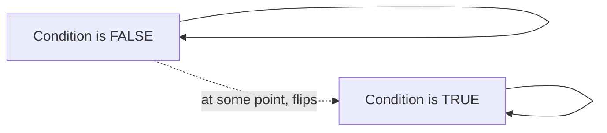

# Searching

## Short Notes

### Linear Search: The Baseline

Check every element until you find the target, or run out. O(n), no preconditions on the data. This is the brute force that every other searching technique exists to beat.

> [!TIP]
> Watch both side by side: [Coddy - Linear Search](https://coddy.tech/visualize/searching/linear-search) · [Coddy - Binary Search](https://coddy.tech/visualize/searching/binary-search)

### Binary Search: Halving Instead of Scanning

Requires sorted data. Compare the target to the middle element, discard the half that can't contain it, repeat. O(log n) instead of O(n), the same halving idea that shows up in [Complexity Analysis](../basic-foundations/complexity-analysis.md) and in modular exponentiation over in [Number Theory](../basic-foundations/number-theory.md).

```java
int binarySearch(int[] nums, int target) {
    int left = 0, right = nums.length - 1;
    while (left <= right) {
        int mid = left + (right - left) / 2; // avoids overflow vs (left + right) / 2
        if (nums[mid] == target) return mid;
        else if (nums[mid] < target) left = mid + 1;
        else right = mid - 1;
    }
    return -1;
}
```

> [!WARNING]
> `mid = (left + right) / 2` can overflow if `left + right` exceeds the integer range on large inputs. `left + (right - left) / 2` gives the same result without that risk. Small detail, but it's the kind of thing that separates "knows binary search" from "has actually implemented it carefully."

### Binary Search Isn't Just for Finding a Value

The real skill: recognizing when a problem has a **monotonic condition**, something that's false, then true (or true, then false) as you move across a range, even if the input itself isn't literally sorted numbers.



If you can answer "is this value good enough" in O(1) or O(log n), and that answer flips exactly once as the value increases, you can binary search on the answer itself, not just on array indices. This shows up in problems like "minimum number of days to make m bouquets" or "capacity to ship packages within D days," neither looks like a search problem at first glance.

> [!TIP]
> The signal: "find the minimum/maximum X such that condition holds" plus a large search space (often up to 10^9) where checking one candidate is fast. That combination is binary-search-on-the-answer, even when nothing in the problem is presorted.

### Variants Worth Knowing by Name

- **Lower bound / upper bound**: find the first index where a value could be inserted to keep the array sorted (first occurrence, or one past the last occurrence)
- **Search in rotated sorted array**: the array is sorted but rotated at an unknown pivot, one half is always still properly sorted, use that to decide which half to search
- **Binary search on a 2D matrix**: when rows and columns are both sorted, treat the matrix as a flattened 1D sorted array using index math, `row = mid / cols`, `col = mid % cols`

---

## Problems

- Binary Search, the plain version, until it's automatic
- Search in Rotated Sorted Array
- Find First and Last Position of Element in Sorted Array (lower/upper bound)
- Koko Eating Bananas or Capacity to Ship Packages Within D Days, binary search on the answer
- Search a 2D Matrix

---

## Resources

- [Coddy - Linear Search](https://coddy.tech/visualize/searching/linear-search)
- [Coddy - Binary Search](https://coddy.tech/visualize/searching/binary-search)
- [GeeksforGeeks - Binary Search](https://www.geeksforgeeks.org/dsa/binary-search/), covers the standard variants in more depth

---
*Back to [Roadmap & Prerequisites](../roadmap.md)*