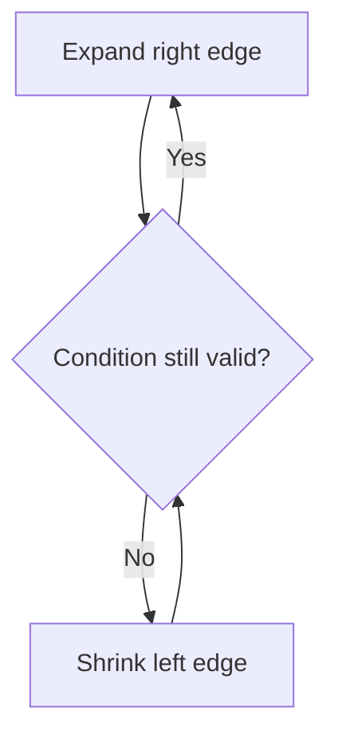

# Sliding Window

## Short Notes

### The Core Idea

A window (a contiguous subarray or substring) that expands and contracts as you scan through the input, maintaining some running state instead of recomputing it from scratch every time the window shifts. This is the direct fix for the "re-scanning the whole window from scratch" waste named in the [DSA README's Optimization Ladder](../README.md).

> [!NOTE]
> No dedicated Coddy visualizer for this one either, same as Two Pointers, it's a technique layered on top of arrays. The mental model overlaps heavily with the two-pointer "same direction, different speeds" shape covered in [Two Pointers](./two-pointers.md), a sliding window is really two pointers marking the window's edges.

### Fixed-Size Window

The window size is given directly (find the max sum of any subarray of size `k`). Slide by one each step: subtract what leaves, add what enters.

```java
int maxSumFixedWindow(int[] nums, int k) {
    int windowSum = 0;
    for (int i = 0; i < k; i++) windowSum += nums[i];
    int maxSum = windowSum;
    for (int i = k; i < nums.length; i++) {
        windowSum += nums[i] - nums[i - k]; // add entering, remove leaving
        maxSum = Math.max(maxSum, windowSum);
    }
    return maxSum;
}
```

### Variable-Size Window

The window size isn't given, it grows and shrinks based on a condition (longest substring with at most K distinct characters, smallest subarray with sum ≥ target). Expand the right edge until the condition breaks, then shrink the left edge until it's satisfied again.



```java
// Longest substring with at most K distinct characters
int longestSubstringKDistinct(String s, int k) {
    Map<Character, Integer> freq = new HashMap<>();
    int left = 0, maxLen = 0;
    for (int right = 0; right < s.length(); right++) {
        freq.merge(s.charAt(right), 1, Integer::sum);
        while (freq.size() > k) {
            char leftChar = s.charAt(left);
            freq.put(leftChar, freq.get(leftChar) - 1);
            if (freq.get(leftChar) == 0) freq.remove(leftChar);
            left++;
        }
        maxLen = Math.max(maxLen, right - left + 1);
    }
    return maxLen;
}
```

> [!TIP]
> Notice this uses a hashmap to track window state, that's [Hashing](../data-structures/hashing.md) and Sliding Window composing together, which is normal. Most real interview problems combine two or three patterns from this repo, not just one in isolation.

### Recognizing Which Shape You're In

| Signal | Shape |
|---|---|
| "Subarray of size K" | Fixed window |
| "Longest / shortest subarray such that..." | Variable window |
| "At most K distinct" / "exactly K distinct" | Variable window, exactly K is often solved as `atMost(K) - atMost(K-1)` |
| Need a running sum/count/frequency as the window moves | Either shape, maintain the state incrementally, don't recompute |

> [!WARNING]
> The single most common bug: forgetting to update the running state (sum, frequency map, distinct count) when shrinking the window, only updating it on expansion. The window has two edges, both need to keep the state correct.

---

## Problems

- Maximum Sum Subarray of Size K, the fixed-window base case above
- Longest Substring Without Repeating Characters, variable window, condition is "no duplicates in the window"
- Longest Substring with At Most K Distinct Characters, the variable-window example above
- Minimum Size Subarray Sum, variable window, condition is "sum ≥ target," shrink to minimize once satisfied
- Permutation in String, fixed window size equal to the pattern length, compare frequency maps as the window slides

---

## Resources

- [GeeksforGeeks - Sliding Window Technique](https://www.geeksforgeeks.org/dsa/window-sliding-technique/)

---
*Back to [Roadmap & Prerequisites](../README.md)*