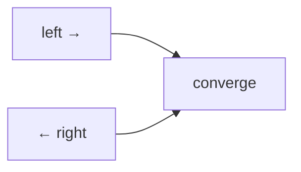

# Two Pointers

## Short Notes

### The Core Idea

Two indices moving through a structure, usually a sorted array, according to some rule, instead of nested loops checking every pair. This is the direct fix for the "check every pair with nested loops" waste named in the [DSA README's Optimization Ladder](../README.md).

> [!NOTE]
> No dedicated Coddy visualizer for this one specifically, it's a technique applied on top of arrays rather than its own data structure. Watching [Coddy - Binary Search](https://coddy.tech/visualize/searching/binary-search) still helps build the "converge from the edges" intuition this pattern relies on.

### The Two Common Shapes

**Opposite ends, converging inward.** Requires sorted data. Move `left` and `right` toward each other based on how the current pair compares to what you need.

```java
// Two Sum on a sorted array: opposite-end convergence
int[] twoSumSorted(int[] nums, int target) {
    int left = 0, right = nums.length - 1;
    while (left < right) {
        int sum = nums[left] + nums[right];
        if (sum == target) return new int[]{left, right};
        else if (sum < target) left++;  // need a bigger sum, move left pointer up
        else right--;                    // need a smaller sum, move right pointer down
    }
    return new int[]{};
}
```

**Same direction, different speeds.** Both pointers start together and move forward, but at different rates or under different conditions, this is the same fast/slow idea from [Linked List](../data-structures/linked-list.md), applied here to arrays for in-place modification.



### Why It Works

Two Pointers is only valid because sorted order guarantees something: moving `left` forward only increases the sum, moving `right` backward only decreases it. Without that guarantee, you can't safely discard the possibilities you skip. That's why "is the array sorted, or can I sort it without breaking the problem" is the first question to ask before reaching for this pattern.

> [!WARNING]
> Applying Two Pointers to unsorted data without realizing it silently gives a wrong answer, not a runtime error, which makes it a dangerous mistake to make under interview pressure. Always confirm the sortedness assumption out loud before writing the pointer logic.

### Three Pointers, Same Idea Extended

Problems like 3Sum fix one element with an outer loop, then run the standard two-pointer convergence on the remaining subarray for each fixed element, O(n²) total instead of O(n³).

---

## Problems

- Two Sum II (sorted array input), the direct base case above
- 3Sum, fix one pointer, two-pointer converge on the rest
- Container With Most Water, opposite-end convergence where the "which pointer moves" decision is driven by height, not sum
- Remove Duplicates from Sorted Array, same-direction two pointers (already introduced in [Arrays & Strings](../data-structures/arrays-strings.md), revisit it here as the two-pointer pattern it actually is)
- Valid Palindrome, opposite-end convergence on a string instead of numeric comparison

---

## Resources

- [GeeksforGeeks - Two Pointer Technique](https://www.geeksforgeeks.org/dsa/two-pointers-technique/)

---
*Back to [Roadmap & Prerequisites](../README.md)*