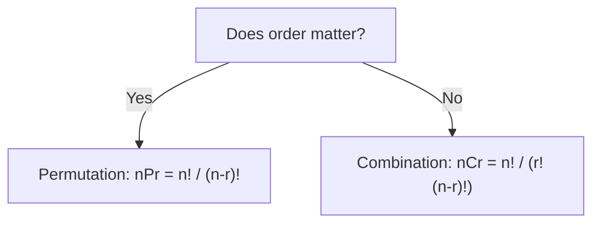

# Math

This is general problem-solving math, distinct from [Number Theory](./number-theory.md), which covers GCD, primes, and modular arithmetic specifically. This file covers the math that shows up under LeetCode's "Math & Geometry" category and inside DP/probability-flavored problems.

## Short Notes

### Combinatorics: Permutations vs Combinations

The single most common math mistake in interviews: using the wrong formula because the problem didn't say "permutation" or "combination" out loud.



- **Permutation**: "how many ways to arrange 3 people in a line" — order matters, ABC is different from BCA.
- **Combination**: "how many ways to pick 3 people for a team" — order doesn't matter, {A, B, C} is the same team regardless of pick order.

```java
// nCr, computed iteratively to avoid factorial overflow on large n
long nCr(int n, int r) {
    if (r > n - r) r = n - r; // nCr == nC(n-r), pick the smaller side
    long result = 1;
    for (int i = 0; i < r; i++) {
        result = result * (n - i) / (i + 1);
    }
    return result;
}
```

> [!WARNING]
> Computing `n!` directly overflows fast, `20!` already exceeds what a 64-bit integer can hold. Compute nCr iteratively like above, or use Pascal's Triangle if you need many values of nCr for the same range of n.

### Pascal's Triangle

Each value is the sum of the two values above it, `C(n, r) = C(n-1, r-1) + C(n-1, r)`. Useful when a problem needs multiple nCr values, since you build the whole table once instead of recomputing factorials repeatedly.

### Summation and Series Formulas

Worth having memorized cold, they show up constantly inside complexity analysis and inside problems themselves:

| Formula | Value |
|---|---|
| Sum of first n natural numbers | n(n+1)/2 |
| Sum of first n squares | n(n+1)(2n+1)/6 |
| Sum of an Arithmetic Progression | n/2 × (first term + last term) |
| Sum of a Geometric Progression | a(rⁿ - 1)/(r - 1), for ratio r ≠ 1 |

> [!TIP]
> "Sum of first n natural numbers" isn't just a formula to memorize, it's *why* a triangular nested loop (`for i in range(n): for j in range(i, n)`) runs in O(n²) and not O(n³), the inner loop's total iteration count across all outer iterations sums to n(n+1)/2, which is still O(n²).

### Logarithm Properties

Relevant because O(log n) shows up everywhere, and because some problems (counting digits, checking powers of a number) are cleaner with logs than loops.

- `log(a × b) = log(a) + log(b)`
- `log(a / b) = log(a) - log(b)`
- `log_b(x) = log(x) / log(b)`, the change of base formula, useful since most languages only give you `log` (natural) or `log10` directly
- Number of digits in `n` (base 10) is `floor(log10(n)) + 1`

> [!WARNING]
> Don't reach for logs to check "is n a power of 2." Floating-point log can be off by a hair near exact powers, giving a wrong answer. Use the bit trick instead: `n > 0 && (n & (n - 1)) == 0`, covered in [Number Theory](./number-theory.md).

### Probability and Expected Value, Just Enough

You won't get deep probability theory in a PBC interview, but a few problems lean on it directly, most commonly reservoir sampling ("pick a random node from a stream of unknown length") and "random pick with weight."

- **Expected value**: the average outcome if you repeated something infinitely, `E[X] = Σ (value × probability of that value)`.
- **Reservoir sampling core idea**: when you've seen `k` items, a new (k+1)th item replaces a random existing one with probability `1/(k+1)`, which keeps every item seen so far equally likely to be the final pick. You don't need to derive this from scratch in an interview, but you should recognize the *shape* of the problem when it shows up.

### Coordinate Geometry Basics

Shows up in grid-based and point-based problems (closest pair, checking collinearity, computing area).

| Need | Formula |
|---|---|
| Distance between two points | `sqrt((x2-x1)² + (y2-y1)²)` |
| Slope between two points | `(y2-y1) / (x2-x1)` |
| Are three points collinear | Slope between (1,2) equals slope between (2,3), or equivalently the cross product `(x2-x1)(y3-y1) - (y2-y1)(x3-x1) == 0` |
| Area of a triangle from 3 points | `abs((x1(y2-y3) + x2(y3-y1) + x3(y1-y2)) / 2)` |

> [!TIP]
> Prefer the cross-product form for collinearity over comparing slopes directly, slope involves division and breaks on vertical lines (division by zero). Cross product avoids that entirely.

---

## Problems

A focused set, not a marathon. The goal is recognizing when a problem is secretly asking for combinatorics or geometry, not becoming a competitive math specialist.

- Count total ways to reach a target using combinations (basic nCr application)
- A problem requiring Pascal's Triangle directly (build the triangle itself)
- Excel Sheet Column Number/Title style problems (base conversion logic, adjacent to math intuition)
- A reservoir sampling problem (random node from a linked list / random pick from a stream)
- A collinear points or basic geometry problem (max points on a line, valid square from 4 points)

---

## Resources

- [GeeksforGeeks - Permutations and Combinations](https://www.geeksforgeeks.org/maths/permutation-and-combination/), for the combinatorics fundamentals
- [GeeksforGeeks - Reservoir Sampling](https://www.geeksforgeeks.org/dsa/reservoir-sampling/), for the one probability-adjacent technique that actually shows up repeatedly

---
*Back to [Roadmap & Prerequisites](../README.md)*