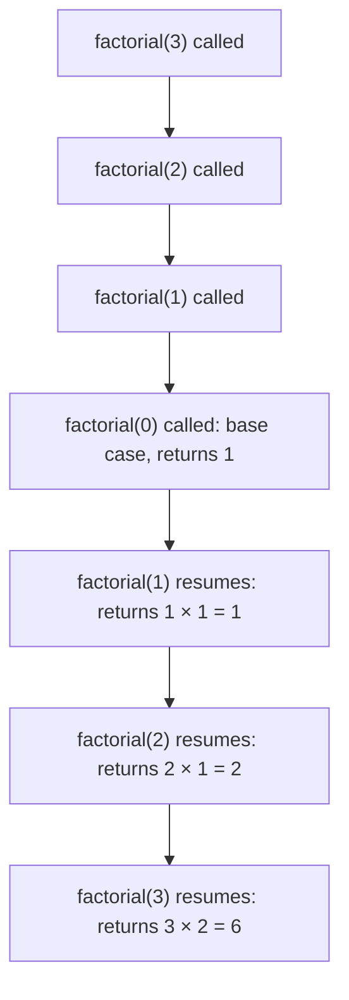

# Recursion

This is the highest-leverage file in this entire folder. Trees, Backtracking, and Dynamic Programming all sit directly on top of this. If this doesn't feel intuitive yet, stop and fix it here, everything downstream will otherwise feel harder than it actually is, for no reason other than a shaky foundation.

## Short Notes

### What Recursion Actually Is

A function that solves a problem by calling itself on a smaller version of the same problem, until it reaches a version small enough to answer directly.

Every recursive function needs exactly two things:

1. **Base case**: the smallest version of the problem, answered directly, no further recursive call
2. **Recursive case**: the problem broken into a smaller version of itself, plus a call to solve that smaller version

```java
int factorial(int n) {
    if (n == 0) return 1;              // base case
    return n * factorial(n - 1);       // recursive case, smaller problem
}
```

> [!WARNING]
> Missing or unreachable base case is the single most common recursion bug. It doesn't throw a helpful error, it throws a stack overflow, often after enough recursive calls that the actual mistake feels disconnected from the crash.

### The Call Stack, What's Actually Happening

Each recursive call adds a new frame onto the call stack, holding that call's local variables and where to resume once it returns. Nothing in a call is "done" until every call it made has returned.



The calls go all the way down to the base case first, then unwind back up, each frame finishing its pending multiplication as control returns to it. This unwind is exactly where the actual computation happens for problems like factorial, the multiplication doesn't happen on the way down, it happens on the way back up.

### How to Actually Think Through Writing One

Don't try to mentally trace the entire call tree for anything beyond a toy example, that's what trips people up and makes recursion feel impossible. Instead:

1. Define what the function promises to return, in one sentence, for *any* valid input, not just the smallest one.
2. Write the base case, the smallest input where you can answer that promise directly.
3. Write the recursive case assuming the recursive call already correctly does what you promised in step 1, for a smaller input. Trust it. Don't re-derive it.
4. Only then, if something's wrong, trace through a small example to find where the promise breaks.

> [!TIP]
> This is called "trusting the recursion," and it's the actual unlock. If you're mentally simulating five levels of calls in your head every time you write a line, you're not using recursion's core advantage, which is that you only ever need to reason about one level at a time.

### Recursion vs Iteration

Anything recursive can be rewritten iteratively, using an explicit stack to hold what the call stack would have held. Interviewers sometimes ask for this directly, "can you do this without recursion," specifically to check whether you understand recursion's mechanism or just its syntax.

```java
// Recursive
void printDown(int n) {
    if (n == 0) return;
    System.out.println(n);
    printDown(n - 1);
}

// Same logic, iterative, using an explicit stack
void printDownIterative(int n) {
    Deque<Integer> stack = new ArrayDeque<>();
    stack.push(n);
    while (!stack.isEmpty()) {
        int curr = stack.pop();
        if (curr == 0) continue;
        System.out.println(curr);
        stack.push(curr - 1);
    }
}
```

> [!IMPORTANT]
> Don't assume your language optimizes recursive calls into loops automatically. Tail call optimization exists in some languages but is not guaranteed in Java, C#, Python, or most C++ compilers by default. Deep recursion (tens of thousands of levels) can genuinely overflow the stack in an interview setting, know when to reach for the iterative version.

### The Shapes Recursion Takes

Not all recursion looks the same, and recognizing which shape you're in tells you what to expect from its complexity, tying directly back to [Complexity Analysis](./complexity-analysis.md).

| Shape | What it looks like | Example |
|---|---|---|
| Linear recursion | One recursive call per invocation | Factorial, sum of digits |
| Tree recursion | Multiple recursive calls per invocation, branching | Naive Fibonacci, subset generation, backtracking |
| Tail recursion | The recursive call is the very last operation, nothing pending after it returns | A version of factorial using an accumulator parameter |

Tree recursion is the one to watch closely, it's where overlapping subproblems show up (the same smaller call getting made from multiple branches), which is the exact signal that leads into Dynamic Programming later in this roadmap.

### Common Mistakes

- **Base case that's never reached**, because the recursive case doesn't actually shrink the problem toward it (e.g. calling `factorial(n)` instead of `factorial(n - 1)`)
- **Doing extra unnecessary work per call**, like recomputing a length or a sum inside every recursive call when it could be passed down as a parameter instead
- **Not recognizing repeated subproblems**, solving the same smaller input multiple times across different branches, which is fine to notice now and fix properly once you reach Dynamic Programming

---

## Problems

Small, deliberately classic. The goal is comfort with the shape, not volume.

- Factorial and sum of digits (linear recursion, the absolute basics)
- Power(x, n), then optimize it to O(log n) using the same halving idea as binary search
- Reverse a string or array recursively, and check if a string is a palindrome recursively
- Tower of Hanoi, the classic exercise for building actual recursive intuition, not just recursive syntax
- Generate all subsets of a set (bridges directly into Backtracking, tree recursion in its clearest form)

---

## Resources

- [GeeksforGeeks - Recursion Introduction](https://www.geeksforgeeks.org/dsa/recursion/), covers the mental model and common pitfalls in more depth than fits here
- [GeeksforGeeks - Tower of Hanoi](https://www.geeksforgeeks.org/dsa/c-program-for-tower-of-hanoi/), work through this one by hand before checking the solution, it's the single best exercise for building genuine recursive thinking

---
*Back to [Roadmap & Prerequisites](../README.md)*