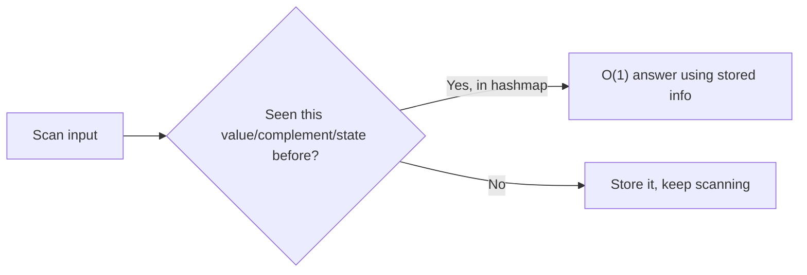

# Hashing

## Short Notes

### The Core Idea

A hash function converts a key into an index, letting you jump straight to where a value lives instead of scanning for it. That's the entire trick behind turning an O(n) lookup into an O(1) one.

> [!TIP]
> Watch keys get hashed into buckets and collisions handled: [Coddy - Hash Table](https://coddy.tech/visualize/data-structures/hash-table) · [Coddy - Hash Map](https://coddy.tech/visualize/data-structures/hash-map)

### Hash Table vs Hash Map, and Set

Language-dependent naming, but the underlying idea is the same structure used three ways:

- **Hash Map** (`HashMap` in Java, `dict` in Python): key-value pairs, O(1) average lookup by key
- **Hash Set** (`HashSet`, `set`): just keys, no associated value, used purely for O(1) "have I seen this" checks
- **Hash Table**: the general term for the underlying data structure both are built on

### Collisions, and Why They Matter

Two different keys can hash to the same bucket. How that gets resolved affects worst-case behavior:

- **Chaining**: each bucket holds a small list of everything that hashed there. Worst case (everything collides into one bucket) degrades to O(n).
- **Open addressing**: on collision, probe for the next open slot instead of chaining.

> [!IMPORTANT]
> "Hashmap lookup is O(1)" is an average-case claim, not a guarantee. Interviewers who ask about worst case want to hear you know it can degrade to O(n) under pathological collisions, that's the kind of detail that separates someone who's used a hashmap from someone who understands one.

### The Pattern to Actually Internalize

Almost every hashing problem follows the same shape: **trade space for time by remembering what you've already seen.**



```java
// Two Sum: instead of checking every pair (O(n²)), remember what you need
int[] twoSum(int[] nums, int target) {
    Map<Integer, Integer> seen = new HashMap<>(); // value -> index
    for (int i = 0; i < nums.length; i++) {
        int complement = target - nums[i];
        if (seen.containsKey(complement)) {
            return new int[]{seen.get(complement), i};
        }
        seen.put(nums[i], i);
    }
    return new int[]{};
}
```

This same shape reappears constantly: frequency counting (remember counts), grouping (remember a computed key like a sorted string for anagram groups), and subarray sum problems (remember prefix sums seen so far).

### When Hashing Isn't the Right Fix

If the problem needs order preserved, or needs range queries (sum between index i and j, repeatedly, with updates), a hashmap alone doesn't help, that's a signal to look at prefix sums, a sorted structure, or a Trie instead (for prefix-based string lookups specifically).

---

## Problems

- Two Sum (above), then Two Sum variants that ask for all pairs, or a count instead of indices
- Group Anagrams, grouping by a computed key (sorted string, or a character frequency signature)
- Longest Consecutive Sequence, using a hash set for O(n) instead of sorting first
- Subarray Sum Equals K, prefix sums stored in a hashmap, the technique generalizes far beyond this one problem
- Valid Sudoku, multiple simultaneous hash sets (rows, columns, boxes) tracking "seen" state at once

---

## Resources

- [Coddy - Hash Table](https://coddy.tech/visualize/data-structures/hash-table)
- [Coddy - Hash Map](https://coddy.tech/visualize/data-structures/hash-map)
- [GeeksforGeeks - Hashing](https://www.geeksforgeeks.org/dsa/hashing-data-structure/), covers collision resolution strategies in more depth

---
*Back to [Roadmap & Prerequisites](../README.md)*