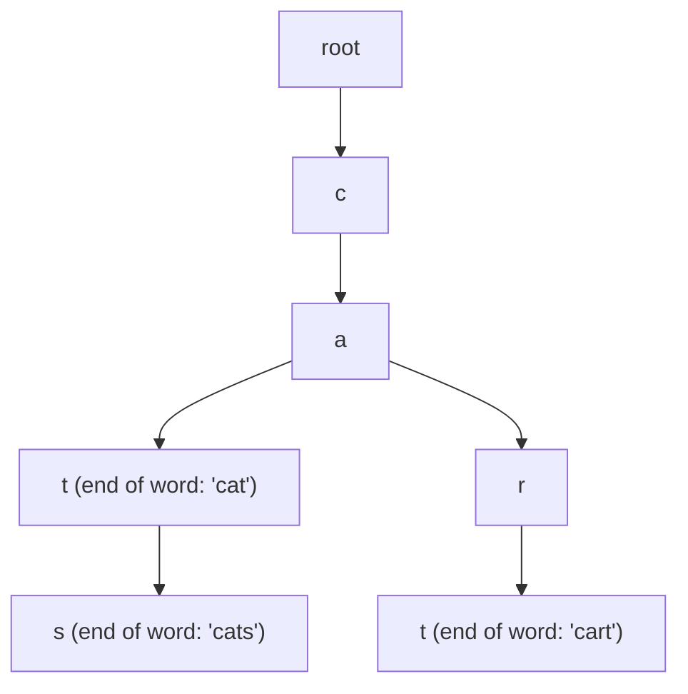

# Tries (Prefix Trees)

## Short Notes

### What Problem This Actually Solves

A hashmap can tell you if an exact word exists in O(1). It cannot efficiently answer "what words start with this prefix" without scanning every entry. A Trie is built specifically to make prefix-based questions fast, each node represents one character, and shared prefixes literally share the same path through the tree.

> [!TIP]
> Watch common prefixes get shared as words are inserted character by character: [Coddy - Trie (Prefix Tree)](https://coddy.tech/visualize/data-structures/trie)



"cat," "cats," and "cart" share the `c -> a` path entirely, the tree only branches where the words actually differ. That shared structure is the entire reason a Trie beats a hashmap for prefix work.

### The Structure

```java
class TrieNode {
    TrieNode[] children = new TrieNode[26]; // one slot per lowercase letter
    boolean isEndOfWord;
}

class Trie {
    TrieNode root = new TrieNode();

    void insert(String word) {
        TrieNode node = root;
        for (char c : word.toCharArray()) {
            int idx = c - 'a';
            if (node.children[idx] == null) node.children[idx] = new TrieNode();
            node = node.children[idx];
        }
        node.isEndOfWord = true;
    }

    boolean search(String word) {
        TrieNode node = find(word);
        return node != null && node.isEndOfWord;
    }

    boolean startsWith(String prefix) {
        return find(prefix) != null;
    }

    private TrieNode find(String s) {
        TrieNode node = root;
        for (char c : s.toCharArray()) {
            int idx = c - 'a';
            if (node.children[idx] == null) return null;
            node = node.children[idx];
        }
        return node;
    }
}
```

> [!IMPORTANT]
> `isEndOfWord` is the detail people forget and then can't explain why their Trie thinks "cat" exists when only "cats" was ever inserted. Without it, reaching the last node of "cat" while walking "cats" would incorrectly look like a match, the flag is what actually distinguishes "this prefix exists" from "this exact word was inserted."

### Complexity, and Why It's Independent of How Many Words You've Stored

Insert, search, and prefix-check are all O(m), where `m` is the length of the word or prefix, not the number of words already in the Trie. That's the actual selling point over a hashmap of strings: a hashmap's prefix search would need to check every stored word, a Trie's cost depends only on how long the string you're looking up is.

### Where a Trie Actually Gets Used

- Autocomplete: given a prefix, find all words extending it (walk to the prefix's node, then DFS from there collecting every complete word)
- Spell checkers, dictionary lookups
- IP routing tables (longest prefix match is structurally the same problem)
- Word Search style problems on a grid, using a Trie to prune the search early the moment the current path stops matching any word in the dictionary

---

## Problems

- Implement Trie (Prefix Tree), the structure above, from memory
- Design Add and Search Words Data Structure, a Trie with wildcard search support
- Word Search II, Trie plus backtracking on a grid, a direct combination with [Backtracking](../algorithms/backtracking.md)
- Longest Word in Dictionary, built incrementally using a Trie to check that every prefix of a candidate word also exists

---

## Resources

- [Coddy - Trie (Prefix Tree)](https://coddy.tech/visualize/data-structures/trie)
- [GeeksforGeeks - Trie Data Structure](https://www.geeksforgeeks.org/dsa/trie-insert-and-search/)

---
*Back to [Roadmap & Prerequisites](../README.md)*