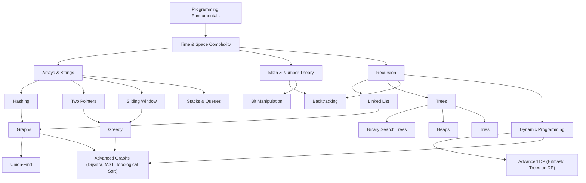

# DSA Roadmap & Prerequisites

This is the practical map. If you landed here from the README, you've either skipped ahead deliberately or come back after reading the thinking behind this folder, either way, this page tells you what to actually learn, in what order, and why that order isn't arbitrary.

---

## Prerequisite Map

Data structures and algorithms aren't a flat list, some topics are load-bearing for others. Learning Trees before Recursion is why Trees feel impossible to most people, the actual gap is Recursion.

Recursion is the single highest-leverage topic on this entire map. It's a direct prerequisite for Trees, Backtracking, and Dynamic Programming, three of the heaviest interview topics. If recursion isn't intuitive yet, stop and fix that before moving forward, everything downstream of it will otherwise feel harder than it actually is.

Notice Advanced Graphs sits downstream of both Greedy and Dynamic Programming, not just basic Graphs. Dijkstra is a greedy algorithm, and Bellman-Ford / Floyd-Warshall are DP under the hood. That's not a coincidence, it's why Graphs is placed later in the roadmap below despite basic traversal (BFS/DFS) being learnable much earlier.

---

## Math & Number Theory, the Prerequisite Everyone Skips

This gets left out of most roadmaps and then quietly costs people marks on problems that aren't really "DSA problems," they're math problems wearing a DSA costume. You don't need a semester of number theory, just enough to not get stuck on the arithmetic while the actual algorithm is fine.

Get comfortable with:

- GCD and LCM, and the Euclidean algorithm for computing GCD fast
- Prime numbers, primality checking, and the Sieve of Eratosthenes for generating primes up to N
- Modular arithmetic, especially `%` behavior with negative numbers in your language, and modular exponentiation
- Basic combinatorics, permutations vs combinations, and when a problem is secretly asking for one of them
- Bit manipulation basics, AND / OR / XOR / shifts, checking and setting a specific bit, counting set bits

> [!TIP]
> XOR shows up constantly as a trick for "find the single non-duplicate," and modular arithmetic shows up constantly in DP problems that ask for an answer "modulo 10^9 + 7." Both look like small details until you're stuck on one mid-interview.

---

## Time & Space Complexity, Before Anything Else

You cannot evaluate whether a solution is good without this. Before touching Arrays, get comfortable with:

- What Big-O actually measures (growth rate, not literal speed)
- Reading a nested loop and identifying O(n²) on sight
- Recognizing O(log n) from halving patterns (binary search, balanced trees)
- The difference between average case and worst case, and why interviewers usually want worst case

> [!WARNING]
> Don't turn this into its own multi-week topic. A few hours of focused study plus applying it to every problem you solve afterward is enough. It sharpens naturally with practice, it doesn't need to be mastered up front in isolation.

---

## How This Folder Is Organized

Every data structure and pattern below gets its own file with three consistent sections:

1. **Short Notes**, the core idea, when to use it, and the signals that point to it
2. **Problems**, a small, deliberately bounded set that actually covers the pattern's variations
3. **Resources**, the specific place to learn the mechanics if the short notes aren't enough on their own

This page only tells you what order to go in and why. Once you land inside a topic's own file, the depth lives there.

---

## The Roadmap, In Order

> [!TIP]
> Don't skip ahead because a later topic sounds more impressive. The prerequisite map above exists because skipping breaks understanding downstream, not because of some arbitrary ordering. Difficulty tags below are relative to each other, not absolute, everyone finds this hard at first.

### Foundational

1. [Math & Number Theory](./math-and-number-theory.md)
2. [Arrays & Strings](./arrays-strings.md), the base every other pattern sits on top of
3. [Hashing](./hashing.md), turns O(n) lookups into O(1), shows up inside half the patterns below
4. [Two Pointers](./two-pointers.md)
5. [Sliding Window](./sliding-window.md)
6. [Stacks & Queues](./stacks-queues.md)

### Core

1. [Recursion](./recursion.md), stop here longer than feels necessary if it isn't clicking yet
2. [Linked List](./linked-list.md)
3. [Trees](./trees.md)
4. [Binary Search Trees](./binary-search-trees.md)
5. [Heaps](./heaps.md)
6. [Tries](./tries.md)
7. [Backtracking](./backtracking.md)
8. [Greedy](./greedy.md)

### Advanced

 1. [Graphs](./graphs.md), basic traversal (BFS/DFS) is approachable right after Recursion, but this file goes all the way to weighted and directed graphs, which lean on Greedy and DP
 2. [Dynamic Programming](./dynamic-programming.md), the topic most people fear, and the one the prerequisite chain above sets you up best for
 3. [Advanced Topics](./advanced.md), Union-Find, Segment Trees, Dijkstra, Bellman-Ford, Floyd-Warshall, MST, Topological Sort, Bitmask DP

---

## Practice Sheets: Use One, Not All Three

Once you understand a pattern from its own file's short notes, curated sheets are where you get repetition across variations. They're valuable specifically because someone already did the work of picking problems that cover a pattern's range instead of you guessing which 10 problems out of 3000 actually matter.

| Sheet | What it actually is | Best for |
| --- | --- | --- |
| [Striver's SDE Sheet](https://takeuforward.org/interviews/strivers-sde-sheet-top-coding-interview-problems/) | ~180 handpicked problems, grouped by topic, with free written explanations for every single one | People who want explanations alongside problems, not just a checklist. Very strong for the Indian PBC interview circuit specifically |
| [NeetCode 150](https://neetcode.io/practice) | 150 problems across 18 categories, ordered easy to hard within each, with free video walkthroughs | People who learn better from watching a solution get derived step by step, and want problems ordered by increasing difficulty within a topic |
| [LeetCode Top Interview 150](https://leetcode.com/studyplan/top-interview-150/) | LeetCode's own official curated list, structured as a 12-week study plan | People who want problems and tracking in the same place they'll actually be interviewed on |

> [!WARNING]
> Don't run all three in parallel. They overlap heavily, you'll end up re-solving the same 80 problems across different sheets and feel productive without actually covering more ground. Pick one, finish it, and only pull from a second sheet afterward if you specifically want more reps on a pattern you're still shaky on.

> [!IMPORTANT]
> A sheet organizes problems by topic. It does not teach you to recognize a topic from an unlabeled problem, that's what the [README](./README.md) is for. Someone who grinds a sheet top to bottom without internalizing the optimization ladder ends up exactly where that page starts: great at problems they've seen, lost the moment the wrapper changes. Use this repo's own per-topic files for the *why*, and a sheet for *volume* once the why is solid.

---

## How Many Problems Is Actually Enough

Not 400. Not "as many as possible." For a well-chosen pattern, 8 to 12 problems that each expose a different variation of that pattern is usually enough to internalize it, meaning you could explain it to someone else and solve a fresh, unseen medium-difficulty problem in it without your notes.

> [!IMPORTANT]
> If you're solving your 30th sliding window problem and it still doesn't feel automatic, more volume isn't the fix. Go back to the short notes for that pattern and check if you actually understand *why* it works, not just *that* it works.

Solving problems in a random, mixed order after your first pass through a pattern matters more than volume within one pattern. Recognizing a pattern buried inside an unfamiliar-looking problem is the actual interview skill, and that only gets trained by mixing topics, not by grinding one at a time.

---

## Before You Move to the First Topic

Confirm:

- [ ] You're comfortable with time and space complexity basics above
- [ ] You understand this folder's structure (short notes, problems, resources per topic)
- [ ] You've read the [README](./README.md)'s constraint-to-pattern signal table at least twice, it'll make more sense in hindsight after your first few topics

Then start with [Math & Number Theory](./math-and-number-theory.md), or [Arrays & Strings](./arrays-strings.md) if you'd rather pick that up along the way.
