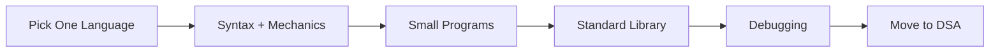
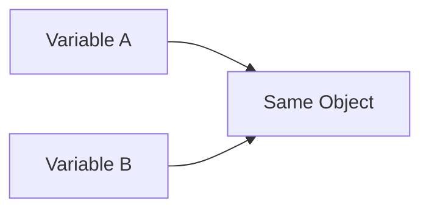
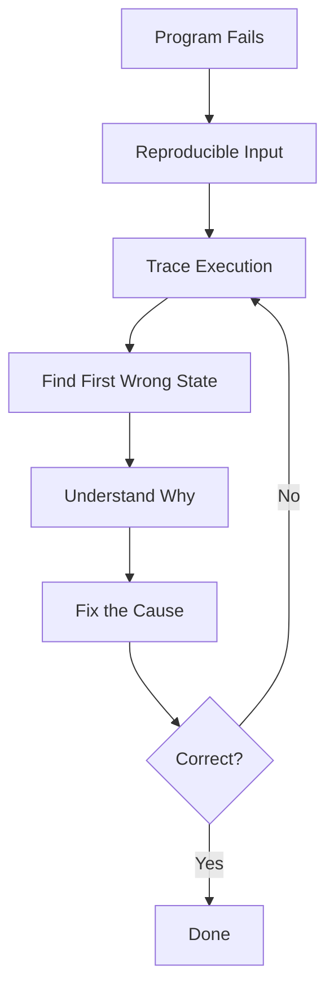

# Programming Fundamentals

Every roadmap after this one assumes you can already write basic code without thinking about the language itself. This page exists to get you there first, so DSA and everything after it is about problem-solving, not about remembering how a loop is written.

> [!IMPORTANT]
> The bar: take a small piece of logic in your head and write it as code without fighting the language. That's it. Not mastery.



---

## 1. Pick One Language
Standard Recommendations of languages you hear from most of folks:
- Java
- C++
- Python
- C#

Pick one, stay with it.

> [!WARNING]
> You'll hear "C++ is mandatory for DSA," "Python is easier," "Company X prefers Java." Ignore all of it. Switching languages mid-prep is how people restart from zero for no reason. Depth in one language beats beginner-level syntax in four.

### Never coded before? Start here

This page is a checklist, not a tutorial. It tells you what to become comfortable with, not how to get there for the first time. If you're starting from zero, use one of these to actually build that comfort, then come back and work through the checkpoint below.

| Language | Where to start | Why this one |
|---|---|---|
| Python | [CodeWithHarry - Python Bootcamp](https://www.codewithharry.com/courses/complete-python-bootcamp-learn-python-from-scratch) | Explains in plain language, builds real small projects as you go, widely used by students in India |
| Java | [Telusko - Java Tutorial for Beginners](https://www.youtube.com/watch?v=BGTx91t8q50) | Goes from zero to comfortable with OOP, explained the way most people actually think, not the way a textbook writes it |
| C++ | [learncpp.com](https://www.learncpp.com/) | Not a video course, a structured written tutorial. Consistently the top recommendation wherever C++ learners ask for one, and it stays current with the language |
| C# | [Learn C# Programming - Full Course with Mini-Projects](https://www.youtube.com/watch?v=YrtFtdTTfv0) | Full beginner-to-intermediate path in one video, with mini-projects along the way so it's not just syntax in isolation |

> [!TIP]
> Don't watch these end to end and then come back. Watch a section, pause, write the code yourself without looking, then move on. That's the only part that actually builds the skill.

If you already know one of these, skip to the [checkpoint](#checkpoint).

---

## 2. Core Mechanics

You need these to stop costing mental effort:

- Variables, common types (int, float, char, bool, string)
- Conditions (`if` / `else` / `switch`), including combining with AND / OR / NOT
- Loops (`for` / `while`), used to traverse, accumulate, and break early
- Functions, meaning parameters, return values, and calling one function from another

```text
function maximum(a, b):
    if a > b:
        return a
    return b
```

A program built as one giant block is a warning sign. You should be structuring code like:

```text
readInput()
validateInput()
calculateResult()
printResult()
```

That's the actual milestone here: organizing logic, not just writing lines that run.

> [!TIP]
> Occasionally looking up an API is normal. Looking up how to write a loop every time means you're not there yet.

---

## 3. Arrays and Strings (Usage Only)

Know how to create, index, update, traverse, and pass these to functions. Nothing more at this stage.

```text
numbers = [4, 7, 2, 9]
numbers[0] -> 4
```

> [!WARNING]
> Stop at usage. Problem-solving techniques on arrays/strings belong in DSA, not here.

---

## 4. Basic OOP (Usage Only)

Just enough to read this and understand it:

```java
class Student {
    String name;
    int marks;

    Student(String name, int marks) {
        this.name = name;
        this.marks = marks;
    }
}
```

Class, object, field, constructor, method call. Stop there.

> [!IMPORTANT]
> Encapsulation, inheritance, polymorphism, SOLID, and design patterns don't belong here. Those live in [OOP](/core-cs/oop/) and [LLD](/system-design/lld/), and they come later.

---

## 5. Standard Library and Sorting APIs

Learn to use your language's collections: add, remove, check existence, iterate, sort, all without rebuilding what already exists.

| Language | Reference |
|---|---|
| Java | [Util package explained](https://www.geeksforgeeks.org/java/java-util-package-java/) |
| C++ | [STL explained](https://www.geeksforgeeks.org/cpp/the-c-standard-template-library-stl/) |
| C# | [BCL explained](https://www.c-sharpcorner.com/article/net-base-class-librarybcl/) |
| Python | [Standard Library docs](https://docs.python.org/3/library/index.html) |

Sorting: know how to sort ascending, descending, and with a custom comparator (e.g. sort `Student` objects by `marks`).

> [!WARNING]
> This is "how to call sort()," not "how sort() works internally." Algorithm internals belong in [DSA](/dsa/).

---

## 6. Value vs Reference Semantics

Know what happens in **your specific language** when you assign a variable, pass an object to a function, or copy a collection. Two variables can end up pointing at the same underlying object, and you need to know when.



> [!IMPORTANT]
> Java, C++, Python, and C# behave differently here. Don't assume behavior from one language carries to another.

---

## 7. Debugging

Not a "later" skill. You should be able to read a compiler error, read a stack trace, set breakpoints, and step through execution.



> [!WARNING]
> Changing code until output looks right is not debugging. Find the first point where actual state diverges from expected state.

---

## Checkpoint

- [ ] Comfortable with variables, conditions, loops, functions
- [ ] Can structure a program into functions instead of one block
- [ ] Can use arrays and strings
- [ ] Can read and write a basic class
- [ ] Can use your language's standard library and sort with a comparator
- [ ] Understand value vs reference behavior in your language
- [ ] Can debug your own code without guessing

If most of this is checked, move on. Don't wait to feel like you've "mastered programming."

---

## Already Know How to Program?

Skip everything above. Just confirm no gaps against the checkpoint list, then go straight to what you need:

- **Coding interviews:** [DSA](/dsa/)
- **Core interview subjects:** [Core CS](/core-cs/)
- **Development roles:** [Development](/development/)
- **OOP:** [OOP](/core-cs/oop/)
- **LLD / HLD:** [LLD](/system-design/lld/) · [HLD](/system-design/hld/)

> [!TIP]
> Picking up a second language later? Don't take a beginner course again. Rewrite programs you already understand (max element, frequency count, sort, simple class, file I/O) in the new language. At that point you're only learning syntax and stdlib, not logic.
